# Reference — TA Build Tree

How units actually get into the game: which constructor builds
what, **laid out in the exact 2-column × 3-row grid TA shows**
in the in-game build menu. Derived from
`gamedata/sidedata.tdf`'s `[CANBUILD]` table plus every
`download/*.tdf` `[MENUENTRY]` registration, merged the way the
engine merges them at boot.

- **45 builders** across 2 sides.
- **575 `(builder, unit)` pairs total**, of which
  **101** come from `download/*.tdf` (marked ⬇️).

Each builder block below shows that constructor's build menu
**one page at a time**, with each page laid out as a 2-column
× 3-row table. Slots are numbered left-to-right, top-to-bottom
(`button 0` = top-left, `button 5` = bottom-right). Empty slots
on a page render as `·`.

- See [TA unit IDs](ta-units.md) for full per-unit stats.
- See [TDF: `[MENUENTRY]`](https://github.com/coreprime/kbot/blob/main/docs/formats/tdf.md#menuentry--build-menu-extension)
  in the kbot docs for the format that ships the ⬇️ additions.
- See [Gamedata: `sidedata.tdf`](https://github.com/coreprime/kbot/blob/main/docs/formats/gamedata.md#canbuild-build-menus)
  in the kbot docs for the static `[CANBUILD]` table.

> [!TIP]
> **Hover any thumbnail** for its `UnitName`. The portraits are
> the same files used by [ta-units.md](ta-units.md).

## Contents

- [Arm](#arm)
  - [Commander](#arm---commander)
  - [Basic factories (tier 1)](#arm---basic-factories-tier-1)
  - [Construction units (mobile, tier 1)](#arm---construction-units-mobile-tier-1)
  - [Advanced Construction (mobile, tier 2)](#arm---advanced-construction-mobile-tier-2)
  - [Utility (mine layers, hover pads)](#arm---utility-mine-layers-hover-pads)
  - [Advanced factories (tier 2)](#arm---advanced-factories-tier-2)
- [Core](#core)
  - [Commander](#core---commander)
  - [Basic factories (tier 1)](#core---basic-factories-tier-1)
  - [Construction units (mobile, tier 1)](#core---construction-units-mobile-tier-1)
  - [Advanced Construction (mobile, tier 2)](#core---advanced-construction-mobile-tier-2)
  - [Utility (mine layers, hover pads)](#core---utility-mine-layers-hover-pads)
  - [Advanced factories (tier 2)](#core---advanced-factories-tier-2)
  - [Krogoth gantry](#core---krogoth-gantry)

---

## ARM

22 builders across 6 tiers.

### Arm — Commander

#### `ARMCOM` — Commander

_Commander_

<table>
<tr>
<td valign="top" width="96"> <code>ARMCOM</code></td>
<td>

<table>
  <thead><tr><th colspan="2" align="left">Page 1</th></tr></thead>
  <tr><td valign="top" align="center">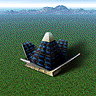 <code>ARMSOLAR</code> Solar Collector</td><td valign="top" align="center">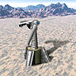 <code>ARMWIN</code> Wind Generator</td></tr>
  <tr><td valign="top" align="center">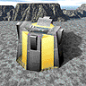 <code>ARMESTOR</code> Energy Storage</td><td valign="top" align="center">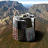 <code>ARMMSTOR</code> Metal Storage</td></tr>
  <tr><td valign="top" align="center">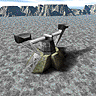 <code>ARMMEX</code> Metal Extractor</td><td valign="top" align="center">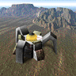 <code>ARMMAKR</code> Metal Maker</td></tr>
</table>

<table>
  <thead><tr><th colspan="2" align="left">Page 2</th></tr></thead>
  <tr><td valign="top" align="center">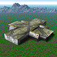 <code>ARMLAB</code> Kbot Lab</td><td valign="top" align="center">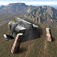 <code>ARMVP</code> Vehicle Plant</td></tr>
  <tr><td valign="top" align="center">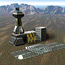 <code>ARMAP</code> Aircraft Plant</td><td valign="top" align="center">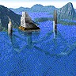 <code>ARMSY</code> Shipyard</td></tr>
  <tr><td valign="top" align="center">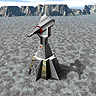 <code>ARMLLT</code> L.L.T.</td><td valign="top" align="center">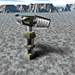 <code>ARMRAD</code> Radar Tower</td></tr>
</table>

<table>
  <thead><tr><th colspan="2" align="left">Page 3</th></tr></thead>
  <tr><td valign="top" align="center">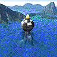 <code>ARMSONAR</code> Sonar Station</td><td valign="top" align="center">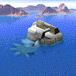 <code>ARMTIDE</code> Tidal Generator</td></tr>
  <tr><td valign="top" align="center">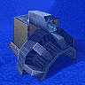 <code>ARMUWES</code> Underwater Energy Storage</td><td valign="top" align="center">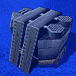 <code>ARMUWMS</code> Underwater Metal Storage</td></tr>
  <tr><td valign="top" align="center">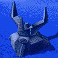 <code>ARMUWMEX</code> Underwater Metal Extractor</td><td valign="top" align="center">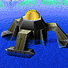 <code>ARMFMKR</code> Floating Metal Maker</td></tr>
</table>

<table>
  <thead><tr><th colspan="2" align="left">Page 4</th></tr></thead>
  <tr><td valign="top" align="center">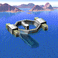 <code>ARMTL</code> Torpedo Launcher</td><td valign="top" align="center" style="color:#aaa">·</td></tr>
  <tr><td valign="top" align="center" style="color:#aaa">·</td><td valign="top" align="center" style="color:#aaa">·</td></tr>
  <tr><td valign="top" align="center" style="color:#aaa">·</td><td valign="top" align="center" style="color:#aaa">·</td></tr>
</table>

<b>19</b> buildable units across <b>4</b> pages.
</td>
</tr>
</table>

### Arm — Basic factories (tier 1)

#### `ARMAP` — Aircraft Plant

_Produces Aircraft_

<table>
<tr>
<td valign="top" width="96"> <code>ARMAP</code></td>
<td>

<table>
  <thead><tr><th colspan="2" align="left">Page 1</th></tr></thead>
  <tr><td valign="top" align="center">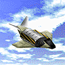 <code>ARMCA</code> Construction Aircraft</td><td valign="top" align="center">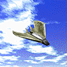 <code>ARMPEEP</code> Peeper</td></tr>
  <tr><td valign="top" align="center">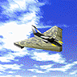 <code>ARMFIG</code> Freedom Fighter</td><td valign="top" align="center">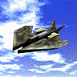 <code>ARMTHUND</code> Thunder</td></tr>
  <tr><td valign="top" align="center">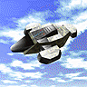 <code>ARMATLAS</code> Atlas</td><td valign="top" align="center" style="color:#aaa">·</td></tr>
</table>

<b>5</b> buildable units across <b>1</b> page.
</td>
</tr>
</table>

#### `ARMLAB` — Kbot Lab

_Produces Kbots_

<table>
<tr>
<td valign="top" width="96"> <code>ARMLAB</code></td>
<td>

<table>
  <thead><tr><th colspan="2" align="left">Page 1</th></tr></thead>
  <tr><td valign="top" align="center">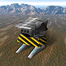 <code>ARMCK</code> Construction KBot</td><td valign="top" align="center">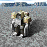 <code>ARMPW</code> Peewee</td></tr>
  <tr><td valign="top" align="center">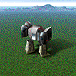 <code>ARMROCK</code> Rocko</td><td valign="top" align="center">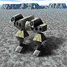 <code>ARMHAM</code> Hammer</td></tr>
  <tr><td valign="top" align="center">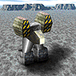 <code>ARMJETH</code> Jethro</td><td valign="top" align="center" style="color:#aaa">·</td></tr>
</table>

<table>
  <thead><tr><th colspan="2" align="left">Page 3</th></tr></thead>
  <tr><td valign="top" align="center">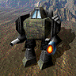 <code>ARMWAR</code> ⬇️ Warrior</td><td valign="top" align="center">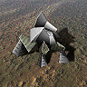 <code>ARMFLEA</code> ⬇️ Flea</td></tr>
  <tr><td valign="top" align="center" style="color:#aaa">·</td><td valign="top" align="center" style="color:#aaa">·</td></tr>
  <tr><td valign="top" align="center" style="color:#aaa">·</td><td valign="top" align="center" style="color:#aaa">·</td></tr>
</table>

<b>7</b> buildable units across <b>2</b> pages; <b>2</b> ⬇️ added by <code>download/*.tdf</code>.
</td>
</tr>
</table>

#### `ARMSY` — Shipyard

_Produces Ships_

<table>
<tr>
<td valign="top" width="96"> <code>ARMSY</code></td>
<td>

<table>
  <thead><tr><th colspan="2" align="left">Page 1</th></tr></thead>
  <tr><td valign="top" align="center">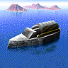 <code>ARMCS</code> Construction Ship</td><td valign="top" align="center">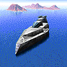 <code>ARMPT</code> Skeeter</td></tr>
  <tr><td valign="top" align="center">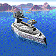 <code>ARMROY</code> Crusader</td><td valign="top" align="center">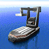 <code>ARMTSHIP</code> Hulk</td></tr>
  <tr><td valign="top" align="center">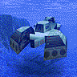 <code>ARMSUB</code> Lurker</td><td valign="top" align="center" style="color:#aaa">·</td></tr>
</table>

<b>5</b> buildable units across <b>1</b> page.
</td>
</tr>
</table>

#### `ARMVP` — Vehicle Plant

_Produces Vehicles_

<table>
<tr>
<td valign="top" width="96"> <code>ARMVP</code></td>
<td>

<table>
  <thead><tr><th colspan="2" align="left">Page 1</th></tr></thead>
  <tr><td valign="top" align="center">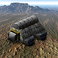 <code>ARMCV</code> Construction Vehicle</td><td valign="top" align="center">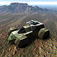 <code>ARMFAV</code> Jeffy</td></tr>
  <tr><td valign="top" align="center">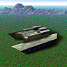 <code>ARMFLASH</code> Flash</td><td valign="top" align="center">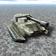 <code>ARMSTUMP</code> Stumpy</td></tr>
  <tr><td valign="top" align="center">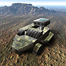 <code>ARMSAM</code> Samson</td><td valign="top" align="center">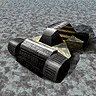 <code>ARMMLV</code> Podger</td></tr>
</table>

<b>6</b> buildable units across <b>1</b> page.
</td>
</tr>
</table>

### Arm — Construction units (mobile, tier 1)

#### `ARMCA` — Construction Aircraft

_Tech Level 1_

<table>
<tr>
<td valign="top" width="96"> <code>ARMCA</code></td>
<td>

<table>
  <thead><tr><th colspan="2" align="left">Page 1</th></tr></thead>
  <tr><td valign="top" align="center"> <code>ARMSOLAR</code> Solar Collector</td><td valign="top" align="center"> <code>ARMWIN</code> Wind Generator</td></tr>
  <tr><td valign="top" align="center"> <code>ARMESTOR</code> Energy Storage</td><td valign="top" align="center"> <code>ARMMSTOR</code> Metal Storage</td></tr>
  <tr><td valign="top" align="center"> <code>ARMMEX</code> Metal Extractor</td><td valign="top" align="center"> <code>ARMMAKR</code> Metal Maker</td></tr>
</table>

<table>
  <thead><tr><th colspan="2" align="left">Page 2</th></tr></thead>
  <tr><td valign="top" align="center"> <code>ARMLAB</code> Kbot Lab</td><td valign="top" align="center"> <code>ARMVP</code> Vehicle Plant</td></tr>
  <tr><td valign="top" align="center"> <code>ARMAP</code> Aircraft Plant</td><td valign="top" align="center"> <code>ARMSY</code> Shipyard</td></tr>
  <tr><td valign="top" align="center"> <code>ARMLLT</code> L.L.T.</td><td valign="top" align="center"> <code>ARMRAD</code> Radar Tower</td></tr>
</table>

<table>
  <thead><tr><th colspan="2" align="left">Page 3</th></tr></thead>
  <tr><td valign="top" align="center">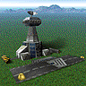 <code>ARMAAP</code> Adv. Aircraft Plant</td><td valign="top" align="center">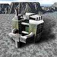 <code>ARMGEO</code> Geothermal Powerplant</td></tr>
  <tr><td valign="top" align="center">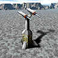 <code>ARMHLT</code> Sentinel</td><td valign="top" align="center">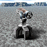 <code>ARMRL</code> Defender</td></tr>
  <tr><td valign="top" align="center">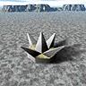 <code>ARMDRAG</code> Dragon&#39;s Teeth</td><td valign="top" align="center">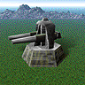 <code>ARMGUARD</code> Guardian</td></tr>
</table>

<table>
  <thead><tr><th colspan="2" align="left">Page 4</th></tr></thead>
  <tr><td valign="top" align="center">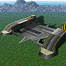 <code>ARMHP</code> Hovercraft Platform</td><td valign="top" align="center" style="color:#aaa">·</td></tr>
  <tr><td valign="top" align="center" style="color:#aaa">·</td><td valign="top" align="center" style="color:#aaa">·</td></tr>
  <tr><td valign="top" align="center" style="color:#aaa">·</td><td valign="top" align="center" style="color:#aaa">·</td></tr>
</table>

<b>19</b> buildable units across <b>4</b> pages.
</td>
</tr>
</table>

#### `ARMCH` — Construction Hovercraft

_Tech Level 1_

<table>
<tr>
<td valign="top" width="96">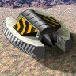 <code>ARMCH</code></td>
<td>

<table>
  <thead><tr><th colspan="2" align="left">Page 1</th></tr></thead>
  <tr><td valign="top" align="center"> <code>ARMSOLAR</code> Solar Collector</td><td valign="top" align="center"> <code>ARMWIN</code> Wind Generator</td></tr>
  <tr><td valign="top" align="center"> <code>ARMESTOR</code> Energy Storage</td><td valign="top" align="center"> <code>ARMMSTOR</code> Metal Storage</td></tr>
  <tr><td valign="top" align="center"> <code>ARMMEX</code> Metal Extractor</td><td valign="top" align="center"> <code>ARMMAKR</code> Metal Maker</td></tr>
</table>

<table>
  <thead><tr><th colspan="2" align="left">Page 2</th></tr></thead>
  <tr><td valign="top" align="center"> <code>ARMLAB</code> Kbot Lab</td><td valign="top" align="center"> <code>ARMVP</code> Vehicle Plant</td></tr>
  <tr><td valign="top" align="center"> <code>ARMAP</code> Aircraft Plant</td><td valign="top" align="center"> <code>ARMSY</code> Shipyard</td></tr>
  <tr><td valign="top" align="center"> <code>ARMLLT</code> L.L.T.</td><td valign="top" align="center"> <code>ARMRAD</code> Radar Tower</td></tr>
</table>

<table>
  <thead><tr><th colspan="2" align="left">Page 3</th></tr></thead>
  <tr><td valign="top" align="center"> <code>ARMAVP</code> Adv. Vehicle Plant</td><td valign="top" align="center"> <code>ARMGEO</code> Geothermal Powerplant</td></tr>
  <tr><td valign="top" align="center"> <code>ARMHLT</code> Sentinel</td><td valign="top" align="center"> <code>ARMRL</code> Defender</td></tr>
  <tr><td valign="top" align="center"> <code>ARMDRAG</code> Dragon&#39;s Teeth</td><td valign="top" align="center"> <code>ARMGUARD</code> Guardian</td></tr>
</table>

<table>
  <thead><tr><th colspan="2" align="left">Page 4</th></tr></thead>
  <tr><td valign="top" align="center"> <code>ARMSONAR</code> Sonar Station</td><td valign="top" align="center"> <code>ARMTIDE</code> Tidal Generator</td></tr>
  <tr><td valign="top" align="center"> <code>ARMUWES</code> Underwater Energy Storage</td><td valign="top" align="center"> <code>ARMUWMS</code> Underwater Metal Storage</td></tr>
  <tr><td valign="top" align="center"> <code>ARMUWMEX</code> Underwater Metal Extractor</td><td valign="top" align="center"> <code>ARMFMKR</code> Floating Metal Maker</td></tr>
</table>

<table>
  <thead><tr><th colspan="2" align="left">Page 5</th></tr></thead>
  <tr><td valign="top" align="center"> <code>ARMFRT</code> Defender - NS</td><td valign="top" align="center"> <code>ARMFDRAG</code> Floating Dragon&#39;s Teeth</td></tr>
  <tr><td valign="top" align="center"> <code>ARMFHLT</code> Stingray</td><td valign="top" align="center"> <code>ARMTL</code> Torpedo Launcher</td></tr>
  <tr><td valign="top" align="center"> <code>ARMHP</code> Hovercraft Platform</td><td valign="top" align="center" style="color:#aaa">·</td></tr>
</table>

<b>29</b> buildable units across <b>5</b> pages.
</td>
</tr>
</table>

#### `ARMCK` — Construction KBot

_Tech Level 1_

<table>
<tr>
<td valign="top" width="96"> <code>ARMCK</code></td>
<td>

<table>
  <thead><tr><th colspan="2" align="left">Page 1</th></tr></thead>
  <tr><td valign="top" align="center"> <code>ARMSOLAR</code> Solar Collector</td><td valign="top" align="center"> <code>ARMWIN</code> Wind Generator</td></tr>
  <tr><td valign="top" align="center"> <code>ARMESTOR</code> Energy Storage</td><td valign="top" align="center"> <code>ARMMSTOR</code> Metal Storage</td></tr>
  <tr><td valign="top" align="center"> <code>ARMMEX</code> Metal Extractor</td><td valign="top" align="center"> <code>ARMMAKR</code> Metal Maker</td></tr>
</table>

<table>
  <thead><tr><th colspan="2" align="left">Page 2</th></tr></thead>
  <tr><td valign="top" align="center"> <code>ARMLAB</code> Kbot Lab</td><td valign="top" align="center"> <code>ARMVP</code> Vehicle Plant</td></tr>
  <tr><td valign="top" align="center"> <code>ARMAP</code> Aircraft Plant</td><td valign="top" align="center"> <code>ARMSY</code> Shipyard</td></tr>
  <tr><td valign="top" align="center"> <code>ARMLLT</code> L.L.T.</td><td valign="top" align="center"> <code>ARMRAD</code> Radar Tower</td></tr>
</table>

<table>
  <thead><tr><th colspan="2" align="left">Page 3</th></tr></thead>
  <tr><td valign="top" align="center"> <code>ARMALAB</code> Adv. Kbot Lab</td><td valign="top" align="center"> <code>ARMGEO</code> Geothermal Powerplant</td></tr>
  <tr><td valign="top" align="center"> <code>ARMHLT</code> Sentinel</td><td valign="top" align="center"> <code>ARMRL</code> Defender</td></tr>
  <tr><td valign="top" align="center"> <code>ARMDRAG</code> Dragon&#39;s Teeth</td><td valign="top" align="center"> <code>ARMGUARD</code> Guardian</td></tr>
</table>

<table>
  <thead><tr><th colspan="2" align="left">Page 4</th></tr></thead>
  <tr><td valign="top" align="center"> <code>ARMHP</code> Hovercraft Platform</td><td valign="top" align="center" style="color:#aaa">·</td></tr>
  <tr><td valign="top" align="center" style="color:#aaa">·</td><td valign="top" align="center" style="color:#aaa">·</td></tr>
  <tr><td valign="top" align="center" style="color:#aaa">·</td><td valign="top" align="center" style="color:#aaa">·</td></tr>
</table>

<b>19</b> buildable units across <b>4</b> pages.
</td>
</tr>
</table>

#### `ARMCS` — Construction Ship

_Tech Level 1_

<table>
<tr>
<td valign="top" width="96"> <code>ARMCS</code></td>
<td>

<table>
  <thead><tr><th colspan="2" align="left">Page 1</th></tr></thead>
  <tr><td valign="top" align="center"> <code>ARMASY</code> Adv. Shipyard</td><td valign="top" align="center"> <code>ARMTL</code> Torpedo Launcher</td></tr>
  <tr><td valign="top" align="center"> <code>ARMTIDE</code> Tidal Generator</td><td valign="top" align="center"> <code>ARMSONAR</code> Sonar Station</td></tr>
  <tr><td valign="top" align="center"> <code>ARMLLT</code> L.L.T.</td><td valign="top" align="center"> <code>ARMSY</code> Shipyard</td></tr>
</table>

<table>
  <thead><tr><th colspan="2" align="left">Page 3</th></tr></thead>
  <tr><td valign="top" align="center"> <code>ARMFRT</code> ⬇️ Defender - NS</td><td valign="top" align="center"> <code>ARMUWES</code> ⬇️ Underwater Energy Storage</td></tr>
  <tr><td valign="top" align="center"> <code>ARMFMKR</code> ⬇️ Floating Metal Maker</td><td valign="top" align="center"> <code>ARMUWMS</code> ⬇️ Underwater Metal Storage</td></tr>
  <tr><td valign="top" align="center"> <code>ARMFHLT</code> ⬇️ Stingray</td><td valign="top" align="center"> <code>ARMUWMEX</code> ⬇️ Underwater Metal Extractor</td></tr>
</table>

<table>
  <thead><tr><th colspan="2" align="left">Page 4</th></tr></thead>
  <tr><td valign="top" align="center"> <code>ARMFDRAG</code> ⬇️ Floating Dragon&#39;s Teeth</td><td valign="top" align="center" style="color:#aaa">·</td></tr>
  <tr><td valign="top" align="center" style="color:#aaa">·</td><td valign="top" align="center" style="color:#aaa">·</td></tr>
  <tr><td valign="top" align="center" style="color:#aaa">·</td><td valign="top" align="center" style="color:#aaa">·</td></tr>
</table>

<b>13</b> buildable units across <b>3</b> pages; <b>7</b> ⬇️ added by <code>download/*.tdf</code>.
</td>
</tr>
</table>

#### `ARMCSA` — Construction Seaplane

_Tech Level 1_

<table>
<tr>
<td valign="top" width="96"> <code>ARMCSA</code></td>
<td>

<table>
  <thead><tr><th colspan="2" align="left">Page 1</th></tr></thead>
  <tr><td valign="top" align="center"> <code>ARMSOLAR</code> Solar Collector</td><td valign="top" align="center"> <code>ARMWIN</code> Wind Generator</td></tr>
  <tr><td valign="top" align="center"> <code>ARMESTOR</code> Energy Storage</td><td valign="top" align="center"> <code>ARMMSTOR</code> Metal Storage</td></tr>
  <tr><td valign="top" align="center"> <code>ARMMEX</code> Metal Extractor</td><td valign="top" align="center"> <code>ARMMAKR</code> Metal Maker</td></tr>
</table>

<table>
  <thead><tr><th colspan="2" align="left">Page 2</th></tr></thead>
  <tr><td valign="top" align="center"> <code>ARMLAB</code> Kbot Lab</td><td valign="top" align="center"> <code>ARMVP</code> Vehicle Plant</td></tr>
  <tr><td valign="top" align="center"> <code>ARMAP</code> Aircraft Plant</td><td valign="top" align="center"> <code>ARMSY</code> Shipyard</td></tr>
  <tr><td valign="top" align="center"> <code>ARMLLT</code> L.L.T.</td><td valign="top" align="center"> <code>ARMRAD</code> Radar Tower</td></tr>
</table>

<table>
  <thead><tr><th colspan="2" align="left">Page 3</th></tr></thead>
  <tr><td valign="top" align="center"> <code>ARMALAB</code> Adv. Kbot Lab</td><td valign="top" align="center"> <code>ARMGEO</code> Geothermal Powerplant</td></tr>
  <tr><td valign="top" align="center"> <code>ARMHLT</code> Sentinel</td><td valign="top" align="center"> <code>ARMRL</code> Defender</td></tr>
  <tr><td valign="top" align="center"> <code>ARMDRAG</code> Dragon&#39;s Teeth</td><td valign="top" align="center"> <code>ARMGUARD</code> Guardian</td></tr>
</table>

<table>
  <thead><tr><th colspan="2" align="left">Page 4</th></tr></thead>
  <tr><td valign="top" align="center"> <code>ARMSONAR</code> Sonar Station</td><td valign="top" align="center"> <code>ARMTIDE</code> Tidal Generator</td></tr>
  <tr><td valign="top" align="center"> <code>ARMUWES</code> Underwater Energy Storage</td><td valign="top" align="center"> <code>ARMUWMS</code> Underwater Metal Storage</td></tr>
  <tr><td valign="top" align="center"> <code>ARMUWMEX</code> Underwater Metal Extractor</td><td valign="top" align="center"> <code>ARMFMKR</code> Floating Metal Maker</td></tr>
</table>

<table>
  <thead><tr><th colspan="2" align="left">Page 5</th></tr></thead>
  <tr><td valign="top" align="center"> <code>ARMFRT</code> Defender - NS</td><td valign="top" align="center"> <code>ARMFDRAG</code> Floating Dragon&#39;s Teeth</td></tr>
  <tr><td valign="top" align="center"> <code>ARMFHLT</code> Stingray</td><td valign="top" align="center"> <code>ARMTL</code> Torpedo Launcher</td></tr>
  <tr><td valign="top" align="center"> <code>ARMHP</code> Hovercraft Platform</td><td valign="top" align="center" style="color:#aaa">·</td></tr>
</table>

<b>29</b> buildable units across <b>5</b> pages.
</td>
</tr>
</table>

#### `ARMCV` — Construction Vehicle

_Tech Level 1_

<table>
<tr>
<td valign="top" width="96"> <code>ARMCV</code></td>
<td>

<table>
  <thead><tr><th colspan="2" align="left">Page 1</th></tr></thead>
  <tr><td valign="top" align="center"> <code>ARMSOLAR</code> Solar Collector</td><td valign="top" align="center"> <code>ARMWIN</code> Wind Generator</td></tr>
  <tr><td valign="top" align="center"> <code>ARMESTOR</code> Energy Storage</td><td valign="top" align="center"> <code>ARMMSTOR</code> Metal Storage</td></tr>
  <tr><td valign="top" align="center"> <code>ARMMEX</code> Metal Extractor</td><td valign="top" align="center"> <code>ARMMAKR</code> Metal Maker</td></tr>
</table>

<table>
  <thead><tr><th colspan="2" align="left">Page 2</th></tr></thead>
  <tr><td valign="top" align="center"> <code>ARMLAB</code> Kbot Lab</td><td valign="top" align="center"> <code>ARMVP</code> Vehicle Plant</td></tr>
  <tr><td valign="top" align="center"> <code>ARMAP</code> Aircraft Plant</td><td valign="top" align="center"> <code>ARMSY</code> Shipyard</td></tr>
  <tr><td valign="top" align="center"> <code>ARMLLT</code> L.L.T.</td><td valign="top" align="center"> <code>ARMRAD</code> Radar Tower</td></tr>
</table>

<table>
  <thead><tr><th colspan="2" align="left">Page 3</th></tr></thead>
  <tr><td valign="top" align="center"> <code>ARMAVP</code> Adv. Vehicle Plant</td><td valign="top" align="center"> <code>ARMGEO</code> Geothermal Powerplant</td></tr>
  <tr><td valign="top" align="center"> <code>ARMHLT</code> Sentinel</td><td valign="top" align="center"> <code>ARMRL</code> Defender</td></tr>
  <tr><td valign="top" align="center"> <code>ARMDRAG</code> Dragon&#39;s Teeth</td><td valign="top" align="center"> <code>ARMGUARD</code> Guardian</td></tr>
</table>

<table>
  <thead><tr><th colspan="2" align="left">Page 4</th></tr></thead>
  <tr><td valign="top" align="center"> <code>ARMHP</code> Hovercraft Platform</td><td valign="top" align="center" style="color:#aaa">·</td></tr>
  <tr><td valign="top" align="center" style="color:#aaa">·</td><td valign="top" align="center" style="color:#aaa">·</td></tr>
  <tr><td valign="top" align="center" style="color:#aaa">·</td><td valign="top" align="center" style="color:#aaa">·</td></tr>
</table>

<b>19</b> buildable units across <b>4</b> pages.
</td>
</tr>
</table>

#### `ARMPLAT` — Seaplane Platform

_Builds Seaplanes_

<table>
<tr>
<td valign="top" width="96"> <code>ARMPLAT</code></td>
<td>

<table>
  <thead><tr><th colspan="2" align="left">Page 1</th></tr></thead>
  <tr><td valign="top" align="center"> <code>ARMCA</code> Construction Aircraft</td><td valign="top" align="center"> <code>ARMSEHAK</code> Seahawk</td></tr>
  <tr><td valign="top" align="center"> <code>ARMSFIG</code> Tornado</td><td valign="top" align="center"> <code>ARMHAWK</code> Hawk</td></tr>
  <tr><td valign="top" align="center"> <code>ARMLANCE</code> Lancet</td><td valign="top" align="center"> <code>ARMSEAP</code> Albatross</td></tr>
</table>

<b>6</b> buildable units across <b>1</b> page.
</td>
</tr>
</table>

### Arm — Advanced Construction (mobile, tier 2)

#### `ARMACA` — Adv. Construction Aircraft

_Tech Level 2_

<table>
<tr>
<td valign="top" width="96"> <code>ARMACA</code></td>
<td>

<table>
  <thead><tr><th colspan="2" align="left">Page 1</th></tr></thead>
  <tr><td valign="top" align="center"> <code>ARMAP</code> Aircraft Plant</td><td valign="top" align="center"> <code>ARMARAD</code> Advanced Radar Tower</td></tr>
  <tr><td valign="top" align="center"> <code>ARMFUS</code> Fusion Reactor</td><td valign="top" align="center"> <code>ARMMOHO</code> Moho Mine</td></tr>
  <tr><td valign="top" align="center"> <code>ARMBRTHA</code> Big Bertha</td><td valign="top" align="center"> <code>ARMSILO</code> Retaliator</td></tr>
</table>

<table>
  <thead><tr><th colspan="2" align="left">Page 2</th></tr></thead>
  <tr><td valign="top" align="center"> <code>ARMANNI</code> Annihilator</td><td valign="top" align="center"> <code>ARMAMD</code> Protector</td></tr>
  <tr><td valign="top" align="center"> <code>ARMASP</code> Air Repair Pad</td><td valign="top" align="center" style="color:#aaa">·</td></tr>
  <tr><td valign="top" align="center" style="color:#aaa">·</td><td valign="top" align="center" style="color:#aaa">·</td></tr>
</table>

<table>
  <thead><tr><th colspan="2" align="left">Page 3</th></tr></thead>
  <tr><td valign="top" align="center" style="color:#aaa">·</td><td valign="top" align="center" style="color:#aaa">·</td></tr>
  <tr><td valign="top" align="center" style="color:#aaa">·</td><td valign="top" align="center"> <code>ARMFLAK</code> ⬇️ Flakker</td></tr>
  <tr><td valign="top" align="center"> <code>ARMFORT</code> ⬇️ Fortification Wall</td><td valign="top" align="center"> <code>ARMAMB</code> ⬇️ Ambusher</td></tr>
</table>

<table>
  <thead><tr><th colspan="2" align="left">Page 4</th></tr></thead>
  <tr><td valign="top" align="center"> <code>ARMCKFUS</code> ⬇️ Cloakable Fusion Reactor</td><td valign="top" align="center"> <code>ARMMMKR</code> ⬇️ Moho Metal Maker</td></tr>
  <tr><td valign="top" align="center"> <code>ARMTARG</code> ⬇️ Targeting Facility</td><td valign="top" align="center"> <code>ARMVULC</code> ⬇️ Vulcan</td></tr>
  <tr><td valign="top" align="center" style="color:#aaa">·</td><td valign="top" align="center"> <code>ARMEMP</code> ⬇️ Stunner</td></tr>
</table>

<b>17</b> buildable units across <b>4</b> pages; <b>8</b> ⬇️ added by <code>download/*.tdf</code>.
</td>
</tr>
</table>

#### `ARMACK` — Adv. Construction Kbot

_Tech Level 2_

<table>
<tr>
<td valign="top" width="96"> <code>ARMACK</code></td>
<td>

<table>
  <thead><tr><th colspan="2" align="left">Page 1</th></tr></thead>
  <tr><td valign="top" align="center"> <code>ARMLAB</code> Kbot Lab</td><td valign="top" align="center"> <code>ARMARAD</code> Advanced Radar Tower</td></tr>
  <tr><td valign="top" align="center"> <code>ARMFUS</code> Fusion Reactor</td><td valign="top" align="center"> <code>ARMMOHO</code> Moho Mine</td></tr>
  <tr><td valign="top" align="center"> <code>ARMBRTHA</code> Big Bertha</td><td valign="top" align="center"> <code>ARMSILO</code> Retaliator</td></tr>
</table>

<table>
  <thead><tr><th colspan="2" align="left">Page 2</th></tr></thead>
  <tr><td valign="top" align="center"> <code>ARMANNI</code> Annihilator</td><td valign="top" align="center"> <code>ARMAMD</code> Protector</td></tr>
  <tr><td valign="top" align="center"> <code>ARMASP</code> Air Repair Pad</td><td valign="top" align="center" style="color:#aaa">·</td></tr>
  <tr><td valign="top" align="center" style="color:#aaa">·</td><td valign="top" align="center" style="color:#aaa">·</td></tr>
</table>

<table>
  <thead><tr><th colspan="2" align="left">Page 3</th></tr></thead>
  <tr><td valign="top" align="center" style="color:#aaa">·</td><td valign="top" align="center" style="color:#aaa">·</td></tr>
  <tr><td valign="top" align="center" style="color:#aaa">·</td><td valign="top" align="center"> <code>ARMFLAK</code> ⬇️ Flakker</td></tr>
  <tr><td valign="top" align="center"> <code>ARMFORT</code> ⬇️ Fortification Wall</td><td valign="top" align="center"> <code>ARMAMB</code> ⬇️ Ambusher</td></tr>
</table>

<table>
  <thead><tr><th colspan="2" align="left">Page 4</th></tr></thead>
  <tr><td valign="top" align="center"> <code>ARMCKFUS</code> ⬇️ Cloakable Fusion Reactor</td><td valign="top" align="center"> <code>ARMMMKR</code> ⬇️ Moho Metal Maker</td></tr>
  <tr><td valign="top" align="center"> <code>ARMTARG</code> ⬇️ Targeting Facility</td><td valign="top" align="center"> <code>ARMVULC</code> ⬇️ Vulcan</td></tr>
  <tr><td valign="top" align="center" style="color:#aaa">·</td><td valign="top" align="center"> <code>ARMEMP</code> ⬇️ Stunner</td></tr>
</table>

<b>17</b> buildable units across <b>4</b> pages; <b>8</b> ⬇️ added by <code>download/*.tdf</code>.
</td>
</tr>
</table>

#### `ARMACSUB` — Advanced Construction Sub

_Tech Level 2_

<table>
<tr>
<td valign="top" width="96"> <code>ARMACSUB</code></td>
<td>

<table>
  <thead><tr><th colspan="2" align="left">Page 1</th></tr></thead>
  <tr><td valign="top" align="center"> <code>ARMSY</code> Shipyard</td><td valign="top" align="center"> <code>ARMASON</code> Advanced Sonar Station</td></tr>
  <tr><td valign="top" align="center"> <code>ARMUWFUS</code> Underwater Fusion Plant</td><td valign="top" align="center"> <code>ARMATL</code> Advanced Torpedo Launcher</td></tr>
  <tr><td valign="top" align="center"> <code>ARMPLAT</code> Seaplane Platform</td><td valign="top" align="center" style="color:#aaa">·</td></tr>
</table>

<b>5</b> buildable units across <b>1</b> page.
</td>
</tr>
</table>

#### `ARMACV` — Adv. Construction Vehicle

_Tech Level 2_

<table>
<tr>
<td valign="top" width="96"> <code>ARMACV</code></td>
<td>

<table>
  <thead><tr><th colspan="2" align="left">Page 1</th></tr></thead>
  <tr><td valign="top" align="center"> <code>ARMVP</code> Vehicle Plant</td><td valign="top" align="center"> <code>ARMARAD</code> Advanced Radar Tower</td></tr>
  <tr><td valign="top" align="center"> <code>ARMFUS</code> Fusion Reactor</td><td valign="top" align="center"> <code>ARMMOHO</code> Moho Mine</td></tr>
  <tr><td valign="top" align="center"> <code>ARMBRTHA</code> Big Bertha</td><td valign="top" align="center"> <code>ARMSILO</code> Retaliator</td></tr>
</table>

<table>
  <thead><tr><th colspan="2" align="left">Page 2</th></tr></thead>
  <tr><td valign="top" align="center"> <code>ARMANNI</code> Annihilator</td><td valign="top" align="center"> <code>ARMAMD</code> Protector</td></tr>
  <tr><td valign="top" align="center"> <code>ARMASP</code> Air Repair Pad</td><td valign="top" align="center" style="color:#aaa">·</td></tr>
  <tr><td valign="top" align="center" style="color:#aaa">·</td><td valign="top" align="center" style="color:#aaa">·</td></tr>
</table>

<table>
  <thead><tr><th colspan="2" align="left">Page 3</th></tr></thead>
  <tr><td valign="top" align="center" style="color:#aaa">·</td><td valign="top" align="center" style="color:#aaa">·</td></tr>
  <tr><td valign="top" align="center" style="color:#aaa">·</td><td valign="top" align="center"> <code>ARMFLAK</code> ⬇️ Flakker</td></tr>
  <tr><td valign="top" align="center"> <code>ARMFORT</code> ⬇️ Fortification Wall</td><td valign="top" align="center"> <code>ARMAMB</code> ⬇️ Ambusher</td></tr>
</table>

<table>
  <thead><tr><th colspan="2" align="left">Page 4</th></tr></thead>
  <tr><td valign="top" align="center"> <code>ARMCKFUS</code> ⬇️ Cloakable Fusion Reactor</td><td valign="top" align="center"> <code>ARMMMKR</code> ⬇️ Moho Metal Maker</td></tr>
  <tr><td valign="top" align="center"> <code>ARMTARG</code> ⬇️ Targeting Facility</td><td valign="top" align="center"> <code>ARMVULC</code> ⬇️ Vulcan</td></tr>
  <tr><td valign="top" align="center" style="color:#aaa">·</td><td valign="top" align="center"> <code>ARMEMP</code> ⬇️ Stunner</td></tr>
</table>

<b>17</b> buildable units across <b>4</b> pages; <b>8</b> ⬇️ added by <code>download/*.tdf</code>.
</td>
</tr>
</table>

### Arm — Utility (mine layers, hover pads)

#### `ARMHP` — Hovercraft Platform

_Builds Hovercraft_

<table>
<tr>
<td valign="top" width="96"> <code>ARMHP</code></td>
<td>

<table>
  <thead><tr><th colspan="2" align="left">Page 1</th></tr></thead>
  <tr><td valign="top" align="center"> <code>ARMCH</code> Construction Hovercraft</td><td valign="top" align="center"> <code>ARMSH</code> Skimmer</td></tr>
  <tr><td valign="top" align="center"> <code>ARMANAC</code> Anaconda</td><td valign="top" align="center"> <code>ARMAH</code> Swatter</td></tr>
  <tr><td valign="top" align="center"> <code>ARMMH</code> Wombat</td><td valign="top" align="center"> <code>ARMTHOVR</code> Bear</td></tr>
</table>

<b>6</b> buildable units across <b>1</b> page.
</td>
</tr>
</table>

#### `ARMMLV` — Podger

_Mine Layer Vehicle_

<table>
<tr>
<td valign="top" width="96"> <code>ARMMLV</code></td>
<td>

<table>
  <thead><tr><th colspan="2" align="left">Page 1</th></tr></thead>
  <tr><td valign="top" align="center"> <code>ARMMINE1</code> Tiny</td><td valign="top" align="center"> <code>ARMMINE2</code> Area Mine</td></tr>
  <tr><td valign="top" align="center"> <code>ARMMINE3</code> Focused Mine</td><td valign="top" align="center"> <code>ARMMINE4</code> HE Area Mine</td></tr>
  <tr><td valign="top" align="center"> <code>ARMMINE5</code> Precision Mine</td><td valign="top" align="center"> <code>ARMMINE6</code> Nuclear Mine</td></tr>
</table>

<b>6</b> buildable units across <b>1</b> page.
</td>
</tr>
</table>

### Arm — Advanced factories (tier 2)

#### `ARMAAP` — Adv. Aircraft Plant

_Produces Aircraft_

<table>
<tr>
<td valign="top" width="96"> <code>ARMAAP</code></td>
<td>

<table>
  <thead><tr><th colspan="2" align="left">Page 1</th></tr></thead>
  <tr><td valign="top" align="center"> <code>ARMACA</code> Adv. Construction Aircraft</td><td valign="top" align="center"> <code>ARMBRAWL</code> Brawler</td></tr>
  <tr><td valign="top" align="center"> <code>ARMPNIX</code> Phoenix</td><td valign="top" align="center"> <code>ARMLANCE</code> Lancet</td></tr>
  <tr><td valign="top" align="center"> <code>ARMHAWK</code> Hawk</td><td valign="top" align="center" style="color:#aaa">·</td></tr>
</table>

<table>
  <thead><tr><th colspan="2" align="left">Page 3</th></tr></thead>
  <tr><td valign="top" align="center"> <code>ARMAWAC</code> ⬇️ Eagle</td><td valign="top" align="center" style="color:#aaa">·</td></tr>
  <tr><td valign="top" align="center" style="color:#aaa">·</td><td valign="top" align="center" style="color:#aaa">·</td></tr>
  <tr><td valign="top" align="center" style="color:#aaa">·</td><td valign="top" align="center" style="color:#aaa">·</td></tr>
</table>

<b>6</b> buildable units across <b>2</b> pages; <b>1</b> ⬇️ added by <code>download/*.tdf</code>.
</td>
</tr>
</table>

#### `ARMALAB` — Adv. Kbot Lab

_Produces Kbots_

<table>
<tr>
<td valign="top" width="96"> <code>ARMALAB</code></td>
<td>

<table>
  <thead><tr><th colspan="2" align="left">Page 1</th></tr></thead>
  <tr><td valign="top" align="center"> <code>ARMACK</code> Adv. Construction Kbot</td><td valign="top" align="center"> <code>ARMZEUS</code> Zeus</td></tr>
  <tr><td valign="top" align="center"> <code>ARMFIDO</code> Fido</td><td valign="top" align="center"> <code>ARMVADER</code> Invader</td></tr>
  <tr><td valign="top" align="center"> <code>ARMASER</code> Eraser</td><td valign="top" align="center"> <code>ARMFAST</code> Zipper</td></tr>
</table>

<table>
  <thead><tr><th colspan="2" align="left">Page 3</th></tr></thead>
  <tr><td valign="top" align="center"> <code>ARMMAV</code> ⬇️ Maverick</td><td valign="top" align="center" style="color:#aaa">·</td></tr>
  <tr><td valign="top" align="center"> <code>ARMMARK</code> ⬇️ Marky</td><td valign="top" align="center" style="color:#aaa">·</td></tr>
  <tr><td valign="top" align="center"> <code>ARMAMPH</code> ⬇️ Pelican</td><td valign="top" align="center"> <code>ARMSNIPE</code> ⬇️ Shooter</td></tr>
</table>

<table>
  <thead><tr><th colspan="2" align="left">Page 4</th></tr></thead>
  <tr><td valign="top" align="center"> <code>ARMSPY</code> ⬇️ Infiltrator</td><td valign="top" align="center"> <code>ARMDECOM</code> ⬇️ Decoy Commander</td></tr>
  <tr><td valign="top" align="center"> <code>ARMFARK</code> ⬇️ FARK</td><td valign="top" align="center" style="color:#aaa">·</td></tr>
  <tr><td valign="top" align="center" style="color:#aaa">·</td><td valign="top" align="center" style="color:#aaa">·</td></tr>
</table>

<b>13</b> buildable units across <b>3</b> pages; <b>7</b> ⬇️ added by <code>download/*.tdf</code>.
</td>
</tr>
</table>

#### `ARMASY` — Adv. Shipyard

_Produces Ships_

<table>
<tr>
<td valign="top" width="96"> <code>ARMASY</code></td>
<td>

<table>
  <thead><tr><th colspan="2" align="left">Page 1</th></tr></thead>
  <tr><td valign="top" align="center"> <code>ARMACSUB</code> Advanced Construction Sub</td><td valign="top" align="center"> <code>ARMCARRY</code> Colossus</td></tr>
  <tr><td valign="top" align="center"> <code>ARMSUBK</code> Piranha</td><td valign="top" align="center"> <code>ARMMSHIP</code> Ranger</td></tr>
  <tr><td valign="top" align="center"> <code>ARMCRUS</code> Conqueror</td><td valign="top" align="center"> <code>ARMBATS</code> Millenium</td></tr>
</table>

<table>
  <thead><tr><th colspan="2" align="left">Page 3</th></tr></thead>
  <tr><td valign="top" align="center"> <code>ARMSJAM</code> ⬇️ Escort</td><td valign="top" align="center"> <code>ARMAAS</code> ⬇️ Archer</td></tr>
  <tr><td valign="top" align="center"> <code>ARMSCRAM</code> ⬇️ Fibber</td><td valign="top" align="center" style="color:#aaa">·</td></tr>
  <tr><td valign="top" align="center" style="color:#aaa">·</td><td valign="top" align="center" style="color:#aaa">·</td></tr>
</table>

<b>9</b> buildable units across <b>2</b> pages; <b>3</b> ⬇️ added by <code>download/*.tdf</code>.
</td>
</tr>
</table>

#### `ARMAVP` — Adv. Vehicle Plant

_Produces Vehicles_

<table>
<tr>
<td valign="top" width="96"> <code>ARMAVP</code></td>
<td>

<table>
  <thead><tr><th colspan="2" align="left">Page 1</th></tr></thead>
  <tr><td valign="top" align="center"> <code>ARMACV</code> Adv. Construction Vehicle</td><td valign="top" align="center"> <code>ARMCROC</code> Triton</td></tr>
  <tr><td valign="top" align="center"> <code>ARMBULL</code> Bulldog</td><td valign="top" align="center"> <code>ARMJAM</code> Jammer</td></tr>
  <tr><td valign="top" align="center"> <code>ARMMART</code> Luger</td><td valign="top" align="center"> <code>ARMSPID</code> Spider</td></tr>
</table>

<table>
  <thead><tr><th colspan="2" align="left">Page 2</th></tr></thead>
  <tr><td valign="top" align="center"> <code>ARMSEER</code> Seer</td><td valign="top" align="center"> <code>ARMMERL</code> Merl</td></tr>
  <tr><td valign="top" align="center" style="color:#aaa">·</td><td valign="top" align="center" style="color:#aaa">·</td></tr>
  <tr><td valign="top" align="center" style="color:#aaa">·</td><td valign="top" align="center" style="color:#aaa">·</td></tr>
</table>

<table>
  <thead><tr><th colspan="2" align="left">Page 3</th></tr></thead>
  <tr><td valign="top" align="center" style="color:#aaa">·</td><td valign="top" align="center" style="color:#aaa">·</td></tr>
  <tr><td valign="top" align="center"> <code>ARMMANNI</code> ⬇️ Penetrator</td><td valign="top" align="center"> <code>ARMYORK</code> ⬇️ Phalanx</td></tr>
  <tr><td valign="top" align="center"> <code>ARMSCAB</code> ⬇️ Scarab</td><td valign="top" align="center" style="color:#aaa">·</td></tr>
</table>

<table>
  <thead><tr><th colspan="2" align="left">Page 4</th></tr></thead>
  <tr><td valign="top" align="center"> <code>ARMLATNK</code> ⬇️ Panther</td><td valign="top" align="center" style="color:#aaa">·</td></tr>
  <tr><td valign="top" align="center" style="color:#aaa">·</td><td valign="top" align="center" style="color:#aaa">·</td></tr>
  <tr><td valign="top" align="center" style="color:#aaa">·</td><td valign="top" align="center" style="color:#aaa">·</td></tr>
</table>

<b>12</b> buildable units across <b>4</b> pages; <b>4</b> ⬇️ added by <code>download/*.tdf</code>.
</td>
</tr>
</table>

---

## CORE

23 builders across 7 tiers.

### Core — Commander

#### `CORCOM` — Commander

_Commander_

<table>
<tr>
<td valign="top" width="96"> <code>CORCOM</code></td>
<td>

<table>
  <thead><tr><th colspan="2" align="left">Page 1</th></tr></thead>
  <tr><td valign="top" align="center"> <code>CORSOLAR</code> Solar Collector</td><td valign="top" align="center"> <code>CORWIN</code> Wind Generator</td></tr>
  <tr><td valign="top" align="center"> <code>CORESTOR</code> Energy Storage</td><td valign="top" align="center"> <code>CORMSTOR</code> Metal Storage</td></tr>
  <tr><td valign="top" align="center"> <code>CORMEX</code> Metal Extractor</td><td valign="top" align="center"> <code>CORMAKR</code> Metal Maker</td></tr>
</table>

<table>
  <thead><tr><th colspan="2" align="left">Page 2</th></tr></thead>
  <tr><td valign="top" align="center"> <code>CORLAB</code> Kbot Lab</td><td valign="top" align="center"> <code>CORVP</code> Vehicle Plant</td></tr>
  <tr><td valign="top" align="center"> <code>CORAP</code> Aircraft Plant</td><td valign="top" align="center"> <code>CORSY</code> Shipyard</td></tr>
  <tr><td valign="top" align="center"> <code>CORLLT</code> Light Laser Tower</td><td valign="top" align="center"> <code>CORRAD</code> Radar Tower</td></tr>
</table>

<table>
  <thead><tr><th colspan="2" align="left">Page 3</th></tr></thead>
  <tr><td valign="top" align="center"> <code>CORSONAR</code> Sonar Station</td><td valign="top" align="center"> <code>CORTIDE</code> Tidal Generator</td></tr>
  <tr><td valign="top" align="center"> <code>CORUWES</code> Underwater Energy Storage</td><td valign="top" align="center"> <code>CORUWMS</code> Underwater Metal Storage</td></tr>
  <tr><td valign="top" align="center"> <code>CORUWMEX</code> Underwater Metal Extractor</td><td valign="top" align="center"> <code>CORFMKR</code> Floating Metal Maker</td></tr>
</table>

<table>
  <thead><tr><th colspan="2" align="left">Page 4</th></tr></thead>
  <tr><td valign="top" align="center"> <code>CORTL</code> Torpedo Launcher</td><td valign="top" align="center" style="color:#aaa">·</td></tr>
  <tr><td valign="top" align="center" style="color:#aaa">·</td><td valign="top" align="center" style="color:#aaa">·</td></tr>
  <tr><td valign="top" align="center" style="color:#aaa">·</td><td valign="top" align="center" style="color:#aaa">·</td></tr>
</table>

<table>
  <thead><tr><th colspan="2" align="left">Page 5</th></tr></thead>
  <tr><td valign="top" align="center" style="color:#aaa">·</td><td valign="top" align="center"> <code>CORPLAS</code> ⬇️ Immolator; //c</td></tr>
  <tr><td valign="top" align="center" style="color:#aaa">·</td><td valign="top" align="center" style="color:#aaa">·</td></tr>
  <tr><td valign="top" align="center" style="color:#aaa">·</td><td valign="top" align="center" style="color:#aaa">·</td></tr>
</table>

<b>20</b> buildable units across <b>5</b> pages; <b>1</b> ⬇️ added by <code>download/*.tdf</code>.
</td>
</tr>
</table>

### Core — Basic factories (tier 1)

#### `CORAP` — Aircraft Plant

_Produces Aircraft_

<table>
<tr>
<td valign="top" width="96"> <code>CORAP</code></td>
<td>

<table>
  <thead><tr><th colspan="2" align="left">Page 1</th></tr></thead>
  <tr><td valign="top" align="center"> <code>CORCA</code> Construction Aircraft</td><td valign="top" align="center"> <code>CORFINK</code> Fink</td></tr>
  <tr><td valign="top" align="center"> <code>CORVENG</code> Avenger</td><td valign="top" align="center"> <code>CORSHAD</code> Shadow</td></tr>
  <tr><td valign="top" align="center"> <code>CORVALK</code> Valkyrie</td><td valign="top" align="center" style="color:#aaa">·</td></tr>
</table>

<b>5</b> buildable units across <b>1</b> page.
</td>
</tr>
</table>

#### `CORLAB` — Kbot Lab

_Produces Kbots_

<table>
<tr>
<td valign="top" width="96"> <code>CORLAB</code></td>
<td>

<table>
  <thead><tr><th colspan="2" align="left">Page 1</th></tr></thead>
  <tr><td valign="top" align="center"> <code>CORCK</code> Construction Kbot</td><td valign="top" align="center"> <code>CORAK</code> A.K.</td></tr>
  <tr><td valign="top" align="center"> <code>CORSTORM</code> Storm</td><td valign="top" align="center"> <code>CORTHUD</code> Thud</td></tr>
  <tr><td valign="top" align="center"> <code>CORCRASH</code> Crasher</td><td valign="top" align="center" style="color:#aaa">·</td></tr>
</table>

<b>5</b> buildable units across <b>1</b> page.
</td>
</tr>
</table>

#### `CORSY` — Shipyard

_Produces Ships_

<table>
<tr>
<td valign="top" width="96"> <code>CORSY</code></td>
<td>

<table>
  <thead><tr><th colspan="2" align="left">Page 1</th></tr></thead>
  <tr><td valign="top" align="center"> <code>CORCS</code> Construction Ship</td><td valign="top" align="center"> <code>CORPT</code> Searcher</td></tr>
  <tr><td valign="top" align="center"> <code>CORROY</code> Enforcer</td><td valign="top" align="center"> <code>CORTSHIP</code> Envoy</td></tr>
  <tr><td valign="top" align="center"> <code>CORSUB</code> Snake</td><td valign="top" align="center" style="color:#aaa">·</td></tr>
</table>

<b>5</b> buildable units across <b>1</b> page.
</td>
</tr>
</table>

#### `CORVP` — Vehicle Plant

_Produces Vehicles_

<table>
<tr>
<td valign="top" width="96"> <code>CORVP</code></td>
<td>

<table>
  <thead><tr><th colspan="2" align="left">Page 1</th></tr></thead>
  <tr><td valign="top" align="center"> <code>CORCV</code> Construction Vehicle</td><td valign="top" align="center"> <code>CORFAV</code> Weasel</td></tr>
  <tr><td valign="top" align="center"> <code>CORGATOR</code> Instigator</td><td valign="top" align="center"> <code>CORRAID</code> Raider</td></tr>
  <tr><td valign="top" align="center"> <code>CORMIST</code> Slasher</td><td valign="top" align="center" style="color:#aaa">·</td></tr>
</table>

<table>
  <thead><tr><th colspan="2" align="left">Page 2</th></tr></thead>
  <tr><td valign="top" align="center" style="color:#aaa">·</td><td valign="top" align="center" style="color:#aaa">·</td></tr>
  <tr><td valign="top" align="center" style="color:#aaa">·</td><td valign="top" align="center" style="color:#aaa">·</td></tr>
  <tr><td valign="top" align="center" style="color:#aaa">·</td><td valign="top" align="center"> <code>CORMLV</code> ⬇️ Spoiler</td></tr>
</table>

<table>
  <thead><tr><th colspan="2" align="left">Page 3</th></tr></thead>
  <tr><td valign="top" align="center"> <code>CORLEVLR</code> ⬇️ Leveler</td><td valign="top" align="center" style="color:#aaa">·</td></tr>
  <tr><td valign="top" align="center" style="color:#aaa">·</td><td valign="top" align="center" style="color:#aaa">·</td></tr>
  <tr><td valign="top" align="center" style="color:#aaa">·</td><td valign="top" align="center" style="color:#aaa">·</td></tr>
</table>

<b>7</b> buildable units across <b>3</b> pages; <b>2</b> ⬇️ added by <code>download/*.tdf</code>.
</td>
</tr>
</table>

### Core — Construction units (mobile, tier 1)

#### `CORCA` — Construction Aircraft

_Tech Level 1_

<table>
<tr>
<td valign="top" width="96"> <code>CORCA</code></td>
<td>

<table>
  <thead><tr><th colspan="2" align="left">Page 1</th></tr></thead>
  <tr><td valign="top" align="center"> <code>CORSOLAR</code> Solar Collector</td><td valign="top" align="center"> <code>CORWIN</code> Wind Generator</td></tr>
  <tr><td valign="top" align="center"> <code>CORESTOR</code> Energy Storage</td><td valign="top" align="center"> <code>CORMSTOR</code> Metal Storage</td></tr>
  <tr><td valign="top" align="center"> <code>CORMEX</code> Metal Extractor</td><td valign="top" align="center"> <code>CORMAKR</code> Metal Maker</td></tr>
</table>

<table>
  <thead><tr><th colspan="2" align="left">Page 2</th></tr></thead>
  <tr><td valign="top" align="center"> <code>CORLAB</code> Kbot Lab</td><td valign="top" align="center"> <code>CORVP</code> Vehicle Plant</td></tr>
  <tr><td valign="top" align="center"> <code>CORAP</code> Aircraft Plant</td><td valign="top" align="center"> <code>CORSY</code> Shipyard</td></tr>
  <tr><td valign="top" align="center"> <code>CORLLT</code> Light Laser Tower</td><td valign="top" align="center"> <code>CORRAD</code> Radar Tower</td></tr>
</table>

<table>
  <thead><tr><th colspan="2" align="left">Page 3</th></tr></thead>
  <tr><td valign="top" align="center"> <code>CORAAP</code> Adv. Aircraft Plant</td><td valign="top" align="center"> <code>CORGEO</code> Geothermal Powerplant</td></tr>
  <tr><td valign="top" align="center"> <code>CORHLT</code> Gaat Gun</td><td valign="top" align="center"> <code>CORRL</code> Pulverizer</td></tr>
  <tr><td valign="top" align="center"> <code>CORDRAG</code> Dragon&#39;s Teeth</td><td valign="top" align="center"> <code>CORPUN</code> Punisher</td></tr>
</table>

<table>
  <thead><tr><th colspan="2" align="left">Page 4</th></tr></thead>
  <tr><td valign="top" align="center"> <code>CORHP</code> Hovercraft Platform</td><td valign="top" align="center"> <code>CORVIPE</code> Viper</td></tr>
  <tr><td valign="top" align="center" style="color:#aaa">·</td><td valign="top" align="center" style="color:#aaa">·</td></tr>
  <tr><td valign="top" align="center" style="color:#aaa">·</td><td valign="top" align="center" style="color:#aaa">·</td></tr>
</table>

<table>
  <thead><tr><th colspan="2" align="left">Page 5</th></tr></thead>
  <tr><td valign="top" align="center" style="color:#aaa">·</td><td valign="top" align="center" style="color:#aaa">·</td></tr>
  <tr><td valign="top" align="center"> <code>CORPLAS</code> ⬇️ Immolator; //c</td><td valign="top" align="center" style="color:#aaa">·</td></tr>
  <tr><td valign="top" align="center" style="color:#aaa">·</td><td valign="top" align="center" style="color:#aaa">·</td></tr>
</table>

<b>21</b> buildable units across <b>5</b> pages; <b>1</b> ⬇️ added by <code>download/*.tdf</code>.
</td>
</tr>
</table>

#### `CORCH` — Construction Hovercraft

_Tech Level 1_

<table>
<tr>
<td valign="top" width="96"> <code>CORCH</code></td>
<td>

<table>
  <thead><tr><th colspan="2" align="left">Page 1</th></tr></thead>
  <tr><td valign="top" align="center"> <code>CORSOLAR</code> Solar Collector</td><td valign="top" align="center"> <code>CORWIN</code> Wind Generator</td></tr>
  <tr><td valign="top" align="center"> <code>CORESTOR</code> Energy Storage</td><td valign="top" align="center"> <code>CORMSTOR</code> Metal Storage</td></tr>
  <tr><td valign="top" align="center"> <code>CORMEX</code> Metal Extractor</td><td valign="top" align="center"> <code>CORMAKR</code> Metal Maker</td></tr>
</table>

<table>
  <thead><tr><th colspan="2" align="left">Page 2</th></tr></thead>
  <tr><td valign="top" align="center"> <code>CORLAB</code> Kbot Lab</td><td valign="top" align="center"> <code>CORVP</code> Vehicle Plant</td></tr>
  <tr><td valign="top" align="center"> <code>CORAP</code> Aircraft Plant</td><td valign="top" align="center"> <code>CORSY</code> Shipyard</td></tr>
  <tr><td valign="top" align="center"> <code>CORLLT</code> Light Laser Tower</td><td valign="top" align="center"> <code>CORRAD</code> Radar Tower</td></tr>
</table>

<table>
  <thead><tr><th colspan="2" align="left">Page 3</th></tr></thead>
  <tr><td valign="top" align="center"> <code>CORAVP</code> Adv. Vehicle Plant</td><td valign="top" align="center"> <code>CORGEO</code> Geothermal Powerplant</td></tr>
  <tr><td valign="top" align="center"> <code>CORHLT</code> Gaat Gun</td><td valign="top" align="center"> <code>CORRL</code> Pulverizer</td></tr>
  <tr><td valign="top" align="center"> <code>CORDRAG</code> Dragon&#39;s Teeth</td><td valign="top" align="center"> <code>CORPUN</code> Punisher</td></tr>
</table>

<table>
  <thead><tr><th colspan="2" align="left">Page 4</th></tr></thead>
  <tr><td valign="top" align="center"> <code>CORSONAR</code> Sonar Station</td><td valign="top" align="center"> <code>CORTIDE</code> Tidal Generator</td></tr>
  <tr><td valign="top" align="center"> <code>CORUWES</code> Underwater Energy Storage</td><td valign="top" align="center"> <code>CORUWMS</code> Underwater Metal Storage</td></tr>
  <tr><td valign="top" align="center"> <code>CORUWMEX</code> Underwater Metal Extractor</td><td valign="top" align="center"> <code>CORFMKR</code> Floating Metal Maker</td></tr>
</table>

<table>
  <thead><tr><th colspan="2" align="left">Page 5</th></tr></thead>
  <tr><td valign="top" align="center"> <code>CORFRT</code> Stinger</td><td valign="top" align="center"> <code>CORFDRAG</code> Floating Dragon&#39;s Teeth</td></tr>
  <tr><td valign="top" align="center"> <code>CORFHLT</code> Thunderbolt</td><td valign="top" align="center"> <code>CORTL</code> Torpedo Launcher</td></tr>
  <tr><td valign="top" align="center"> <code>CORHP</code> Hovercraft Platform</td><td valign="top" align="center"> <code>CORVIPE</code> Viper</td></tr>
</table>

<b>30</b> buildable units across <b>5</b> pages.
</td>
</tr>
</table>

#### `CORCK` — Construction Kbot

_Tech Level 1_

<table>
<tr>
<td valign="top" width="96"> <code>CORCK</code></td>
<td>

<table>
  <thead><tr><th colspan="2" align="left">Page 1</th></tr></thead>
  <tr><td valign="top" align="center"> <code>CORSOLAR</code> Solar Collector</td><td valign="top" align="center"> <code>CORWIN</code> Wind Generator</td></tr>
  <tr><td valign="top" align="center"> <code>CORESTOR</code> Energy Storage</td><td valign="top" align="center"> <code>CORMSTOR</code> Metal Storage</td></tr>
  <tr><td valign="top" align="center"> <code>CORMEX</code> Metal Extractor</td><td valign="top" align="center"> <code>CORMAKR</code> Metal Maker</td></tr>
</table>

<table>
  <thead><tr><th colspan="2" align="left">Page 2</th></tr></thead>
  <tr><td valign="top" align="center"> <code>CORLAB</code> Kbot Lab</td><td valign="top" align="center"> <code>CORVP</code> Vehicle Plant</td></tr>
  <tr><td valign="top" align="center"> <code>CORAP</code> Aircraft Plant</td><td valign="top" align="center"> <code>CORSY</code> Shipyard</td></tr>
  <tr><td valign="top" align="center"> <code>CORLLT</code> Light Laser Tower</td><td valign="top" align="center"> <code>CORRAD</code> Radar Tower</td></tr>
</table>

<table>
  <thead><tr><th colspan="2" align="left">Page 3</th></tr></thead>
  <tr><td valign="top" align="center"> <code>CORALAB</code> Adv. Kbot Lab</td><td valign="top" align="center"> <code>CORGEO</code> Geothermal Powerplant</td></tr>
  <tr><td valign="top" align="center"> <code>CORHLT</code> Gaat Gun</td><td valign="top" align="center"> <code>CORRL</code> Pulverizer</td></tr>
  <tr><td valign="top" align="center"> <code>CORDRAG</code> Dragon&#39;s Teeth</td><td valign="top" align="center"> <code>CORPUN</code> Punisher</td></tr>
</table>

<table>
  <thead><tr><th colspan="2" align="left">Page 4</th></tr></thead>
  <tr><td valign="top" align="center"> <code>CORHP</code> Hovercraft Platform</td><td valign="top" align="center"> <code>CORVIPE</code> Viper</td></tr>
  <tr><td valign="top" align="center" style="color:#aaa">·</td><td valign="top" align="center" style="color:#aaa">·</td></tr>
  <tr><td valign="top" align="center" style="color:#aaa">·</td><td valign="top" align="center" style="color:#aaa">·</td></tr>
</table>

<table>
  <thead><tr><th colspan="2" align="left">Page 5</th></tr></thead>
  <tr><td valign="top" align="center" style="color:#aaa">·</td><td valign="top" align="center" style="color:#aaa">·</td></tr>
  <tr><td valign="top" align="center"> <code>CORPLAS</code> ⬇️ Immolator; //c</td><td valign="top" align="center" style="color:#aaa">·</td></tr>
  <tr><td valign="top" align="center" style="color:#aaa">·</td><td valign="top" align="center" style="color:#aaa">·</td></tr>
</table>

<b>21</b> buildable units across <b>5</b> pages; <b>1</b> ⬇️ added by <code>download/*.tdf</code>.
</td>
</tr>
</table>

#### `CORCS` — Construction Ship

_Tech Level 1_

<table>
<tr>
<td valign="top" width="96"> <code>CORCS</code></td>
<td>

<table>
  <thead><tr><th colspan="2" align="left">Page 1</th></tr></thead>
  <tr><td valign="top" align="center"> <code>CORASY</code> Adv. Shipyard</td><td valign="top" align="center"> <code>CORTL</code> Torpedo Launcher</td></tr>
  <tr><td valign="top" align="center"> <code>CORTIDE</code> Tidal Generator</td><td valign="top" align="center"> <code>CORSONAR</code> Sonar Station</td></tr>
  <tr><td valign="top" align="center" style="color:#aaa">·</td><td valign="top" align="center" style="color:#aaa">·</td></tr>
</table>

<table>
  <thead><tr><th colspan="2" align="left">Page 3</th></tr></thead>
  <tr><td valign="top" align="center"> <code>CORFRT</code> ⬇️ Stinger</td><td valign="top" align="center"> <code>CORUWES</code> ⬇️ Underwater Energy Storage</td></tr>
  <tr><td valign="top" align="center"> <code>CORFMKR</code> ⬇️ Floating Metal Maker</td><td valign="top" align="center"> <code>CORUWMS</code> ⬇️ Underwater Metal Storage</td></tr>
  <tr><td valign="top" align="center"> <code>CORFHLT</code> ⬇️ Thunderbolt</td><td valign="top" align="center"> <code>CORUWMEX</code> ⬇️ Underwater Metal Extractor</td></tr>
</table>

<table>
  <thead><tr><th colspan="2" align="left">Page 4</th></tr></thead>
  <tr><td valign="top" align="center"> <code>CORFDRAG</code> ⬇️ Floating Dragon&#39;s Teeth</td><td valign="top" align="center" style="color:#aaa">·</td></tr>
  <tr><td valign="top" align="center" style="color:#aaa">·</td><td valign="top" align="center" style="color:#aaa">·</td></tr>
  <tr><td valign="top" align="center" style="color:#aaa">·</td><td valign="top" align="center" style="color:#aaa">·</td></tr>
</table>

<b>11</b> buildable units across <b>3</b> pages; <b>7</b> ⬇️ added by <code>download/*.tdf</code>.
</td>
</tr>
</table>

#### `CORCSA` — Construction Seaplane

_Tech Level 1_

<table>
<tr>
<td valign="top" width="96"> <code>CORCSA</code></td>
<td>

<table>
  <thead><tr><th colspan="2" align="left">Page 1</th></tr></thead>
  <tr><td valign="top" align="center"> <code>CORSOLAR</code> Solar Collector</td><td valign="top" align="center"> <code>CORWIN</code> Wind Generator</td></tr>
  <tr><td valign="top" align="center"> <code>CORESTOR</code> Energy Storage</td><td valign="top" align="center"> <code>CORMSTOR</code> Metal Storage</td></tr>
  <tr><td valign="top" align="center"> <code>CORMEX</code> Metal Extractor</td><td valign="top" align="center"> <code>CORMAKR</code> Metal Maker</td></tr>
</table>

<table>
  <thead><tr><th colspan="2" align="left">Page 2</th></tr></thead>
  <tr><td valign="top" align="center"> <code>CORLAB</code> Kbot Lab</td><td valign="top" align="center"> <code>CORVP</code> Vehicle Plant</td></tr>
  <tr><td valign="top" align="center"> <code>CORAP</code> Aircraft Plant</td><td valign="top" align="center"> <code>CORSY</code> Shipyard</td></tr>
  <tr><td valign="top" align="center"> <code>CORLLT</code> Light Laser Tower</td><td valign="top" align="center"> <code>CORRAD</code> Radar Tower</td></tr>
</table>

<table>
  <thead><tr><th colspan="2" align="left">Page 3</th></tr></thead>
  <tr><td valign="top" align="center"> <code>CORALAB</code> Adv. Kbot Lab</td><td valign="top" align="center"> <code>CORGEO</code> Geothermal Powerplant</td></tr>
  <tr><td valign="top" align="center"> <code>CORHLT</code> Gaat Gun</td><td valign="top" align="center"> <code>CORRL</code> Pulverizer</td></tr>
  <tr><td valign="top" align="center"> <code>CORDRAG</code> Dragon&#39;s Teeth</td><td valign="top" align="center"> <code>CORPUN</code> Punisher</td></tr>
</table>

<table>
  <thead><tr><th colspan="2" align="left">Page 4</th></tr></thead>
  <tr><td valign="top" align="center"> <code>CORSONAR</code> Sonar Station</td><td valign="top" align="center"> <code>CORTIDE</code> Tidal Generator</td></tr>
  <tr><td valign="top" align="center"> <code>CORUWES</code> Underwater Energy Storage</td><td valign="top" align="center"> <code>CORUWMS</code> Underwater Metal Storage</td></tr>
  <tr><td valign="top" align="center"> <code>CORUWMEX</code> Underwater Metal Extractor</td><td valign="top" align="center"> <code>CORFMKR</code> Floating Metal Maker</td></tr>
</table>

<table>
  <thead><tr><th colspan="2" align="left">Page 5</th></tr></thead>
  <tr><td valign="top" align="center"> <code>CORFRT</code> Stinger</td><td valign="top" align="center"> <code>CORFDRAG</code> Floating Dragon&#39;s Teeth</td></tr>
  <tr><td valign="top" align="center"> <code>CORFHLT</code> Thunderbolt</td><td valign="top" align="center"> <code>CORTL</code> Torpedo Launcher</td></tr>
  <tr><td valign="top" align="center"> <code>CORHP</code> Hovercraft Platform</td><td valign="top" align="center"> <code>CORVIPE</code> Viper</td></tr>
</table>

<b>30</b> buildable units across <b>5</b> pages.
</td>
</tr>
</table>

#### `CORCV` — Construction Vehicle

_Tech Level 1_

<table>
<tr>
<td valign="top" width="96"> <code>CORCV</code></td>
<td>

<table>
  <thead><tr><th colspan="2" align="left">Page 1</th></tr></thead>
  <tr><td valign="top" align="center"> <code>CORSOLAR</code> Solar Collector</td><td valign="top" align="center"> <code>CORWIN</code> Wind Generator</td></tr>
  <tr><td valign="top" align="center"> <code>CORESTOR</code> Energy Storage</td><td valign="top" align="center"> <code>CORMSTOR</code> Metal Storage</td></tr>
  <tr><td valign="top" align="center"> <code>CORMEX</code> Metal Extractor</td><td valign="top" align="center"> <code>CORMAKR</code> Metal Maker</td></tr>
</table>

<table>
  <thead><tr><th colspan="2" align="left">Page 2</th></tr></thead>
  <tr><td valign="top" align="center"> <code>CORLAB</code> Kbot Lab</td><td valign="top" align="center"> <code>CORVP</code> Vehicle Plant</td></tr>
  <tr><td valign="top" align="center"> <code>CORAP</code> Aircraft Plant</td><td valign="top" align="center"> <code>CORSY</code> Shipyard</td></tr>
  <tr><td valign="top" align="center"> <code>CORLLT</code> Light Laser Tower</td><td valign="top" align="center"> <code>CORRAD</code> Radar Tower</td></tr>
</table>

<table>
  <thead><tr><th colspan="2" align="left">Page 3</th></tr></thead>
  <tr><td valign="top" align="center"> <code>CORAVP</code> Adv. Vehicle Plant</td><td valign="top" align="center"> <code>CORGEO</code> Geothermal Powerplant</td></tr>
  <tr><td valign="top" align="center"> <code>CORHLT</code> Gaat Gun</td><td valign="top" align="center"> <code>CORRL</code> Pulverizer</td></tr>
  <tr><td valign="top" align="center"> <code>CORDRAG</code> Dragon&#39;s Teeth</td><td valign="top" align="center"> <code>CORPUN</code> Punisher</td></tr>
</table>

<table>
  <thead><tr><th colspan="2" align="left">Page 4</th></tr></thead>
  <tr><td valign="top" align="center"> <code>CORHP</code> Hovercraft Platform</td><td valign="top" align="center"> <code>CORVIPE</code> Viper</td></tr>
  <tr><td valign="top" align="center" style="color:#aaa">·</td><td valign="top" align="center" style="color:#aaa">·</td></tr>
  <tr><td valign="top" align="center" style="color:#aaa">·</td><td valign="top" align="center" style="color:#aaa">·</td></tr>
</table>

<table>
  <thead><tr><th colspan="2" align="left">Page 5</th></tr></thead>
  <tr><td valign="top" align="center" style="color:#aaa">·</td><td valign="top" align="center" style="color:#aaa">·</td></tr>
  <tr><td valign="top" align="center"> <code>CORPLAS</code> ⬇️ Immolator; //c</td><td valign="top" align="center" style="color:#aaa">·</td></tr>
  <tr><td valign="top" align="center" style="color:#aaa">·</td><td valign="top" align="center" style="color:#aaa">·</td></tr>
</table>

<b>21</b> buildable units across <b>5</b> pages; <b>1</b> ⬇️ added by <code>download/*.tdf</code>.
</td>
</tr>
</table>

#### `CORPLAT` — Seaplane Platform

_Builds Seaplanes_

<table>
<tr>
<td valign="top" width="96"> <code>CORPLAT</code></td>
<td>

<table>
  <thead><tr><th colspan="2" align="left">Page 1</th></tr></thead>
  <tr><td valign="top" align="center"> <code>CORCA</code> Construction Aircraft</td><td valign="top" align="center"> <code>CORHUNT</code> Hunter</td></tr>
  <tr><td valign="top" align="center"> <code>CORSFIG</code> Voodoo</td><td valign="top" align="center"> <code>CORVAMP</code> Vamp</td></tr>
  <tr><td valign="top" align="center"> <code>CORTITAN</code> Titan</td><td valign="top" align="center"> <code>CORSEAP</code> Typhoon</td></tr>
</table>

<b>6</b> buildable units across <b>1</b> page.
</td>
</tr>
</table>

### Core — Advanced Construction (mobile, tier 2)

#### `CORACA` — Adv. Construction Aircraft

_Tech Level 2_

<table>
<tr>
<td valign="top" width="96"> <code>CORACA</code></td>
<td>

<table>
  <thead><tr><th colspan="2" align="left">Page 1</th></tr></thead>
  <tr><td valign="top" align="center"> <code>CORAP</code> Aircraft Plant</td><td valign="top" align="center"> <code>CORARAD</code> Advanced Radar Tower</td></tr>
  <tr><td valign="top" align="center"> <code>CORFUS</code> Fusion Power Plant</td><td valign="top" align="center"> <code>CORMOHO</code> Moho Mine</td></tr>
  <tr><td valign="top" align="center"> <code>CORINT</code> Intimidator</td><td valign="top" align="center"> <code>CORDOOM</code> Doomsday Machine</td></tr>
</table>

<table>
  <thead><tr><th colspan="2" align="left">Page 2</th></tr></thead>
  <tr><td valign="top" align="center"> <code>CORSILO</code> Silencer</td><td valign="top" align="center"> <code>CORFMD</code> Fortitude Missile Defense</td></tr>
  <tr><td valign="top" align="center"> <code>CORASP</code> Air Repair Pad</td><td valign="top" align="center" style="color:#aaa">·</td></tr>
  <tr><td valign="top" align="center" style="color:#aaa">·</td><td valign="top" align="center" style="color:#aaa">·</td></tr>
</table>

<table>
  <thead><tr><th colspan="2" align="left">Page 3</th></tr></thead>
  <tr><td valign="top" align="center" style="color:#aaa">·</td><td valign="top" align="center" style="color:#aaa">·</td></tr>
  <tr><td valign="top" align="center" style="color:#aaa">·</td><td valign="top" align="center"> <code>CORFLAK</code> ⬇️ Cobra</td></tr>
  <tr><td valign="top" align="center"> <code>CORFORT</code> ⬇️ Fortification Wall</td><td valign="top" align="center"> <code>CORTOAST</code> ⬇️ Toaster</td></tr>
</table>

<table>
  <thead><tr><th colspan="2" align="left">Page 4</th></tr></thead>
  <tr><td valign="top" align="center"> <code>CORCKFUS</code> ⬇️ Cloakable Fusion Reactor</td><td valign="top" align="center"> <code>CORMMKR</code> ⬇️ Moho Metal Maker</td></tr>
  <tr><td valign="top" align="center"> <code>CORTARG</code> ⬇️ Targeting Facility</td><td valign="top" align="center"> <code>CORBUZZ</code> ⬇️ Buzzsaw</td></tr>
  <tr><td valign="top" align="center" style="color:#aaa">·</td><td valign="top" align="center"> <code>CORTRON</code> ⬇️ Neutron</td></tr>
</table>

<b>17</b> buildable units across <b>4</b> pages; <b>8</b> ⬇️ added by <code>download/*.tdf</code>.
</td>
</tr>
</table>

#### `CORACK` — Adv. Construction Kbot

_Tech Level 2_

<table>
<tr>
<td valign="top" width="96"> <code>CORACK</code></td>
<td>

<table>
  <thead><tr><th colspan="2" align="left">Page 1</th></tr></thead>
  <tr><td valign="top" align="center"> <code>CORLAB</code> Kbot Lab</td><td valign="top" align="center"> <code>CORARAD</code> Advanced Radar Tower</td></tr>
  <tr><td valign="top" align="center"> <code>CORFUS</code> Fusion Power Plant</td><td valign="top" align="center"> <code>CORMOHO</code> Moho Mine</td></tr>
  <tr><td valign="top" align="center"> <code>CORINT</code> Intimidator</td><td valign="top" align="center"> <code>CORDOOM</code> Doomsday Machine</td></tr>
</table>

<table>
  <thead><tr><th colspan="2" align="left">Page 2</th></tr></thead>
  <tr><td valign="top" align="center"> <code>CORSILO</code> Silencer</td><td valign="top" align="center"> <code>CORFMD</code> Fortitude Missile Defense</td></tr>
  <tr><td valign="top" align="center"> <code>CORASP</code> Air Repair Pad</td><td valign="top" align="center" style="color:#aaa">·</td></tr>
  <tr><td valign="top" align="center" style="color:#aaa">·</td><td valign="top" align="center" style="color:#aaa">·</td></tr>
</table>

<table>
  <thead><tr><th colspan="2" align="left">Page 3</th></tr></thead>
  <tr><td valign="top" align="center" style="color:#aaa">·</td><td valign="top" align="center" style="color:#aaa">·</td></tr>
  <tr><td valign="top" align="center" style="color:#aaa">·</td><td valign="top" align="center"> <code>CORFLAK</code> ⬇️ Cobra</td></tr>
  <tr><td valign="top" align="center"> <code>CORFORT</code> ⬇️ Fortification Wall</td><td valign="top" align="center"> <code>CORTOAST</code> ⬇️ Toaster</td></tr>
</table>

<table>
  <thead><tr><th colspan="2" align="left">Page 4</th></tr></thead>
  <tr><td valign="top" align="center"> <code>CORCKFUS</code> ⬇️ Cloakable Fusion Reactor</td><td valign="top" align="center"> <code>CORMMKR</code> ⬇️ Moho Metal Maker</td></tr>
  <tr><td valign="top" align="center"> <code>CORTARG</code> ⬇️ Targeting Facility</td><td valign="top" align="center"> <code>CORBUZZ</code> ⬇️ Buzzsaw</td></tr>
  <tr><td valign="top" align="center"> <code>CORGANT</code> ⬇️ Krogoth Gantry</td><td valign="top" align="center"> <code>CORTRON</code> ⬇️ Neutron</td></tr>
</table>

<b>18</b> buildable units across <b>4</b> pages; <b>9</b> ⬇️ added by <code>download/*.tdf</code>.
</td>
</tr>
</table>

#### `CORACSUB` — Advanced Construction Sub

_Tech Level 2_

<table>
<tr>
<td valign="top" width="96"> <code>CORACSUB</code></td>
<td>

<table>
  <thead><tr><th colspan="2" align="left">Page 1</th></tr></thead>
  <tr><td valign="top" align="center"> <code>CORSY</code> Shipyard</td><td valign="top" align="center"> <code>CORASON</code> Advanced Sonar Station</td></tr>
  <tr><td valign="top" align="center"> <code>CORUWFUS</code> Underwater Fusion Plant</td><td valign="top" align="center"> <code>CORATL</code> Advanced Torpedo Launcher</td></tr>
  <tr><td valign="top" align="center"> <code>CORPLAT</code> Seaplane Platform</td><td valign="top" align="center" style="color:#aaa">·</td></tr>
</table>

<b>5</b> buildable units across <b>1</b> page.
</td>
</tr>
</table>

#### `CORACV` — Adv. Construction Vehicle

_Tech Level 2_

<table>
<tr>
<td valign="top" width="96"> <code>CORACV</code></td>
<td>

<table>
  <thead><tr><th colspan="2" align="left">Page 1</th></tr></thead>
  <tr><td valign="top" align="center"> <code>CORVP</code> Vehicle Plant</td><td valign="top" align="center"> <code>CORARAD</code> Advanced Radar Tower</td></tr>
  <tr><td valign="top" align="center"> <code>CORFUS</code> Fusion Power Plant</td><td valign="top" align="center"> <code>CORMOHO</code> Moho Mine</td></tr>
  <tr><td valign="top" align="center"> <code>CORINT</code> Intimidator</td><td valign="top" align="center"> <code>CORDOOM</code> Doomsday Machine</td></tr>
</table>

<table>
  <thead><tr><th colspan="2" align="left">Page 2</th></tr></thead>
  <tr><td valign="top" align="center"> <code>CORSILO</code> Silencer</td><td valign="top" align="center"> <code>CORFMD</code> Fortitude Missile Defense</td></tr>
  <tr><td valign="top" align="center"> <code>CORASP</code> Air Repair Pad</td><td valign="top" align="center" style="color:#aaa">·</td></tr>
  <tr><td valign="top" align="center" style="color:#aaa">·</td><td valign="top" align="center" style="color:#aaa">·</td></tr>
</table>

<table>
  <thead><tr><th colspan="2" align="left">Page 3</th></tr></thead>
  <tr><td valign="top" align="center" style="color:#aaa">·</td><td valign="top" align="center" style="color:#aaa">·</td></tr>
  <tr><td valign="top" align="center" style="color:#aaa">·</td><td valign="top" align="center"> <code>CORFLAK</code> ⬇️ Cobra</td></tr>
  <tr><td valign="top" align="center"> <code>CORFORT</code> ⬇️ Fortification Wall</td><td valign="top" align="center"> <code>CORTOAST</code> ⬇️ Toaster</td></tr>
</table>

<table>
  <thead><tr><th colspan="2" align="left">Page 4</th></tr></thead>
  <tr><td valign="top" align="center"> <code>CORCKFUS</code> ⬇️ Cloakable Fusion Reactor</td><td valign="top" align="center"> <code>CORMMKR</code> ⬇️ Moho Metal Maker</td></tr>
  <tr><td valign="top" align="center"> <code>CORTARG</code> ⬇️ Targeting Facility</td><td valign="top" align="center"> <code>CORBUZZ</code> ⬇️ Buzzsaw</td></tr>
  <tr><td valign="top" align="center" style="color:#aaa">·</td><td valign="top" align="center"> <code>CORTRON</code> ⬇️ Neutron</td></tr>
</table>

<b>17</b> buildable units across <b>4</b> pages; <b>8</b> ⬇️ added by <code>download/*.tdf</code>.
</td>
</tr>
</table>

### Core — Utility (mine layers, hover pads)

#### `CORHP` — Hovercraft Platform

_Builds Hovercraft_

<table>
<tr>
<td valign="top" width="96"> <code>CORHP</code></td>
<td>

<table>
  <thead><tr><th colspan="2" align="left">Page 1</th></tr></thead>
  <tr><td valign="top" align="center"> <code>CORCH</code> Construction Hovercraft</td><td valign="top" align="center"> <code>CORSH</code> Scrubber</td></tr>
  <tr><td valign="top" align="center"> <code>CORSNAP</code> Snapper</td><td valign="top" align="center"> <code>CORAH</code> Slinger</td></tr>
  <tr><td valign="top" align="center"> <code>CORMH</code> Nixer</td><td valign="top" align="center"> <code>CORTHOVR</code> Turtle</td></tr>
</table>

<b>6</b> buildable units across <b>1</b> page.
</td>
</tr>
</table>

#### `CORMLV` — Spoiler

_Mine Layer Vehicle_

<table>
<tr>
<td valign="top" width="96"> <code>CORMLV</code></td>
<td>

<table>
  <thead><tr><th colspan="2" align="left">Page 1</th></tr></thead>
  <tr><td valign="top" align="center"> <code>CORMINE1</code> M-104</td><td valign="top" align="center"> <code>CORMINE2</code> M-209</td></tr>
  <tr><td valign="top" align="center"> <code>CORMINE3</code> M-303</td><td valign="top" align="center"> <code>CORMINE4</code> M-420</td></tr>
  <tr><td valign="top" align="center"> <code>CORMINE5</code> M-515</td><td valign="top" align="center"> <code>CORMINE6</code> M-610</td></tr>
</table>

<b>6</b> buildable units across <b>1</b> page.
</td>
</tr>
</table>

### Core — Advanced factories (tier 2)

#### `CORAAP` — Adv. Aircraft Plant

_Produces Aircraft_

<table>
<tr>
<td valign="top" width="96"> <code>CORAAP</code></td>
<td>

<table>
  <thead><tr><th colspan="2" align="left">Page 1</th></tr></thead>
  <tr><td valign="top" align="center"> <code>CORACA</code> Adv. Construction Aircraft</td><td valign="top" align="center"> <code>CORAPE</code> Rapier</td></tr>
  <tr><td valign="top" align="center"> <code>CORTITAN</code> Titan</td><td valign="top" align="center"> <code>CORHURC</code> Hurricane</td></tr>
  <tr><td valign="top" align="center"> <code>CORVAMP</code> Vamp</td><td valign="top" align="center" style="color:#aaa">·</td></tr>
</table>

<table>
  <thead><tr><th colspan="2" align="left">Page 3</th></tr></thead>
  <tr><td valign="top" align="center"> <code>CORAWAC</code> ⬇️ Vulture</td><td valign="top" align="center" style="color:#aaa">·</td></tr>
  <tr><td valign="top" align="center" style="color:#aaa">·</td><td valign="top" align="center" style="color:#aaa">·</td></tr>
  <tr><td valign="top" align="center" style="color:#aaa">·</td><td valign="top" align="center" style="color:#aaa">·</td></tr>
</table>

<b>6</b> buildable units across <b>2</b> pages; <b>1</b> ⬇️ added by <code>download/*.tdf</code>.
</td>
</tr>
</table>

#### `CORALAB` — Adv. Kbot Lab

_Produces Kbots_

<table>
<tr>
<td valign="top" width="96"> <code>CORALAB</code></td>
<td>

<table>
  <thead><tr><th colspan="2" align="left">Page 1</th></tr></thead>
  <tr><td valign="top" align="center"> <code>CORACK</code> Adv. Construction Kbot</td><td valign="top" align="center"> <code>CORPYRO</code> Pyro</td></tr>
  <tr><td valign="top" align="center"> <code>CORCAN</code> The Can</td><td valign="top" align="center"> <code>CORROACH</code> Roach</td></tr>
  <tr><td valign="top" align="center"> <code>CORSPEC</code> Spectre</td><td valign="top" align="center" style="color:#aaa">·</td></tr>
</table>

<table>
  <thead><tr><th colspan="2" align="left">Page 2</th></tr></thead>
  <tr><td valign="top" align="center" style="color:#aaa">·</td><td valign="top" align="center" style="color:#aaa">·</td></tr>
  <tr><td valign="top" align="center" style="color:#aaa">·</td><td valign="top" align="center" style="color:#aaa">·</td></tr>
  <tr><td valign="top" align="center" style="color:#aaa">·</td><td valign="top" align="center"> <code>CORFAST</code> ⬇️ Freaker</td></tr>
</table>

<table>
  <thead><tr><th colspan="2" align="left">Page 3</th></tr></thead>
  <tr><td valign="top" align="center"> <code>CORMORT</code> ⬇️ Morty</td><td valign="top" align="center"> <code>CORHRK</code> ⬇️ Dominator</td></tr>
  <tr><td valign="top" align="center"> <code>CORVOYR</code> ⬇️ Voyeur</td><td valign="top" align="center"> <code>CORSUMO</code> ⬇️ Sumo</td></tr>
  <tr><td valign="top" align="center"> <code>CORAMPH</code> ⬇️ Gimp</td><td valign="top" align="center" style="color:#aaa">·</td></tr>
</table>

<table>
  <thead><tr><th colspan="2" align="left">Page 4</th></tr></thead>
  <tr><td valign="top" align="center"> <code>CORSPY</code> ⬇️ Parasite</td><td valign="top" align="center"> <code>CORDECOM</code> ⬇️ Decoy Commander</td></tr>
  <tr><td valign="top" align="center"> <code>CORNECRO</code> ⬇️ Resurrection Kbot</td><td valign="top" align="center" style="color:#aaa">·</td></tr>
  <tr><td valign="top" align="center" style="color:#aaa">·</td><td valign="top" align="center" style="color:#aaa">·</td></tr>
</table>

<b>14</b> buildable units across <b>4</b> pages; <b>9</b> ⬇️ added by <code>download/*.tdf</code>.
</td>
</tr>
</table>

#### `CORASY` — Adv. Shipyard

_Produces Ships_

<table>
<tr>
<td valign="top" width="96"> <code>CORASY</code></td>
<td>

<table>
  <thead><tr><th colspan="2" align="left">Page 1</th></tr></thead>
  <tr><td valign="top" align="center"> <code>CORCS</code> Construction Ship</td><td valign="top" align="center"> <code>CORCARRY</code> Hive</td></tr>
  <tr><td valign="top" align="center"> <code>CORSHARK</code> Shark</td><td valign="top" align="center"> <code>CORMSHIP</code> Missile Frigate</td></tr>
  <tr><td valign="top" align="center"> <code>CORCRUS</code> Executioner</td><td valign="top" align="center"> <code>CORBATS</code> Warlord</td></tr>
</table>

<table>
  <thead><tr><th colspan="2" align="left">Page 3</th></tr></thead>
  <tr><td valign="top" align="center"> <code>CORSJAM</code> ⬇️ Phantom</td><td valign="top" align="center"> <code>CORARCH</code> ⬇️ Shredder</td></tr>
  <tr><td valign="top" align="center"> <code>CORSSUB</code> ⬇️ Leviathan</td><td valign="top" align="center" style="color:#aaa">·</td></tr>
  <tr><td valign="top" align="center" style="color:#aaa">·</td><td valign="top" align="center" style="color:#aaa">·</td></tr>
</table>

<b>9</b> buildable units across <b>2</b> pages; <b>3</b> ⬇️ added by <code>download/*.tdf</code>.
</td>
</tr>
</table>

#### `CORAVP` — Adv. Vehicle Plant

_Produces Vehicles_

<table>
<tr>
<td valign="top" width="96"> <code>CORAVP</code></td>
<td>

<table>
  <thead><tr><th colspan="2" align="left">Page 1</th></tr></thead>
  <tr><td valign="top" align="center"> <code>CORACV</code> Adv. Construction Vehicle</td><td valign="top" align="center"> <code>CORSEAL</code> Crock</td></tr>
  <tr><td valign="top" align="center"> <code>CORREAP</code> Reaper</td><td valign="top" align="center"> <code>CORETER</code> Deleter</td></tr>
  <tr><td valign="top" align="center"> <code>CORMART</code> Mobile Artillery</td><td valign="top" align="center"> <code>CORGOL</code> Goliath</td></tr>
</table>

<table>
  <thead><tr><th colspan="2" align="left">Page 2</th></tr></thead>
  <tr><td valign="top" align="center"> <code>CORVRAD</code> Informer</td><td valign="top" align="center"> <code>CORVROC</code> Diplomat</td></tr>
  <tr><td valign="top" align="center" style="color:#aaa">·</td><td valign="top" align="center" style="color:#aaa">·</td></tr>
  <tr><td valign="top" align="center" style="color:#aaa">·</td><td valign="top" align="center" style="color:#aaa">·</td></tr>
</table>

<table>
  <thead><tr><th colspan="2" align="left">Page 3</th></tr></thead>
  <tr><td valign="top" align="center" style="color:#aaa">·</td><td valign="top" align="center" style="color:#aaa">·</td></tr>
  <tr><td valign="top" align="center" style="color:#aaa">·</td><td valign="top" align="center"> <code>CORSENT</code> ⬇️ Copperhead</td></tr>
  <tr><td valign="top" align="center"> <code>CORMABM</code> ⬇️ Hedgehog</td><td valign="top" align="center" style="color:#aaa">·</td></tr>
</table>

<b>10</b> buildable units across <b>3</b> pages; <b>2</b> ⬇️ added by <code>download/*.tdf</code>.
</td>
</tr>
</table>

### Core — Krogoth gantry

#### `CORGANT` — Krogoth Gantry

_Builds Krogoth_

<table>
<tr>
<td valign="top" width="96"> <code>CORGANT</code></td>
<td>

<table>
  <thead><tr><th colspan="2" align="left">Page 1</th></tr></thead>
  <tr><td valign="top" align="center"> <code>CORKROG</code> Krogoth</td><td valign="top" align="center" style="color:#aaa">·</td></tr>
  <tr><td valign="top" align="center" style="color:#aaa">·</td><td valign="top" align="center" style="color:#aaa">·</td></tr>
  <tr><td valign="top" align="center" style="color:#aaa">·</td><td valign="top" align="center" style="color:#aaa">·</td></tr>
</table>

<b>1</b> buildable unit across <b>1</b> page.
</td>
</tr>
</table>

---

## Reverse index: who can build each unit

Sorted alphabetically. For each buildable unit, the constructors
that can produce it — each builder shown with its own portrait,
code, and display name. Useful when you're staring at a tech
requirement and trying to remember which factory you need to
queue first.

### Arm buildables — 130 units

<table>
<tr><td valign="top" width="120" rowspan="2" align="center">
 <b><code>ARMAAP</code></b> Adv. Aircraft Plant
</td>
<td valign="top">
<b>ARM</b> · built by <b>1</b> constructor · <em>Produces Aircraft</em>
</td></tr>
<tr><td valign="top">
<table>
<tr><td valign="top" align="center" width="56"> <code>ARMCA</code> Construction Aircraft</td><td>&nbsp;</td><td>&nbsp;</td><td>&nbsp;</td><td>&nbsp;</td><td>&nbsp;</td></tr>
</table>
</td></tr>
</table>

<table>
<tr><td valign="top" width="120" rowspan="2" align="center">
 <b><code>ARMAAS</code></b> Archer
</td>
<td valign="top">
<b>ARM</b> · built by <b>1</b> constructor · <em>Anti-Air Ship</em>
</td></tr>
<tr><td valign="top">
<table>
<tr><td valign="top" align="center" width="56"> <code>ARMASY</code> Adv. Shipyard</td><td>&nbsp;</td><td>&nbsp;</td><td>&nbsp;</td><td>&nbsp;</td><td>&nbsp;</td></tr>
</table>
</td></tr>
</table>

<table>
<tr><td valign="top" width="120" rowspan="2" align="center">
 <b><code>ARMACA</code></b> Adv. Construction Aircraft
</td>
<td valign="top">
<b>ARM</b> · built by <b>1</b> constructor · <em>Tech Level 2</em>
</td></tr>
<tr><td valign="top">
<table>
<tr><td valign="top" align="center" width="56"> <code>ARMAAP</code> Adv. Aircraft Plant</td><td>&nbsp;</td><td>&nbsp;</td><td>&nbsp;</td><td>&nbsp;</td><td>&nbsp;</td></tr>
</table>
</td></tr>
</table>

<table>
<tr><td valign="top" width="120" rowspan="2" align="center">
 <b><code>ARMACK</code></b> Adv. Construction Kbot
</td>
<td valign="top">
<b>ARM</b> · built by <b>1</b> constructor · <em>Tech Level 2</em>
</td></tr>
<tr><td valign="top">
<table>
<tr><td valign="top" align="center" width="56"> <code>ARMALAB</code> Adv. Kbot Lab</td><td>&nbsp;</td><td>&nbsp;</td><td>&nbsp;</td><td>&nbsp;</td><td>&nbsp;</td></tr>
</table>
</td></tr>
</table>

<table>
<tr><td valign="top" width="120" rowspan="2" align="center">
 <b><code>ARMACSUB</code></b> Advanced Construction Sub
</td>
<td valign="top">
<b>ARM</b> · built by <b>1</b> constructor · <em>Tech Level 2</em>
</td></tr>
<tr><td valign="top">
<table>
<tr><td valign="top" align="center" width="56"> <code>ARMASY</code> Adv. Shipyard</td><td>&nbsp;</td><td>&nbsp;</td><td>&nbsp;</td><td>&nbsp;</td><td>&nbsp;</td></tr>
</table>
</td></tr>
</table>

<table>
<tr><td valign="top" width="120" rowspan="2" align="center">
 <b><code>ARMACV</code></b> Adv. Construction Vehicle
</td>
<td valign="top">
<b>ARM</b> · built by <b>1</b> constructor · <em>Tech Level 2</em>
</td></tr>
<tr><td valign="top">
<table>
<tr><td valign="top" align="center" width="56"> <code>ARMAVP</code> Adv. Vehicle Plant</td><td>&nbsp;</td><td>&nbsp;</td><td>&nbsp;</td><td>&nbsp;</td><td>&nbsp;</td></tr>
</table>
</td></tr>
</table>

<table>
<tr><td valign="top" width="120" rowspan="2" align="center">
 <b><code>ARMAH</code></b> Swatter
</td>
<td valign="top">
<b>ARM</b> · built by <b>1</b> constructor · <em>Anti-Air Hovercraft</em>
</td></tr>
<tr><td valign="top">
<table>
<tr><td valign="top" align="center" width="56"> <code>ARMHP</code> Hovercraft Platform</td><td>&nbsp;</td><td>&nbsp;</td><td>&nbsp;</td><td>&nbsp;</td><td>&nbsp;</td></tr>
</table>
</td></tr>
</table>

<table>
<tr><td valign="top" width="120" rowspan="2" align="center">
 <b><code>ARMALAB</code></b> Adv. Kbot Lab
</td>
<td valign="top">
<b>ARM</b> · built by <b>2</b> constructors · <em>Produces Kbots</em>
</td></tr>
<tr><td valign="top">
<table>
<tr><td valign="top" align="center" width="56"> <code>ARMCK</code> Construction KBot</td><td valign="top" align="center" width="56"> <code>ARMCSA</code> Construction Seaplane</td><td>&nbsp;</td><td>&nbsp;</td><td>&nbsp;</td><td>&nbsp;</td></tr>
</table>
</td></tr>
</table>

<table>
<tr><td valign="top" width="120" rowspan="2" align="center">
 <b><code>ARMAMB</code></b> Ambusher
</td>
<td valign="top">
<b>ARM</b> · built by <b>3</b> constructors · <em>Pop-up Heavy Cannon</em>
</td></tr>
<tr><td valign="top">
<table>
<tr><td valign="top" align="center" width="56"> <code>ARMACA</code> Adv. Construction Aircraft</td><td valign="top" align="center" width="56"> <code>ARMACK</code> Adv. Construction Kbot</td><td valign="top" align="center" width="56"> <code>ARMACV</code> Adv. Construction Vehicle</td><td>&nbsp;</td><td>&nbsp;</td><td>&nbsp;</td></tr>
</table>
</td></tr>
</table>

<table>
<tr><td valign="top" width="120" rowspan="2" align="center">
 <b><code>ARMAMD</code></b> Protector
</td>
<td valign="top">
<b>ARM</b> · built by <b>3</b> constructors · <em>Anti Missile Defense System</em>
</td></tr>
<tr><td valign="top">
<table>
<tr><td valign="top" align="center" width="56"> <code>ARMACA</code> Adv. Construction Aircraft</td><td valign="top" align="center" width="56"> <code>ARMACK</code> Adv. Construction Kbot</td><td valign="top" align="center" width="56"> <code>ARMACV</code> Adv. Construction Vehicle</td><td>&nbsp;</td><td>&nbsp;</td><td>&nbsp;</td></tr>
</table>
</td></tr>
</table>

<table>
<tr><td valign="top" width="120" rowspan="2" align="center">
 <b><code>ARMAMPH</code></b> Pelican
</td>
<td valign="top">
<b>ARM</b> · built by <b>1</b> constructor · <em>Amphibious Kbot</em>
</td></tr>
<tr><td valign="top">
<table>
<tr><td valign="top" align="center" width="56"> <code>ARMALAB</code> Adv. Kbot Lab</td><td>&nbsp;</td><td>&nbsp;</td><td>&nbsp;</td><td>&nbsp;</td><td>&nbsp;</td></tr>
</table>
</td></tr>
</table>

<table>
<tr><td valign="top" width="120" rowspan="2" align="center">
 <b><code>ARMANAC</code></b> Anaconda
</td>
<td valign="top">
<b>ARM</b> · built by <b>1</b> constructor · <em>Hovertank</em>
</td></tr>
<tr><td valign="top">
<table>
<tr><td valign="top" align="center" width="56"> <code>ARMHP</code> Hovercraft Platform</td><td>&nbsp;</td><td>&nbsp;</td><td>&nbsp;</td><td>&nbsp;</td><td>&nbsp;</td></tr>
</table>
</td></tr>
</table>

<table>
<tr><td valign="top" width="120" rowspan="2" align="center">
 <b><code>ARMANNI</code></b> Annihilator
</td>
<td valign="top">
<b>ARM</b> · built by <b>3</b> constructors · <em>Energy weapon</em>
</td></tr>
<tr><td valign="top">
<table>
<tr><td valign="top" align="center" width="56"> <code>ARMACA</code> Adv. Construction Aircraft</td><td valign="top" align="center" width="56"> <code>ARMACK</code> Adv. Construction Kbot</td><td valign="top" align="center" width="56"> <code>ARMACV</code> Adv. Construction Vehicle</td><td>&nbsp;</td><td>&nbsp;</td><td>&nbsp;</td></tr>
</table>
</td></tr>
</table>

<table>
<tr><td valign="top" width="120" rowspan="2" align="center">
 <b><code>ARMAP</code></b> Aircraft Plant
</td>
<td valign="top">
<b>ARM</b> · built by <b>7</b> constructors · <em>Produces Aircraft</em>
</td></tr>
<tr><td valign="top">
<table>
<tr><td valign="top" align="center" width="56"> <code>ARMACA</code> Adv. Construction Aircraft</td><td valign="top" align="center" width="56"> <code>ARMCA</code> Construction Aircraft</td><td valign="top" align="center" width="56"> <code>ARMCH</code> Construction Hovercraft</td><td valign="top" align="center" width="56"> <code>ARMCK</code> Construction KBot</td><td valign="top" align="center" width="56"> <code>ARMCOM</code> Commander</td><td valign="top" align="center" width="56"> <code>ARMCSA</code> Construction Seaplane</td></tr>
<tr><td valign="top" align="center" width="56"> <code>ARMCV</code> Construction Vehicle</td><td>&nbsp;</td><td>&nbsp;</td><td>&nbsp;</td><td>&nbsp;</td><td>&nbsp;</td></tr>
</table>
</td></tr>
</table>

<table>
<tr><td valign="top" width="120" rowspan="2" align="center">
 <b><code>ARMARAD</code></b> Advanced Radar Tower
</td>
<td valign="top">
<b>ARM</b> · built by <b>3</b> constructors · <em>Long Range Radar Tower</em>
</td></tr>
<tr><td valign="top">
<table>
<tr><td valign="top" align="center" width="56"> <code>ARMACA</code> Adv. Construction Aircraft</td><td valign="top" align="center" width="56"> <code>ARMACK</code> Adv. Construction Kbot</td><td valign="top" align="center" width="56"> <code>ARMACV</code> Adv. Construction Vehicle</td><td>&nbsp;</td><td>&nbsp;</td><td>&nbsp;</td></tr>
</table>
</td></tr>
</table>

<table>
<tr><td valign="top" width="120" rowspan="2" align="center">
 <b><code>ARMASER</code></b> Eraser
</td>
<td valign="top">
<b>ARM</b> · built by <b>1</b> constructor · <em>Radar Jammer</em>
</td></tr>
<tr><td valign="top">
<table>
<tr><td valign="top" align="center" width="56"> <code>ARMALAB</code> Adv. Kbot Lab</td><td>&nbsp;</td><td>&nbsp;</td><td>&nbsp;</td><td>&nbsp;</td><td>&nbsp;</td></tr>
</table>
</td></tr>
</table>

<table>
<tr><td valign="top" width="120" rowspan="2" align="center">
 <b><code>ARMASON</code></b> Advanced Sonar Station
</td>
<td valign="top">
<b>ARM</b> · built by <b>1</b> constructor · <em>Extended Sonar</em>
</td></tr>
<tr><td valign="top">
<table>
<tr><td valign="top" align="center" width="56"> <code>ARMACSUB</code> Advanced Construction Sub</td><td>&nbsp;</td><td>&nbsp;</td><td>&nbsp;</td><td>&nbsp;</td><td>&nbsp;</td></tr>
</table>
</td></tr>
</table>

<table>
<tr><td valign="top" width="120" rowspan="2" align="center">
 <b><code>ARMASP</code></b> Air Repair Pad
</td>
<td valign="top">
<b>ARM</b> · built by <b>3</b> constructors · <em>Automatically repairs aircraft</em>
</td></tr>
<tr><td valign="top">
<table>
<tr><td valign="top" align="center" width="56"> <code>ARMACA</code> Adv. Construction Aircraft</td><td valign="top" align="center" width="56"> <code>ARMACK</code> Adv. Construction Kbot</td><td valign="top" align="center" width="56"> <code>ARMACV</code> Adv. Construction Vehicle</td><td>&nbsp;</td><td>&nbsp;</td><td>&nbsp;</td></tr>
</table>
</td></tr>
</table>

<table>
<tr><td valign="top" width="120" rowspan="2" align="center">
 <b><code>ARMASY</code></b> Adv. Shipyard
</td>
<td valign="top">
<b>ARM</b> · built by <b>1</b> constructor · <em>Produces Ships</em>
</td></tr>
<tr><td valign="top">
<table>
<tr><td valign="top" align="center" width="56"> <code>ARMCS</code> Construction Ship</td><td>&nbsp;</td><td>&nbsp;</td><td>&nbsp;</td><td>&nbsp;</td><td>&nbsp;</td></tr>
</table>
</td></tr>
</table>

<table>
<tr><td valign="top" width="120" rowspan="2" align="center">
 <b><code>ARMATL</code></b> Advanced Torpedo Launcher
</td>
<td valign="top">
<b>ARM</b> · built by <b>1</b> constructor · <em>Advanced Torpedo Launcher</em>
</td></tr>
<tr><td valign="top">
<table>
<tr><td valign="top" align="center" width="56"> <code>ARMACSUB</code> Advanced Construction Sub</td><td>&nbsp;</td><td>&nbsp;</td><td>&nbsp;</td><td>&nbsp;</td><td>&nbsp;</td></tr>
</table>
</td></tr>
</table>

<table>
<tr><td valign="top" width="120" rowspan="2" align="center">
 <b><code>ARMATLAS</code></b> Atlas
</td>
<td valign="top">
<b>ARM</b> · built by <b>1</b> constructor · <em>Air Transport</em>
</td></tr>
<tr><td valign="top">
<table>
<tr><td valign="top" align="center" width="56"> <code>ARMAP</code> Aircraft Plant</td><td>&nbsp;</td><td>&nbsp;</td><td>&nbsp;</td><td>&nbsp;</td><td>&nbsp;</td></tr>
</table>
</td></tr>
</table>

<table>
<tr><td valign="top" width="120" rowspan="2" align="center">
 <b><code>ARMAVP</code></b> Adv. Vehicle Plant
</td>
<td valign="top">
<b>ARM</b> · built by <b>2</b> constructors · <em>Produces Vehicles</em>
</td></tr>
<tr><td valign="top">
<table>
<tr><td valign="top" align="center" width="56"> <code>ARMCH</code> Construction Hovercraft</td><td valign="top" align="center" width="56"> <code>ARMCV</code> Construction Vehicle</td><td>&nbsp;</td><td>&nbsp;</td><td>&nbsp;</td><td>&nbsp;</td></tr>
</table>
</td></tr>
</table>

<table>
<tr><td valign="top" width="120" rowspan="2" align="center">
 <b><code>ARMAWAC</code></b> Eagle
</td>
<td valign="top">
<b>ARM</b> · built by <b>1</b> constructor · <em>Radar Plane</em>
</td></tr>
<tr><td valign="top">
<table>
<tr><td valign="top" align="center" width="56"> <code>ARMAAP</code> Adv. Aircraft Plant</td><td>&nbsp;</td><td>&nbsp;</td><td>&nbsp;</td><td>&nbsp;</td><td>&nbsp;</td></tr>
</table>
</td></tr>
</table>

<table>
<tr><td valign="top" width="120" rowspan="2" align="center">
 <b><code>ARMBATS</code></b> Millenium
</td>
<td valign="top">
<b>ARM</b> · built by <b>1</b> constructor · <em>Battleship</em>
</td></tr>
<tr><td valign="top">
<table>
<tr><td valign="top" align="center" width="56"> <code>ARMASY</code> Adv. Shipyard</td><td>&nbsp;</td><td>&nbsp;</td><td>&nbsp;</td><td>&nbsp;</td><td>&nbsp;</td></tr>
</table>
</td></tr>
</table>

<table>
<tr><td valign="top" width="120" rowspan="2" align="center">
 <b><code>ARMBRAWL</code></b> Brawler
</td>
<td valign="top">
<b>ARM</b> · built by <b>1</b> constructor · <em>Gunship</em>
</td></tr>
<tr><td valign="top">
<table>
<tr><td valign="top" align="center" width="56"> <code>ARMAAP</code> Adv. Aircraft Plant</td><td>&nbsp;</td><td>&nbsp;</td><td>&nbsp;</td><td>&nbsp;</td><td>&nbsp;</td></tr>
</table>
</td></tr>
</table>

<table>
<tr><td valign="top" width="120" rowspan="2" align="center">
 <b><code>ARMBRTHA</code></b> Big Bertha
</td>
<td valign="top">
<b>ARM</b> · built by <b>3</b> constructors · <em>Long Range Plasma Cannon</em>
</td></tr>
<tr><td valign="top">
<table>
<tr><td valign="top" align="center" width="56"> <code>ARMACA</code> Adv. Construction Aircraft</td><td valign="top" align="center" width="56"> <code>ARMACK</code> Adv. Construction Kbot</td><td valign="top" align="center" width="56"> <code>ARMACV</code> Adv. Construction Vehicle</td><td>&nbsp;</td><td>&nbsp;</td><td>&nbsp;</td></tr>
</table>
</td></tr>
</table>

<table>
<tr><td valign="top" width="120" rowspan="2" align="center">
 <b><code>ARMBULL</code></b> Bulldog
</td>
<td valign="top">
<b>ARM</b> · built by <b>1</b> constructor · <em>Heavy Assault Tank</em>
</td></tr>
<tr><td valign="top">
<table>
<tr><td valign="top" align="center" width="56"> <code>ARMAVP</code> Adv. Vehicle Plant</td><td>&nbsp;</td><td>&nbsp;</td><td>&nbsp;</td><td>&nbsp;</td><td>&nbsp;</td></tr>
</table>
</td></tr>
</table>

<table>
<tr><td valign="top" width="120" rowspan="2" align="center">
 <b><code>ARMCA</code></b> Construction Aircraft
</td>
<td valign="top">
<b>ARM</b> · built by <b>2</b> constructors · <em>Tech Level 1</em>
</td></tr>
<tr><td valign="top">
<table>
<tr><td valign="top" align="center" width="56"> <code>ARMAP</code> Aircraft Plant</td><td valign="top" align="center" width="56"> <code>ARMPLAT</code> Seaplane Platform</td><td>&nbsp;</td><td>&nbsp;</td><td>&nbsp;</td><td>&nbsp;</td></tr>
</table>
</td></tr>
</table>

<table>
<tr><td valign="top" width="120" rowspan="2" align="center">
 <b><code>ARMCARRY</code></b> Colossus
</td>
<td valign="top">
<b>ARM</b> · built by <b>1</b> constructor · <em>Light Carrier</em>
</td></tr>
<tr><td valign="top">
<table>
<tr><td valign="top" align="center" width="56"> <code>ARMASY</code> Adv. Shipyard</td><td>&nbsp;</td><td>&nbsp;</td><td>&nbsp;</td><td>&nbsp;</td><td>&nbsp;</td></tr>
</table>
</td></tr>
</table>

<table>
<tr><td valign="top" width="120" rowspan="2" align="center">
 <b><code>ARMCH</code></b> Construction Hovercraft
</td>
<td valign="top">
<b>ARM</b> · built by <b>1</b> constructor · <em>Tech Level 1</em>
</td></tr>
<tr><td valign="top">
<table>
<tr><td valign="top" align="center" width="56"> <code>ARMHP</code> Hovercraft Platform</td><td>&nbsp;</td><td>&nbsp;</td><td>&nbsp;</td><td>&nbsp;</td><td>&nbsp;</td></tr>
</table>
</td></tr>
</table>

<table>
<tr><td valign="top" width="120" rowspan="2" align="center">
 <b><code>ARMCK</code></b> Construction KBot
</td>
<td valign="top">
<b>ARM</b> · built by <b>1</b> constructor · <em>Tech Level 1</em>
</td></tr>
<tr><td valign="top">
<table>
<tr><td valign="top" align="center" width="56"> <code>ARMLAB</code> Kbot Lab</td><td>&nbsp;</td><td>&nbsp;</td><td>&nbsp;</td><td>&nbsp;</td><td>&nbsp;</td></tr>
</table>
</td></tr>
</table>

<table>
<tr><td valign="top" width="120" rowspan="2" align="center">
 <b><code>ARMCKFUS</code></b> Cloakable Fusion Reactor
</td>
<td valign="top">
<b>ARM</b> · built by <b>3</b> constructors · <em>Produces Energy</em>
</td></tr>
<tr><td valign="top">
<table>
<tr><td valign="top" align="center" width="56"> <code>ARMACA</code> Adv. Construction Aircraft</td><td valign="top" align="center" width="56"> <code>ARMACK</code> Adv. Construction Kbot</td><td valign="top" align="center" width="56"> <code>ARMACV</code> Adv. Construction Vehicle</td><td>&nbsp;</td><td>&nbsp;</td><td>&nbsp;</td></tr>
</table>
</td></tr>
</table>

<table>
<tr><td valign="top" width="120" rowspan="2" align="center">
 <b><code>ARMCROC</code></b> Triton
</td>
<td valign="top">
<b>ARM</b> · built by <b>1</b> constructor · <em>Amphibious Tank</em>
</td></tr>
<tr><td valign="top">
<table>
<tr><td valign="top" align="center" width="56"> <code>ARMAVP</code> Adv. Vehicle Plant</td><td>&nbsp;</td><td>&nbsp;</td><td>&nbsp;</td><td>&nbsp;</td><td>&nbsp;</td></tr>
</table>
</td></tr>
</table>

<table>
<tr><td valign="top" width="120" rowspan="2" align="center">
 <b><code>ARMCRUS</code></b> Conqueror
</td>
<td valign="top">
<b>ARM</b> · built by <b>1</b> constructor · <em>Cruiser</em>
</td></tr>
<tr><td valign="top">
<table>
<tr><td valign="top" align="center" width="56"> <code>ARMASY</code> Adv. Shipyard</td><td>&nbsp;</td><td>&nbsp;</td><td>&nbsp;</td><td>&nbsp;</td><td>&nbsp;</td></tr>
</table>
</td></tr>
</table>

<table>
<tr><td valign="top" width="120" rowspan="2" align="center">
 <b><code>ARMCS</code></b> Construction Ship
</td>
<td valign="top">
<b>ARM</b> · built by <b>1</b> constructor · <em>Tech Level 1</em>
</td></tr>
<tr><td valign="top">
<table>
<tr><td valign="top" align="center" width="56"> <code>ARMSY</code> Shipyard</td><td>&nbsp;</td><td>&nbsp;</td><td>&nbsp;</td><td>&nbsp;</td><td>&nbsp;</td></tr>
</table>
</td></tr>
</table>

<table>
<tr><td valign="top" width="120" rowspan="2" align="center">
 <b><code>ARMCV</code></b> Construction Vehicle
</td>
<td valign="top">
<b>ARM</b> · built by <b>1</b> constructor · <em>Tech Level 1</em>
</td></tr>
<tr><td valign="top">
<table>
<tr><td valign="top" align="center" width="56"> <code>ARMVP</code> Vehicle Plant</td><td>&nbsp;</td><td>&nbsp;</td><td>&nbsp;</td><td>&nbsp;</td><td>&nbsp;</td></tr>
</table>
</td></tr>
</table>

<table>
<tr><td valign="top" width="120" rowspan="2" align="center">
 <b><code>ARMDECOM</code></b> Decoy Commander
</td>
<td valign="top">
<b>ARM</b> · built by <b>1</b> constructor · <em>Decoy Commander</em>
</td></tr>
<tr><td valign="top">
<table>
<tr><td valign="top" align="center" width="56"> <code>ARMALAB</code> Adv. Kbot Lab</td><td>&nbsp;</td><td>&nbsp;</td><td>&nbsp;</td><td>&nbsp;</td><td>&nbsp;</td></tr>
</table>
</td></tr>
</table>

<table>
<tr><td valign="top" width="120" rowspan="2" align="center">
 <b><code>ARMDRAG</code></b> Dragon&#39;s Teeth
</td>
<td valign="top">
<b>ARM</b> · built by <b>5</b> constructors · <em>Perimeter Defense</em>
</td></tr>
<tr><td valign="top">
<table>
<tr><td valign="top" align="center" width="56"> <code>ARMCA</code> Construction Aircraft</td><td valign="top" align="center" width="56"> <code>ARMCH</code> Construction Hovercraft</td><td valign="top" align="center" width="56"> <code>ARMCK</code> Construction KBot</td><td valign="top" align="center" width="56"> <code>ARMCSA</code> Construction Seaplane</td><td valign="top" align="center" width="56"> <code>ARMCV</code> Construction Vehicle</td><td>&nbsp;</td></tr>
</table>
</td></tr>
</table>

<table>
<tr><td valign="top" width="120" rowspan="2" align="center">
 <b><code>ARMEMP</code></b> Stunner
</td>
<td valign="top">
<b>ARM</b> · built by <b>3</b> constructors · <em>EMP Missile Launcher</em>
</td></tr>
<tr><td valign="top">
<table>
<tr><td valign="top" align="center" width="56"> <code>ARMACA</code> Adv. Construction Aircraft</td><td valign="top" align="center" width="56"> <code>ARMACK</code> Adv. Construction Kbot</td><td valign="top" align="center" width="56"> <code>ARMACV</code> Adv. Construction Vehicle</td><td>&nbsp;</td><td>&nbsp;</td><td>&nbsp;</td></tr>
</table>
</td></tr>
</table>

<table>
<tr><td valign="top" width="120" rowspan="2" align="center">
 <b><code>ARMESTOR</code></b> Energy Storage
</td>
<td valign="top">
<b>ARM</b> · built by <b>6</b> constructors · <em>Increases Energy Storage</em>
</td></tr>
<tr><td valign="top">
<table>
<tr><td valign="top" align="center" width="56"> <code>ARMCA</code> Construction Aircraft</td><td valign="top" align="center" width="56"> <code>ARMCH</code> Construction Hovercraft</td><td valign="top" align="center" width="56"> <code>ARMCK</code> Construction KBot</td><td valign="top" align="center" width="56"> <code>ARMCOM</code> Commander</td><td valign="top" align="center" width="56"> <code>ARMCSA</code> Construction Seaplane</td><td valign="top" align="center" width="56"> <code>ARMCV</code> Construction Vehicle</td></tr>
</table>
</td></tr>
</table>

<table>
<tr><td valign="top" width="120" rowspan="2" align="center">
 <b><code>ARMFARK</code></b> FARK
</td>
<td valign="top">
<b>ARM</b> · built by <b>1</b> constructor · <em>Fast Assist-Repair Kbot</em>
</td></tr>
<tr><td valign="top">
<table>
<tr><td valign="top" align="center" width="56"> <code>ARMALAB</code> Adv. Kbot Lab</td><td>&nbsp;</td><td>&nbsp;</td><td>&nbsp;</td><td>&nbsp;</td><td>&nbsp;</td></tr>
</table>
</td></tr>
</table>

<table>
<tr><td valign="top" width="120" rowspan="2" align="center">
 <b><code>ARMFAST</code></b> Zipper
</td>
<td valign="top">
<b>ARM</b> · built by <b>1</b> constructor · <em>Fast Attack Kbot</em>
</td></tr>
<tr><td valign="top">
<table>
<tr><td valign="top" align="center" width="56"> <code>ARMALAB</code> Adv. Kbot Lab</td><td>&nbsp;</td><td>&nbsp;</td><td>&nbsp;</td><td>&nbsp;</td><td>&nbsp;</td></tr>
</table>
</td></tr>
</table>

<table>
<tr><td valign="top" width="120" rowspan="2" align="center">
 <b><code>ARMFAV</code></b> Jeffy
</td>
<td valign="top">
<b>ARM</b> · built by <b>1</b> constructor · <em>Fast Attack Vehicle</em>
</td></tr>
<tr><td valign="top">
<table>
<tr><td valign="top" align="center" width="56"> <code>ARMVP</code> Vehicle Plant</td><td>&nbsp;</td><td>&nbsp;</td><td>&nbsp;</td><td>&nbsp;</td><td>&nbsp;</td></tr>
</table>
</td></tr>
</table>

<table>
<tr><td valign="top" width="120" rowspan="2" align="center">
 <b><code>ARMFDRAG</code></b> Floating Dragon&#39;s Teeth
</td>
<td valign="top">
<b>ARM</b> · built by <b>3</b> constructors · <em>Floating Dragon's Teeth</em>
</td></tr>
<tr><td valign="top">
<table>
<tr><td valign="top" align="center" width="56"> <code>ARMCH</code> Construction Hovercraft</td><td valign="top" align="center" width="56"> <code>ARMCS</code> Construction Ship</td><td valign="top" align="center" width="56"> <code>ARMCSA</code> Construction Seaplane</td><td>&nbsp;</td><td>&nbsp;</td><td>&nbsp;</td></tr>
</table>
</td></tr>
</table>

<table>
<tr><td valign="top" width="120" rowspan="2" align="center">
 <b><code>ARMFHLT</code></b> Stingray
</td>
<td valign="top">
<b>ARM</b> · built by <b>3</b> constructors · <em>Floating Heavy Laser Tower</em>
</td></tr>
<tr><td valign="top">
<table>
<tr><td valign="top" align="center" width="56"> <code>ARMCH</code> Construction Hovercraft</td><td valign="top" align="center" width="56"> <code>ARMCS</code> Construction Ship</td><td valign="top" align="center" width="56"> <code>ARMCSA</code> Construction Seaplane</td><td>&nbsp;</td><td>&nbsp;</td><td>&nbsp;</td></tr>
</table>
</td></tr>
</table>

<table>
<tr><td valign="top" width="120" rowspan="2" align="center">
 <b><code>ARMFIDO</code></b> Fido
</td>
<td valign="top">
<b>ARM</b> · built by <b>1</b> constructor · <em>Assault Kbot</em>
</td></tr>
<tr><td valign="top">
<table>
<tr><td valign="top" align="center" width="56"> <code>ARMALAB</code> Adv. Kbot Lab</td><td>&nbsp;</td><td>&nbsp;</td><td>&nbsp;</td><td>&nbsp;</td><td>&nbsp;</td></tr>
</table>
</td></tr>
</table>

<table>
<tr><td valign="top" width="120" rowspan="2" align="center">
 <b><code>ARMFIG</code></b> Freedom Fighter
</td>
<td valign="top">
<b>ARM</b> · built by <b>1</b> constructor · <em>Fighter</em>
</td></tr>
<tr><td valign="top">
<table>
<tr><td valign="top" align="center" width="56"> <code>ARMAP</code> Aircraft Plant</td><td>&nbsp;</td><td>&nbsp;</td><td>&nbsp;</td><td>&nbsp;</td><td>&nbsp;</td></tr>
</table>
</td></tr>
</table>

<table>
<tr><td valign="top" width="120" rowspan="2" align="center">
 <b><code>ARMFLAK</code></b> Flakker
</td>
<td valign="top">
<b>ARM</b> · built by <b>3</b> constructors · <em>Anti-Air Flak Gun</em>
</td></tr>
<tr><td valign="top">
<table>
<tr><td valign="top" align="center" width="56"> <code>ARMACA</code> Adv. Construction Aircraft</td><td valign="top" align="center" width="56"> <code>ARMACK</code> Adv. Construction Kbot</td><td valign="top" align="center" width="56"> <code>ARMACV</code> Adv. Construction Vehicle</td><td>&nbsp;</td><td>&nbsp;</td><td>&nbsp;</td></tr>
</table>
</td></tr>
</table>

<table>
<tr><td valign="top" width="120" rowspan="2" align="center">
 <b><code>ARMFLASH</code></b> Flash
</td>
<td valign="top">
<b>ARM</b> · built by <b>1</b> constructor · <em>Fast Assault Tank</em>
</td></tr>
<tr><td valign="top">
<table>
<tr><td valign="top" align="center" width="56"> <code>ARMVP</code> Vehicle Plant</td><td>&nbsp;</td><td>&nbsp;</td><td>&nbsp;</td><td>&nbsp;</td><td>&nbsp;</td></tr>
</table>
</td></tr>
</table>

<table>
<tr><td valign="top" width="120" rowspan="2" align="center">
 <b><code>ARMFLEA</code></b> Flea
</td>
<td valign="top">
<b>ARM</b> · built by <b>1</b> constructor · <em>Fast Light Scout Kbot</em>
</td></tr>
<tr><td valign="top">
<table>
<tr><td valign="top" align="center" width="56"> <code>ARMLAB</code> Kbot Lab</td><td>&nbsp;</td><td>&nbsp;</td><td>&nbsp;</td><td>&nbsp;</td><td>&nbsp;</td></tr>
</table>
</td></tr>
</table>

<table>
<tr><td valign="top" width="120" rowspan="2" align="center">
 <b><code>ARMFMKR</code></b> Floating Metal Maker
</td>
<td valign="top">
<b>ARM</b> · built by <b>4</b> constructors · <em>Floating Metal Maker</em>
</td></tr>
<tr><td valign="top">
<table>
<tr><td valign="top" align="center" width="56"> <code>ARMCH</code> Construction Hovercraft</td><td valign="top" align="center" width="56"> <code>ARMCOM</code> Commander</td><td valign="top" align="center" width="56"> <code>ARMCS</code> Construction Ship</td><td valign="top" align="center" width="56"> <code>ARMCSA</code> Construction Seaplane</td><td>&nbsp;</td><td>&nbsp;</td></tr>
</table>
</td></tr>
</table>

<table>
<tr><td valign="top" width="120" rowspan="2" align="center">
 <b><code>ARMFORT</code></b> Fortification Wall
</td>
<td valign="top">
<b>ARM</b> · built by <b>3</b> constructors · <em>Perimeter Defense</em>
</td></tr>
<tr><td valign="top">
<table>
<tr><td valign="top" align="center" width="56"> <code>ARMACA</code> Adv. Construction Aircraft</td><td valign="top" align="center" width="56"> <code>ARMACK</code> Adv. Construction Kbot</td><td valign="top" align="center" width="56"> <code>ARMACV</code> Adv. Construction Vehicle</td><td>&nbsp;</td><td>&nbsp;</td><td>&nbsp;</td></tr>
</table>
</td></tr>
</table>

<table>
<tr><td valign="top" width="120" rowspan="2" align="center">
 <b><code>ARMFRT</code></b> Defender - NS
</td>
<td valign="top">
<b>ARM</b> · built by <b>3</b> constructors · <em>Missile Tower - Naval Series</em>
</td></tr>
<tr><td valign="top">
<table>
<tr><td valign="top" align="center" width="56"> <code>ARMCH</code> Construction Hovercraft</td><td valign="top" align="center" width="56"> <code>ARMCS</code> Construction Ship</td><td valign="top" align="center" width="56"> <code>ARMCSA</code> Construction Seaplane</td><td>&nbsp;</td><td>&nbsp;</td><td>&nbsp;</td></tr>
</table>
</td></tr>
</table>

<table>
<tr><td valign="top" width="120" rowspan="2" align="center">
 <b><code>ARMFUS</code></b> Fusion Reactor
</td>
<td valign="top">
<b>ARM</b> · built by <b>3</b> constructors · <em>Produces Energy</em>
</td></tr>
<tr><td valign="top">
<table>
<tr><td valign="top" align="center" width="56"> <code>ARMACA</code> Adv. Construction Aircraft</td><td valign="top" align="center" width="56"> <code>ARMACK</code> Adv. Construction Kbot</td><td valign="top" align="center" width="56"> <code>ARMACV</code> Adv. Construction Vehicle</td><td>&nbsp;</td><td>&nbsp;</td><td>&nbsp;</td></tr>
</table>
</td></tr>
</table>

<table>
<tr><td valign="top" width="120" rowspan="2" align="center">
 <b><code>ARMGEO</code></b> Geothermal Powerplant
</td>
<td valign="top">
<b>ARM</b> · built by <b>5</b> constructors · <em>Produces Energy</em>
</td></tr>
<tr><td valign="top">
<table>
<tr><td valign="top" align="center" width="56"> <code>ARMCA</code> Construction Aircraft</td><td valign="top" align="center" width="56"> <code>ARMCH</code> Construction Hovercraft</td><td valign="top" align="center" width="56"> <code>ARMCK</code> Construction KBot</td><td valign="top" align="center" width="56"> <code>ARMCSA</code> Construction Seaplane</td><td valign="top" align="center" width="56"> <code>ARMCV</code> Construction Vehicle</td><td>&nbsp;</td></tr>
</table>
</td></tr>
</table>

<table>
<tr><td valign="top" width="120" rowspan="2" align="center">
 <b><code>ARMGUARD</code></b> Guardian
</td>
<td valign="top">
<b>ARM</b> · built by <b>5</b> constructors · <em>Plasma Battery</em>
</td></tr>
<tr><td valign="top">
<table>
<tr><td valign="top" align="center" width="56"> <code>ARMCA</code> Construction Aircraft</td><td valign="top" align="center" width="56"> <code>ARMCH</code> Construction Hovercraft</td><td valign="top" align="center" width="56"> <code>ARMCK</code> Construction KBot</td><td valign="top" align="center" width="56"> <code>ARMCSA</code> Construction Seaplane</td><td valign="top" align="center" width="56"> <code>ARMCV</code> Construction Vehicle</td><td>&nbsp;</td></tr>
</table>
</td></tr>
</table>

<table>
<tr><td valign="top" width="120" rowspan="2" align="center">
 <b><code>ARMHAM</code></b> Hammer
</td>
<td valign="top">
<b>ARM</b> · built by <b>1</b> constructor · <em>Artillery Kbot</em>
</td></tr>
<tr><td valign="top">
<table>
<tr><td valign="top" align="center" width="56"> <code>ARMLAB</code> Kbot Lab</td><td>&nbsp;</td><td>&nbsp;</td><td>&nbsp;</td><td>&nbsp;</td><td>&nbsp;</td></tr>
</table>
</td></tr>
</table>

<table>
<tr><td valign="top" width="120" rowspan="2" align="center">
 <b><code>ARMHAWK</code></b> Hawk
</td>
<td valign="top">
<b>ARM</b> · built by <b>2</b> constructors · <em>Stealth Fighter</em>
</td></tr>
<tr><td valign="top">
<table>
<tr><td valign="top" align="center" width="56"> <code>ARMAAP</code> Adv. Aircraft Plant</td><td valign="top" align="center" width="56"> <code>ARMPLAT</code> Seaplane Platform</td><td>&nbsp;</td><td>&nbsp;</td><td>&nbsp;</td><td>&nbsp;</td></tr>
</table>
</td></tr>
</table>

<table>
<tr><td valign="top" width="120" rowspan="2" align="center">
 <b><code>ARMHLT</code></b> Sentinel
</td>
<td valign="top">
<b>ARM</b> · built by <b>5</b> constructors · <em>Heavy Laser Tower</em>
</td></tr>
<tr><td valign="top">
<table>
<tr><td valign="top" align="center" width="56"> <code>ARMCA</code> Construction Aircraft</td><td valign="top" align="center" width="56"> <code>ARMCH</code> Construction Hovercraft</td><td valign="top" align="center" width="56"> <code>ARMCK</code> Construction KBot</td><td valign="top" align="center" width="56"> <code>ARMCSA</code> Construction Seaplane</td><td valign="top" align="center" width="56"> <code>ARMCV</code> Construction Vehicle</td><td>&nbsp;</td></tr>
</table>
</td></tr>
</table>

<table>
<tr><td valign="top" width="120" rowspan="2" align="center">
 <b><code>ARMHP</code></b> Hovercraft Platform
</td>
<td valign="top">
<b>ARM</b> · built by <b>5</b> constructors · <em>Builds Hovercraft</em>
</td></tr>
<tr><td valign="top">
<table>
<tr><td valign="top" align="center" width="56"> <code>ARMCA</code> Construction Aircraft</td><td valign="top" align="center" width="56"> <code>ARMCH</code> Construction Hovercraft</td><td valign="top" align="center" width="56"> <code>ARMCK</code> Construction KBot</td><td valign="top" align="center" width="56"> <code>ARMCSA</code> Construction Seaplane</td><td valign="top" align="center" width="56"> <code>ARMCV</code> Construction Vehicle</td><td>&nbsp;</td></tr>
</table>
</td></tr>
</table>

<table>
<tr><td valign="top" width="120" rowspan="2" align="center">
 <b><code>ARMJAM</code></b> Jammer
</td>
<td valign="top">
<b>ARM</b> · built by <b>1</b> constructor · <em>Mobile Radar Jammer</em>
</td></tr>
<tr><td valign="top">
<table>
<tr><td valign="top" align="center" width="56"> <code>ARMAVP</code> Adv. Vehicle Plant</td><td>&nbsp;</td><td>&nbsp;</td><td>&nbsp;</td><td>&nbsp;</td><td>&nbsp;</td></tr>
</table>
</td></tr>
</table>

<table>
<tr><td valign="top" width="120" rowspan="2" align="center">
 <b><code>ARMJETH</code></b> Jethro
</td>
<td valign="top">
<b>ARM</b> · built by <b>1</b> constructor · <em>Anti-Air Kbot</em>
</td></tr>
<tr><td valign="top">
<table>
<tr><td valign="top" align="center" width="56"> <code>ARMLAB</code> Kbot Lab</td><td>&nbsp;</td><td>&nbsp;</td><td>&nbsp;</td><td>&nbsp;</td><td>&nbsp;</td></tr>
</table>
</td></tr>
</table>

<table>
<tr><td valign="top" width="120" rowspan="2" align="center">
 <b><code>ARMLAB</code></b> Kbot Lab
</td>
<td valign="top">
<b>ARM</b> · built by <b>7</b> constructors · <em>Produces Kbots</em>
</td></tr>
<tr><td valign="top">
<table>
<tr><td valign="top" align="center" width="56"> <code>ARMACK</code> Adv. Construction Kbot</td><td valign="top" align="center" width="56"> <code>ARMCA</code> Construction Aircraft</td><td valign="top" align="center" width="56"> <code>ARMCH</code> Construction Hovercraft</td><td valign="top" align="center" width="56"> <code>ARMCK</code> Construction KBot</td><td valign="top" align="center" width="56"> <code>ARMCOM</code> Commander</td><td valign="top" align="center" width="56"> <code>ARMCSA</code> Construction Seaplane</td></tr>
<tr><td valign="top" align="center" width="56"> <code>ARMCV</code> Construction Vehicle</td><td>&nbsp;</td><td>&nbsp;</td><td>&nbsp;</td><td>&nbsp;</td><td>&nbsp;</td></tr>
</table>
</td></tr>
</table>

<table>
<tr><td valign="top" width="120" rowspan="2" align="center">
 <b><code>ARMLANCE</code></b> Lancet
</td>
<td valign="top">
<b>ARM</b> · built by <b>2</b> constructors · <em>Torpedo Bomber</em>
</td></tr>
<tr><td valign="top">
<table>
<tr><td valign="top" align="center" width="56"> <code>ARMAAP</code> Adv. Aircraft Plant</td><td valign="top" align="center" width="56"> <code>ARMPLAT</code> Seaplane Platform</td><td>&nbsp;</td><td>&nbsp;</td><td>&nbsp;</td><td>&nbsp;</td></tr>
</table>
</td></tr>
</table>

<table>
<tr><td valign="top" width="120" rowspan="2" align="center">
 <b><code>ARMLATNK</code></b> Panther
</td>
<td valign="top">
<b>ARM</b> · built by <b>1</b> constructor · <em>Lightning Tank</em>
</td></tr>
<tr><td valign="top">
<table>
<tr><td valign="top" align="center" width="56"> <code>ARMAVP</code> Adv. Vehicle Plant</td><td>&nbsp;</td><td>&nbsp;</td><td>&nbsp;</td><td>&nbsp;</td><td>&nbsp;</td></tr>
</table>
</td></tr>
</table>

<table>
<tr><td valign="top" width="120" rowspan="2" align="center">
 <b><code>ARMLLT</code></b> L.L.T.
</td>
<td valign="top">
<b>ARM</b> · built by <b>7</b> constructors · <em>Light Laser Tower</em>
</td></tr>
<tr><td valign="top">
<table>
<tr><td valign="top" align="center" width="56"> <code>ARMCA</code> Construction Aircraft</td><td valign="top" align="center" width="56"> <code>ARMCH</code> Construction Hovercraft</td><td valign="top" align="center" width="56"> <code>ARMCK</code> Construction KBot</td><td valign="top" align="center" width="56"> <code>ARMCOM</code> Commander</td><td valign="top" align="center" width="56"> <code>ARMCS</code> Construction Ship</td><td valign="top" align="center" width="56"> <code>ARMCSA</code> Construction Seaplane</td></tr>
<tr><td valign="top" align="center" width="56"> <code>ARMCV</code> Construction Vehicle</td><td>&nbsp;</td><td>&nbsp;</td><td>&nbsp;</td><td>&nbsp;</td><td>&nbsp;</td></tr>
</table>
</td></tr>
</table>

<table>
<tr><td valign="top" width="120" rowspan="2" align="center">
 <b><code>ARMMAKR</code></b> Metal Maker
</td>
<td valign="top">
<b>ARM</b> · built by <b>6</b> constructors · <em>Converts Energy into Metal</em>
</td></tr>
<tr><td valign="top">
<table>
<tr><td valign="top" align="center" width="56"> <code>ARMCA</code> Construction Aircraft</td><td valign="top" align="center" width="56"> <code>ARMCH</code> Construction Hovercraft</td><td valign="top" align="center" width="56"> <code>ARMCK</code> Construction KBot</td><td valign="top" align="center" width="56"> <code>ARMCOM</code> Commander</td><td valign="top" align="center" width="56"> <code>ARMCSA</code> Construction Seaplane</td><td valign="top" align="center" width="56"> <code>ARMCV</code> Construction Vehicle</td></tr>
</table>
</td></tr>
</table>

<table>
<tr><td valign="top" width="120" rowspan="2" align="center">
 <b><code>ARMMANNI</code></b> Penetrator
</td>
<td valign="top">
<b>ARM</b> · built by <b>1</b> constructor · <em>Mobile Energy Weapon</em>
</td></tr>
<tr><td valign="top">
<table>
<tr><td valign="top" align="center" width="56"> <code>ARMAVP</code> Adv. Vehicle Plant</td><td>&nbsp;</td><td>&nbsp;</td><td>&nbsp;</td><td>&nbsp;</td><td>&nbsp;</td></tr>
</table>
</td></tr>
</table>

<table>
<tr><td valign="top" width="120" rowspan="2" align="center">
 <b><code>ARMMARK</code></b> Marky
</td>
<td valign="top">
<b>ARM</b> · built by <b>1</b> constructor · <em>Mobile Radar Kbot</em>
</td></tr>
<tr><td valign="top">
<table>
<tr><td valign="top" align="center" width="56"> <code>ARMALAB</code> Adv. Kbot Lab</td><td>&nbsp;</td><td>&nbsp;</td><td>&nbsp;</td><td>&nbsp;</td><td>&nbsp;</td></tr>
</table>
</td></tr>
</table>

<table>
<tr><td valign="top" width="120" rowspan="2" align="center">
 <b><code>ARMMART</code></b> Luger
</td>
<td valign="top">
<b>ARM</b> · built by <b>1</b> constructor · <em>Mobile Artillery</em>
</td></tr>
<tr><td valign="top">
<table>
<tr><td valign="top" align="center" width="56"> <code>ARMAVP</code> Adv. Vehicle Plant</td><td>&nbsp;</td><td>&nbsp;</td><td>&nbsp;</td><td>&nbsp;</td><td>&nbsp;</td></tr>
</table>
</td></tr>
</table>

<table>
<tr><td valign="top" width="120" rowspan="2" align="center">
 <b><code>ARMMAV</code></b> Maverick
</td>
<td valign="top">
<b>ARM</b> · built by <b>1</b> constructor · <em>Gun-slinging Kbot</em>
</td></tr>
<tr><td valign="top">
<table>
<tr><td valign="top" align="center" width="56"> <code>ARMALAB</code> Adv. Kbot Lab</td><td>&nbsp;</td><td>&nbsp;</td><td>&nbsp;</td><td>&nbsp;</td><td>&nbsp;</td></tr>
</table>
</td></tr>
</table>

<table>
<tr><td valign="top" width="120" rowspan="2" align="center">
 <b><code>ARMMERL</code></b> Merl
</td>
<td valign="top">
<b>ARM</b> · built by <b>1</b> constructor · <em>Mobile Rocket Launcher</em>
</td></tr>
<tr><td valign="top">
<table>
<tr><td valign="top" align="center" width="56"> <code>ARMAVP</code> Adv. Vehicle Plant</td><td>&nbsp;</td><td>&nbsp;</td><td>&nbsp;</td><td>&nbsp;</td><td>&nbsp;</td></tr>
</table>
</td></tr>
</table>

<table>
<tr><td valign="top" width="120" rowspan="2" align="center">
 <b><code>ARMMEX</code></b> Metal Extractor
</td>
<td valign="top">
<b>ARM</b> · built by <b>6</b> constructors · <em>Extracts Metal</em>
</td></tr>
<tr><td valign="top">
<table>
<tr><td valign="top" align="center" width="56"> <code>ARMCA</code> Construction Aircraft</td><td valign="top" align="center" width="56"> <code>ARMCH</code> Construction Hovercraft</td><td valign="top" align="center" width="56"> <code>ARMCK</code> Construction KBot</td><td valign="top" align="center" width="56"> <code>ARMCOM</code> Commander</td><td valign="top" align="center" width="56"> <code>ARMCSA</code> Construction Seaplane</td><td valign="top" align="center" width="56"> <code>ARMCV</code> Construction Vehicle</td></tr>
</table>
</td></tr>
</table>

<table>
<tr><td valign="top" width="120" rowspan="2" align="center">
 <b><code>ARMMH</code></b> Wombat
</td>
<td valign="top">
<b>ARM</b> · built by <b>1</b> constructor · <em>Hovercraft Rocket Launcher</em>
</td></tr>
<tr><td valign="top">
<table>
<tr><td valign="top" align="center" width="56"> <code>ARMHP</code> Hovercraft Platform</td><td>&nbsp;</td><td>&nbsp;</td><td>&nbsp;</td><td>&nbsp;</td><td>&nbsp;</td></tr>
</table>
</td></tr>
</table>

<table>
<tr><td valign="top" width="120" rowspan="2" align="center">
 <b><code>ARMMINE1</code></b> Tiny
</td>
<td valign="top">
<b>ARM</b> · built by <b>1</b> constructor · <em>Low Damage, Med. Range Mine</em>
</td></tr>
<tr><td valign="top">
<table>
<tr><td valign="top" align="center" width="56"> <code>ARMMLV</code> Podger</td><td>&nbsp;</td><td>&nbsp;</td><td>&nbsp;</td><td>&nbsp;</td><td>&nbsp;</td></tr>
</table>
</td></tr>
</table>

<table>
<tr><td valign="top" width="120" rowspan="2" align="center">
 <b><code>ARMMINE2</code></b> Area Mine
</td>
<td valign="top">
<b>ARM</b> · built by <b>1</b> constructor · <em>Low Damage, Large Range Mine</em>
</td></tr>
<tr><td valign="top">
<table>
<tr><td valign="top" align="center" width="56"> <code>ARMMLV</code> Podger</td><td>&nbsp;</td><td>&nbsp;</td><td>&nbsp;</td><td>&nbsp;</td><td>&nbsp;</td></tr>
</table>
</td></tr>
</table>

<table>
<tr><td valign="top" width="120" rowspan="2" align="center">
 <b><code>ARMMINE3</code></b> Focused Mine
</td>
<td valign="top">
<b>ARM</b> · built by <b>1</b> constructor · <em>Med. Damage, Small Range Mine</em>
</td></tr>
<tr><td valign="top">
<table>
<tr><td valign="top" align="center" width="56"> <code>ARMMLV</code> Podger</td><td>&nbsp;</td><td>&nbsp;</td><td>&nbsp;</td><td>&nbsp;</td><td>&nbsp;</td></tr>
</table>
</td></tr>
</table>

<table>
<tr><td valign="top" width="120" rowspan="2" align="center">
 <b><code>ARMMINE4</code></b> HE Area Mine
</td>
<td valign="top">
<b>ARM</b> · built by <b>1</b> constructor · <em>Med. Damage, Large Range Mine</em>
</td></tr>
<tr><td valign="top">
<table>
<tr><td valign="top" align="center" width="56"> <code>ARMMLV</code> Podger</td><td>&nbsp;</td><td>&nbsp;</td><td>&nbsp;</td><td>&nbsp;</td><td>&nbsp;</td></tr>
</table>
</td></tr>
</table>

<table>
<tr><td valign="top" width="120" rowspan="2" align="center">
 <b><code>ARMMINE5</code></b> Precision Mine
</td>
<td valign="top">
<b>ARM</b> · built by <b>1</b> constructor · <em>High Damage, Small Range Mine</em>
</td></tr>
<tr><td valign="top">
<table>
<tr><td valign="top" align="center" width="56"> <code>ARMMLV</code> Podger</td><td>&nbsp;</td><td>&nbsp;</td><td>&nbsp;</td><td>&nbsp;</td><td>&nbsp;</td></tr>
</table>
</td></tr>
</table>

<table>
<tr><td valign="top" width="120" rowspan="2" align="center">
 <b><code>ARMMINE6</code></b> Nuclear Mine
</td>
<td valign="top">
<b>ARM</b> · built by <b>1</b> constructor · <em>Nuclear Mine</em>
</td></tr>
<tr><td valign="top">
<table>
<tr><td valign="top" align="center" width="56"> <code>ARMMLV</code> Podger</td><td>&nbsp;</td><td>&nbsp;</td><td>&nbsp;</td><td>&nbsp;</td><td>&nbsp;</td></tr>
</table>
</td></tr>
</table>

<table>
<tr><td valign="top" width="120" rowspan="2" align="center">
 <b><code>ARMMLV</code></b> Podger
</td>
<td valign="top">
<b>ARM</b> · built by <b>1</b> constructor · <em>Mine Layer Vehicle</em>
</td></tr>
<tr><td valign="top">
<table>
<tr><td valign="top" align="center" width="56"> <code>ARMVP</code> Vehicle Plant</td><td>&nbsp;</td><td>&nbsp;</td><td>&nbsp;</td><td>&nbsp;</td><td>&nbsp;</td></tr>
</table>
</td></tr>
</table>

<table>
<tr><td valign="top" width="120" rowspan="2" align="center">
 <b><code>ARMMMKR</code></b> Moho Metal Maker
</td>
<td valign="top">
<b>ARM</b> · built by <b>3</b> constructors · <em>Converts Energy into Metal</em>
</td></tr>
<tr><td valign="top">
<table>
<tr><td valign="top" align="center" width="56"> <code>ARMACA</code> Adv. Construction Aircraft</td><td valign="top" align="center" width="56"> <code>ARMACK</code> Adv. Construction Kbot</td><td valign="top" align="center" width="56"> <code>ARMACV</code> Adv. Construction Vehicle</td><td>&nbsp;</td><td>&nbsp;</td><td>&nbsp;</td></tr>
</table>
</td></tr>
</table>

<table>
<tr><td valign="top" width="120" rowspan="2" align="center">
 <b><code>ARMMOHO</code></b> Moho Mine
</td>
<td valign="top">
<b>ARM</b> · built by <b>3</b> constructors · <em>Advanced Metal Extractor</em>
</td></tr>
<tr><td valign="top">
<table>
<tr><td valign="top" align="center" width="56"> <code>ARMACA</code> Adv. Construction Aircraft</td><td valign="top" align="center" width="56"> <code>ARMACK</code> Adv. Construction Kbot</td><td valign="top" align="center" width="56"> <code>ARMACV</code> Adv. Construction Vehicle</td><td>&nbsp;</td><td>&nbsp;</td><td>&nbsp;</td></tr>
</table>
</td></tr>
</table>

<table>
<tr><td valign="top" width="120" rowspan="2" align="center">
 <b><code>ARMMSHIP</code></b> Ranger
</td>
<td valign="top">
<b>ARM</b> · built by <b>1</b> constructor · <em>Missile Ship</em>
</td></tr>
<tr><td valign="top">
<table>
<tr><td valign="top" align="center" width="56"> <code>ARMASY</code> Adv. Shipyard</td><td>&nbsp;</td><td>&nbsp;</td><td>&nbsp;</td><td>&nbsp;</td><td>&nbsp;</td></tr>
</table>
</td></tr>
</table>

<table>
<tr><td valign="top" width="120" rowspan="2" align="center">
 <b><code>ARMMSTOR</code></b> Metal Storage
</td>
<td valign="top">
<b>ARM</b> · built by <b>6</b> constructors · <em>Increases Metal Storage</em>
</td></tr>
<tr><td valign="top">
<table>
<tr><td valign="top" align="center" width="56"> <code>ARMCA</code> Construction Aircraft</td><td valign="top" align="center" width="56"> <code>ARMCH</code> Construction Hovercraft</td><td valign="top" align="center" width="56"> <code>ARMCK</code> Construction KBot</td><td valign="top" align="center" width="56"> <code>ARMCOM</code> Commander</td><td valign="top" align="center" width="56"> <code>ARMCSA</code> Construction Seaplane</td><td valign="top" align="center" width="56"> <code>ARMCV</code> Construction Vehicle</td></tr>
</table>
</td></tr>
</table>

<table>
<tr><td valign="top" width="120" rowspan="2" align="center">
 <b><code>ARMPEEP</code></b> Peeper
</td>
<td valign="top">
<b>ARM</b> · built by <b>1</b> constructor · <em>Air Scout</em>
</td></tr>
<tr><td valign="top">
<table>
<tr><td valign="top" align="center" width="56"> <code>ARMAP</code> Aircraft Plant</td><td>&nbsp;</td><td>&nbsp;</td><td>&nbsp;</td><td>&nbsp;</td><td>&nbsp;</td></tr>
</table>
</td></tr>
</table>

<table>
<tr><td valign="top" width="120" rowspan="2" align="center">
 <b><code>ARMPLAT</code></b> Seaplane Platform
</td>
<td valign="top">
<b>ARM</b> · built by <b>1</b> constructor · <em>Builds Seaplanes</em>
</td></tr>
<tr><td valign="top">
<table>
<tr><td valign="top" align="center" width="56"> <code>ARMACSUB</code> Advanced Construction Sub</td><td>&nbsp;</td><td>&nbsp;</td><td>&nbsp;</td><td>&nbsp;</td><td>&nbsp;</td></tr>
</table>
</td></tr>
</table>

<table>
<tr><td valign="top" width="120" rowspan="2" align="center">
 <b><code>ARMPNIX</code></b> Phoenix
</td>
<td valign="top">
<b>ARM</b> · built by <b>1</b> constructor · <em>Bomber</em>
</td></tr>
<tr><td valign="top">
<table>
<tr><td valign="top" align="center" width="56"> <code>ARMAAP</code> Adv. Aircraft Plant</td><td>&nbsp;</td><td>&nbsp;</td><td>&nbsp;</td><td>&nbsp;</td><td>&nbsp;</td></tr>
</table>
</td></tr>
</table>

<table>
<tr><td valign="top" width="120" rowspan="2" align="center">
 <b><code>ARMPT</code></b> Skeeter
</td>
<td valign="top">
<b>ARM</b> · built by <b>1</b> constructor · <em>Scout Ship</em>
</td></tr>
<tr><td valign="top">
<table>
<tr><td valign="top" align="center" width="56"> <code>ARMSY</code> Shipyard</td><td>&nbsp;</td><td>&nbsp;</td><td>&nbsp;</td><td>&nbsp;</td><td>&nbsp;</td></tr>
</table>
</td></tr>
</table>

<table>
<tr><td valign="top" width="120" rowspan="2" align="center">
 <b><code>ARMPW</code></b> Peewee
</td>
<td valign="top">
<b>ARM</b> · built by <b>1</b> constructor · <em>Infantry Kbot</em>
</td></tr>
<tr><td valign="top">
<table>
<tr><td valign="top" align="center" width="56"> <code>ARMLAB</code> Kbot Lab</td><td>&nbsp;</td><td>&nbsp;</td><td>&nbsp;</td><td>&nbsp;</td><td>&nbsp;</td></tr>
</table>
</td></tr>
</table>

<table>
<tr><td valign="top" width="120" rowspan="2" align="center">
 <b><code>ARMRAD</code></b> Radar Tower
</td>
<td valign="top">
<b>ARM</b> · built by <b>6</b> constructors · <em>Radar Tower</em>
</td></tr>
<tr><td valign="top">
<table>
<tr><td valign="top" align="center" width="56"> <code>ARMCA</code> Construction Aircraft</td><td valign="top" align="center" width="56"> <code>ARMCH</code> Construction Hovercraft</td><td valign="top" align="center" width="56"> <code>ARMCK</code> Construction KBot</td><td valign="top" align="center" width="56"> <code>ARMCOM</code> Commander</td><td valign="top" align="center" width="56"> <code>ARMCSA</code> Construction Seaplane</td><td valign="top" align="center" width="56"> <code>ARMCV</code> Construction Vehicle</td></tr>
</table>
</td></tr>
</table>

<table>
<tr><td valign="top" width="120" rowspan="2" align="center">
 <b><code>ARMRL</code></b> Defender
</td>
<td valign="top">
<b>ARM</b> · built by <b>5</b> constructors · <em>Missile Tower</em>
</td></tr>
<tr><td valign="top">
<table>
<tr><td valign="top" align="center" width="56"> <code>ARMCA</code> Construction Aircraft</td><td valign="top" align="center" width="56"> <code>ARMCH</code> Construction Hovercraft</td><td valign="top" align="center" width="56"> <code>ARMCK</code> Construction KBot</td><td valign="top" align="center" width="56"> <code>ARMCSA</code> Construction Seaplane</td><td valign="top" align="center" width="56"> <code>ARMCV</code> Construction Vehicle</td><td>&nbsp;</td></tr>
</table>
</td></tr>
</table>

<table>
<tr><td valign="top" width="120" rowspan="2" align="center">
 <b><code>ARMROCK</code></b> Rocko
</td>
<td valign="top">
<b>ARM</b> · built by <b>1</b> constructor · <em>Rocket Kbot</em>
</td></tr>
<tr><td valign="top">
<table>
<tr><td valign="top" align="center" width="56"> <code>ARMLAB</code> Kbot Lab</td><td>&nbsp;</td><td>&nbsp;</td><td>&nbsp;</td><td>&nbsp;</td><td>&nbsp;</td></tr>
</table>
</td></tr>
</table>

<table>
<tr><td valign="top" width="120" rowspan="2" align="center">
 <b><code>ARMROY</code></b> Crusader
</td>
<td valign="top">
<b>ARM</b> · built by <b>1</b> constructor · <em>Destroyer</em>
</td></tr>
<tr><td valign="top">
<table>
<tr><td valign="top" align="center" width="56"> <code>ARMSY</code> Shipyard</td><td>&nbsp;</td><td>&nbsp;</td><td>&nbsp;</td><td>&nbsp;</td><td>&nbsp;</td></tr>
</table>
</td></tr>
</table>

<table>
<tr><td valign="top" width="120" rowspan="2" align="center">
 <b><code>ARMSAM</code></b> Samson
</td>
<td valign="top">
<b>ARM</b> · built by <b>1</b> constructor · <em>Mobile Missile Launcher</em>
</td></tr>
<tr><td valign="top">
<table>
<tr><td valign="top" align="center" width="56"> <code>ARMVP</code> Vehicle Plant</td><td>&nbsp;</td><td>&nbsp;</td><td>&nbsp;</td><td>&nbsp;</td><td>&nbsp;</td></tr>
</table>
</td></tr>
</table>

<table>
<tr><td valign="top" width="120" rowspan="2" align="center">
 <b><code>ARMSCAB</code></b> Scarab
</td>
<td valign="top">
<b>ARM</b> · built by <b>1</b> constructor · <em>Mobile Missile Defense</em>
</td></tr>
<tr><td valign="top">
<table>
<tr><td valign="top" align="center" width="56"> <code>ARMAVP</code> Adv. Vehicle Plant</td><td>&nbsp;</td><td>&nbsp;</td><td>&nbsp;</td><td>&nbsp;</td><td>&nbsp;</td></tr>
</table>
</td></tr>
</table>

<table>
<tr><td valign="top" width="120" rowspan="2" align="center">
 <b><code>ARMSCRAM</code></b> Fibber
</td>
<td valign="top">
<b>ARM</b> · built by <b>1</b> constructor · <em>Sonar Jamming Sub</em>
</td></tr>
<tr><td valign="top">
<table>
<tr><td valign="top" align="center" width="56"> <code>ARMASY</code> Adv. Shipyard</td><td>&nbsp;</td><td>&nbsp;</td><td>&nbsp;</td><td>&nbsp;</td><td>&nbsp;</td></tr>
</table>
</td></tr>
</table>

<table>
<tr><td valign="top" width="120" rowspan="2" align="center">
 <b><code>ARMSEAP</code></b> Albatross
</td>
<td valign="top">
<b>ARM</b> · built by <b>1</b> constructor · <em>Torpedo Seaplane</em>
</td></tr>
<tr><td valign="top">
<table>
<tr><td valign="top" align="center" width="56"> <code>ARMPLAT</code> Seaplane Platform</td><td>&nbsp;</td><td>&nbsp;</td><td>&nbsp;</td><td>&nbsp;</td><td>&nbsp;</td></tr>
</table>
</td></tr>
</table>

<table>
<tr><td valign="top" width="120" rowspan="2" align="center">
 <b><code>ARMSEER</code></b> Seer
</td>
<td valign="top">
<b>ARM</b> · built by <b>1</b> constructor · <em>Mobile Radar</em>
</td></tr>
<tr><td valign="top">
<table>
<tr><td valign="top" align="center" width="56"> <code>ARMAVP</code> Adv. Vehicle Plant</td><td>&nbsp;</td><td>&nbsp;</td><td>&nbsp;</td><td>&nbsp;</td><td>&nbsp;</td></tr>
</table>
</td></tr>
</table>

<table>
<tr><td valign="top" width="120" rowspan="2" align="center">
 <b><code>ARMSEHAK</code></b> Seahawk
</td>
<td valign="top">
<b>ARM</b> · built by <b>1</b> constructor · <em>Airborne Sonar</em>
</td></tr>
<tr><td valign="top">
<table>
<tr><td valign="top" align="center" width="56"> <code>ARMPLAT</code> Seaplane Platform</td><td>&nbsp;</td><td>&nbsp;</td><td>&nbsp;</td><td>&nbsp;</td><td>&nbsp;</td></tr>
</table>
</td></tr>
</table>

<table>
<tr><td valign="top" width="120" rowspan="2" align="center">
 <b><code>ARMSFIG</code></b> Tornado
</td>
<td valign="top">
<b>ARM</b> · built by <b>1</b> constructor · <em>Seaplane Fighter</em>
</td></tr>
<tr><td valign="top">
<table>
<tr><td valign="top" align="center" width="56"> <code>ARMPLAT</code> Seaplane Platform</td><td>&nbsp;</td><td>&nbsp;</td><td>&nbsp;</td><td>&nbsp;</td><td>&nbsp;</td></tr>
</table>
</td></tr>
</table>

<table>
<tr><td valign="top" width="120" rowspan="2" align="center">
 <b><code>ARMSH</code></b> Skimmer
</td>
<td valign="top">
<b>ARM</b> · built by <b>1</b> constructor · <em>Scout Hovercraft</em>
</td></tr>
<tr><td valign="top">
<table>
<tr><td valign="top" align="center" width="56"> <code>ARMHP</code> Hovercraft Platform</td><td>&nbsp;</td><td>&nbsp;</td><td>&nbsp;</td><td>&nbsp;</td><td>&nbsp;</td></tr>
</table>
</td></tr>
</table>

<table>
<tr><td valign="top" width="120" rowspan="2" align="center">
 <b><code>ARMSILO</code></b> Retaliator
</td>
<td valign="top">
<b>ARM</b> · built by <b>3</b> constructors · <em>Nuclear Missile Launcher</em>
</td></tr>
<tr><td valign="top">
<table>
<tr><td valign="top" align="center" width="56"> <code>ARMACA</code> Adv. Construction Aircraft</td><td valign="top" align="center" width="56"> <code>ARMACK</code> Adv. Construction Kbot</td><td valign="top" align="center" width="56"> <code>ARMACV</code> Adv. Construction Vehicle</td><td>&nbsp;</td><td>&nbsp;</td><td>&nbsp;</td></tr>
</table>
</td></tr>
</table>

<table>
<tr><td valign="top" width="120" rowspan="2" align="center">
 <b><code>ARMSJAM</code></b> Escort
</td>
<td valign="top">
<b>ARM</b> · built by <b>1</b> constructor · <em>Radar Jammer Ship</em>
</td></tr>
<tr><td valign="top">
<table>
<tr><td valign="top" align="center" width="56"> <code>ARMASY</code> Adv. Shipyard</td><td>&nbsp;</td><td>&nbsp;</td><td>&nbsp;</td><td>&nbsp;</td><td>&nbsp;</td></tr>
</table>
</td></tr>
</table>

<table>
<tr><td valign="top" width="120" rowspan="2" align="center">
 <b><code>ARMSNIPE</code></b> Shooter
</td>
<td valign="top">
<b>ARM</b> · built by <b>1</b> constructor · <em>Sniper Kbot</em>
</td></tr>
<tr><td valign="top">
<table>
<tr><td valign="top" align="center" width="56"> <code>ARMALAB</code> Adv. Kbot Lab</td><td>&nbsp;</td><td>&nbsp;</td><td>&nbsp;</td><td>&nbsp;</td><td>&nbsp;</td></tr>
</table>
</td></tr>
</table>

<table>
<tr><td valign="top" width="120" rowspan="2" align="center">
 <b><code>ARMSOLAR</code></b> Solar Collector
</td>
<td valign="top">
<b>ARM</b> · built by <b>6</b> constructors · <em>Produces Energy</em>
</td></tr>
<tr><td valign="top">
<table>
<tr><td valign="top" align="center" width="56"> <code>ARMCA</code> Construction Aircraft</td><td valign="top" align="center" width="56"> <code>ARMCH</code> Construction Hovercraft</td><td valign="top" align="center" width="56"> <code>ARMCK</code> Construction KBot</td><td valign="top" align="center" width="56"> <code>ARMCOM</code> Commander</td><td valign="top" align="center" width="56"> <code>ARMCSA</code> Construction Seaplane</td><td valign="top" align="center" width="56"> <code>ARMCV</code> Construction Vehicle</td></tr>
</table>
</td></tr>
</table>

<table>
<tr><td valign="top" width="120" rowspan="2" align="center">
 <b><code>ARMSONAR</code></b> Sonar Station
</td>
<td valign="top">
<b>ARM</b> · built by <b>4</b> constructors · <em>Locates Water Units</em>
</td></tr>
<tr><td valign="top">
<table>
<tr><td valign="top" align="center" width="56"> <code>ARMCH</code> Construction Hovercraft</td><td valign="top" align="center" width="56"> <code>ARMCOM</code> Commander</td><td valign="top" align="center" width="56"> <code>ARMCS</code> Construction Ship</td><td valign="top" align="center" width="56"> <code>ARMCSA</code> Construction Seaplane</td><td>&nbsp;</td><td>&nbsp;</td></tr>
</table>
</td></tr>
</table>

<table>
<tr><td valign="top" width="120" rowspan="2" align="center">
 <b><code>ARMSPID</code></b> Spider
</td>
<td valign="top">
<b>ARM</b> · built by <b>1</b> constructor · <em>Spider Assault Vehicle</em>
</td></tr>
<tr><td valign="top">
<table>
<tr><td valign="top" align="center" width="56"> <code>ARMAVP</code> Adv. Vehicle Plant</td><td>&nbsp;</td><td>&nbsp;</td><td>&nbsp;</td><td>&nbsp;</td><td>&nbsp;</td></tr>
</table>
</td></tr>
</table>

<table>
<tr><td valign="top" width="120" rowspan="2" align="center">
 <b><code>ARMSPY</code></b> Infiltrator
</td>
<td valign="top">
<b>ARM</b> · built by <b>1</b> constructor · <em>SPY Kbot</em>
</td></tr>
<tr><td valign="top">
<table>
<tr><td valign="top" align="center" width="56"> <code>ARMALAB</code> Adv. Kbot Lab</td><td>&nbsp;</td><td>&nbsp;</td><td>&nbsp;</td><td>&nbsp;</td><td>&nbsp;</td></tr>
</table>
</td></tr>
</table>

<table>
<tr><td valign="top" width="120" rowspan="2" align="center">
 <b><code>ARMSTUMP</code></b> Stumpy
</td>
<td valign="top">
<b>ARM</b> · built by <b>1</b> constructor · <em>Medium Assault Tank</em>
</td></tr>
<tr><td valign="top">
<table>
<tr><td valign="top" align="center" width="56"> <code>ARMVP</code> Vehicle Plant</td><td>&nbsp;</td><td>&nbsp;</td><td>&nbsp;</td><td>&nbsp;</td><td>&nbsp;</td></tr>
</table>
</td></tr>
</table>

<table>
<tr><td valign="top" width="120" rowspan="2" align="center">
 <b><code>ARMSUB</code></b> Lurker
</td>
<td valign="top">
<b>ARM</b> · built by <b>1</b> constructor · <em>Submarine</em>
</td></tr>
<tr><td valign="top">
<table>
<tr><td valign="top" align="center" width="56"> <code>ARMSY</code> Shipyard</td><td>&nbsp;</td><td>&nbsp;</td><td>&nbsp;</td><td>&nbsp;</td><td>&nbsp;</td></tr>
</table>
</td></tr>
</table>

<table>
<tr><td valign="top" width="120" rowspan="2" align="center">
 <b><code>ARMSUBK</code></b> Piranha
</td>
<td valign="top">
<b>ARM</b> · built by <b>1</b> constructor · <em>Submarine Killer</em>
</td></tr>
<tr><td valign="top">
<table>
<tr><td valign="top" align="center" width="56"> <code>ARMASY</code> Adv. Shipyard</td><td>&nbsp;</td><td>&nbsp;</td><td>&nbsp;</td><td>&nbsp;</td><td>&nbsp;</td></tr>
</table>
</td></tr>
</table>

<table>
<tr><td valign="top" width="120" rowspan="2" align="center">
 <b><code>ARMSY</code></b> Shipyard
</td>
<td valign="top">
<b>ARM</b> · built by <b>8</b> constructors · <em>Produces Ships</em>
</td></tr>
<tr><td valign="top">
<table>
<tr><td valign="top" align="center" width="56"> <code>ARMACSUB</code> Advanced Construction Sub</td><td valign="top" align="center" width="56"> <code>ARMCA</code> Construction Aircraft</td><td valign="top" align="center" width="56"> <code>ARMCH</code> Construction Hovercraft</td><td valign="top" align="center" width="56"> <code>ARMCK</code> Construction KBot</td><td valign="top" align="center" width="56"> <code>ARMCOM</code> Commander</td><td valign="top" align="center" width="56"> <code>ARMCS</code> Construction Ship</td></tr>
<tr><td valign="top" align="center" width="56"> <code>ARMCSA</code> Construction Seaplane</td><td valign="top" align="center" width="56"> <code>ARMCV</code> Construction Vehicle</td><td>&nbsp;</td><td>&nbsp;</td><td>&nbsp;</td><td>&nbsp;</td></tr>
</table>
</td></tr>
</table>

<table>
<tr><td valign="top" width="120" rowspan="2" align="center">
 <b><code>ARMTARG</code></b> Targeting Facility
</td>
<td valign="top">
<b>ARM</b> · built by <b>3</b> constructors · <em>Automatic Radar Targeting</em>
</td></tr>
<tr><td valign="top">
<table>
<tr><td valign="top" align="center" width="56"> <code>ARMACA</code> Adv. Construction Aircraft</td><td valign="top" align="center" width="56"> <code>ARMACK</code> Adv. Construction Kbot</td><td valign="top" align="center" width="56"> <code>ARMACV</code> Adv. Construction Vehicle</td><td>&nbsp;</td><td>&nbsp;</td><td>&nbsp;</td></tr>
</table>
</td></tr>
</table>

<table>
<tr><td valign="top" width="120" rowspan="2" align="center">
 <b><code>ARMTHOVR</code></b> Bear
</td>
<td valign="top">
<b>ARM</b> · built by <b>1</b> constructor · <em>Transport Hovercraft</em>
</td></tr>
<tr><td valign="top">
<table>
<tr><td valign="top" align="center" width="56"> <code>ARMHP</code> Hovercraft Platform</td><td>&nbsp;</td><td>&nbsp;</td><td>&nbsp;</td><td>&nbsp;</td><td>&nbsp;</td></tr>
</table>
</td></tr>
</table>

<table>
<tr><td valign="top" width="120" rowspan="2" align="center">
 <b><code>ARMTHUND</code></b> Thunder
</td>
<td valign="top">
<b>ARM</b> · built by <b>1</b> constructor · <em>Bomber</em>
</td></tr>
<tr><td valign="top">
<table>
<tr><td valign="top" align="center" width="56"> <code>ARMAP</code> Aircraft Plant</td><td>&nbsp;</td><td>&nbsp;</td><td>&nbsp;</td><td>&nbsp;</td><td>&nbsp;</td></tr>
</table>
</td></tr>
</table>

<table>
<tr><td valign="top" width="120" rowspan="2" align="center">
 <b><code>ARMTIDE</code></b> Tidal Generator
</td>
<td valign="top">
<b>ARM</b> · built by <b>4</b> constructors · <em>Produces Energy</em>
</td></tr>
<tr><td valign="top">
<table>
<tr><td valign="top" align="center" width="56"> <code>ARMCH</code> Construction Hovercraft</td><td valign="top" align="center" width="56"> <code>ARMCOM</code> Commander</td><td valign="top" align="center" width="56"> <code>ARMCS</code> Construction Ship</td><td valign="top" align="center" width="56"> <code>ARMCSA</code> Construction Seaplane</td><td>&nbsp;</td><td>&nbsp;</td></tr>
</table>
</td></tr>
</table>

<table>
<tr><td valign="top" width="120" rowspan="2" align="center">
 <b><code>ARMTL</code></b> Torpedo Launcher
</td>
<td valign="top">
<b>ARM</b> · built by <b>4</b> constructors · <em>Torpedo Launcher</em>
</td></tr>
<tr><td valign="top">
<table>
<tr><td valign="top" align="center" width="56"> <code>ARMCH</code> Construction Hovercraft</td><td valign="top" align="center" width="56"> <code>ARMCOM</code> Commander</td><td valign="top" align="center" width="56"> <code>ARMCS</code> Construction Ship</td><td valign="top" align="center" width="56"> <code>ARMCSA</code> Construction Seaplane</td><td>&nbsp;</td><td>&nbsp;</td></tr>
</table>
</td></tr>
</table>

<table>
<tr><td valign="top" width="120" rowspan="2" align="center">
 <b><code>ARMTSHIP</code></b> Hulk
</td>
<td valign="top">
<b>ARM</b> · built by <b>1</b> constructor · <em>Transport Ship</em>
</td></tr>
<tr><td valign="top">
<table>
<tr><td valign="top" align="center" width="56"> <code>ARMSY</code> Shipyard</td><td>&nbsp;</td><td>&nbsp;</td><td>&nbsp;</td><td>&nbsp;</td><td>&nbsp;</td></tr>
</table>
</td></tr>
</table>

<table>
<tr><td valign="top" width="120" rowspan="2" align="center">
 <b><code>ARMUWES</code></b> Underwater Energy Storage
</td>
<td valign="top">
<b>ARM</b> · built by <b>4</b> constructors · <em>Increases Energy Storage</em>
</td></tr>
<tr><td valign="top">
<table>
<tr><td valign="top" align="center" width="56"> <code>ARMCH</code> Construction Hovercraft</td><td valign="top" align="center" width="56"> <code>ARMCOM</code> Commander</td><td valign="top" align="center" width="56"> <code>ARMCS</code> Construction Ship</td><td valign="top" align="center" width="56"> <code>ARMCSA</code> Construction Seaplane</td><td>&nbsp;</td><td>&nbsp;</td></tr>
</table>
</td></tr>
</table>

<table>
<tr><td valign="top" width="120" rowspan="2" align="center">
 <b><code>ARMUWFUS</code></b> Underwater Fusion Plant
</td>
<td valign="top">
<b>ARM</b> · built by <b>1</b> constructor · <em>Produces Energy</em>
</td></tr>
<tr><td valign="top">
<table>
<tr><td valign="top" align="center" width="56"> <code>ARMACSUB</code> Advanced Construction Sub</td><td>&nbsp;</td><td>&nbsp;</td><td>&nbsp;</td><td>&nbsp;</td><td>&nbsp;</td></tr>
</table>
</td></tr>
</table>

<table>
<tr><td valign="top" width="120" rowspan="2" align="center">
 <b><code>ARMUWMEX</code></b> Underwater Metal Extractor
</td>
<td valign="top">
<b>ARM</b> · built by <b>4</b> constructors · <em>Extracts Metal</em>
</td></tr>
<tr><td valign="top">
<table>
<tr><td valign="top" align="center" width="56"> <code>ARMCH</code> Construction Hovercraft</td><td valign="top" align="center" width="56"> <code>ARMCOM</code> Commander</td><td valign="top" align="center" width="56"> <code>ARMCS</code> Construction Ship</td><td valign="top" align="center" width="56"> <code>ARMCSA</code> Construction Seaplane</td><td>&nbsp;</td><td>&nbsp;</td></tr>
</table>
</td></tr>
</table>

<table>
<tr><td valign="top" width="120" rowspan="2" align="center">
 <b><code>ARMUWMS</code></b> Underwater Metal Storage
</td>
<td valign="top">
<b>ARM</b> · built by <b>4</b> constructors · <em>Increases Metal Storage</em>
</td></tr>
<tr><td valign="top">
<table>
<tr><td valign="top" align="center" width="56"> <code>ARMCH</code> Construction Hovercraft</td><td valign="top" align="center" width="56"> <code>ARMCOM</code> Commander</td><td valign="top" align="center" width="56"> <code>ARMCS</code> Construction Ship</td><td valign="top" align="center" width="56"> <code>ARMCSA</code> Construction Seaplane</td><td>&nbsp;</td><td>&nbsp;</td></tr>
</table>
</td></tr>
</table>

<table>
<tr><td valign="top" width="120" rowspan="2" align="center">
 <b><code>ARMVADER</code></b> Invader
</td>
<td valign="top">
<b>ARM</b> · built by <b>1</b> constructor · <em>Crawling Bomb</em>
</td></tr>
<tr><td valign="top">
<table>
<tr><td valign="top" align="center" width="56"> <code>ARMALAB</code> Adv. Kbot Lab</td><td>&nbsp;</td><td>&nbsp;</td><td>&nbsp;</td><td>&nbsp;</td><td>&nbsp;</td></tr>
</table>
</td></tr>
</table>

<table>
<tr><td valign="top" width="120" rowspan="2" align="center">
 <b><code>ARMVP</code></b> Vehicle Plant
</td>
<td valign="top">
<b>ARM</b> · built by <b>7</b> constructors · <em>Produces Vehicles</em>
</td></tr>
<tr><td valign="top">
<table>
<tr><td valign="top" align="center" width="56"> <code>ARMACV</code> Adv. Construction Vehicle</td><td valign="top" align="center" width="56"> <code>ARMCA</code> Construction Aircraft</td><td valign="top" align="center" width="56"> <code>ARMCH</code> Construction Hovercraft</td><td valign="top" align="center" width="56"> <code>ARMCK</code> Construction KBot</td><td valign="top" align="center" width="56"> <code>ARMCOM</code> Commander</td><td valign="top" align="center" width="56"> <code>ARMCSA</code> Construction Seaplane</td></tr>
<tr><td valign="top" align="center" width="56"> <code>ARMCV</code> Construction Vehicle</td><td>&nbsp;</td><td>&nbsp;</td><td>&nbsp;</td><td>&nbsp;</td><td>&nbsp;</td></tr>
</table>
</td></tr>
</table>

<table>
<tr><td valign="top" width="120" rowspan="2" align="center">
 <b><code>ARMVULC</code></b> Vulcan
</td>
<td valign="top">
<b>ARM</b> · built by <b>3</b> constructors · <em>Rapid Fire Plasma Cannon</em>
</td></tr>
<tr><td valign="top">
<table>
<tr><td valign="top" align="center" width="56"> <code>ARMACA</code> Adv. Construction Aircraft</td><td valign="top" align="center" width="56"> <code>ARMACK</code> Adv. Construction Kbot</td><td valign="top" align="center" width="56"> <code>ARMACV</code> Adv. Construction Vehicle</td><td>&nbsp;</td><td>&nbsp;</td><td>&nbsp;</td></tr>
</table>
</td></tr>
</table>

<table>
<tr><td valign="top" width="120" rowspan="2" align="center">
 <b><code>ARMWAR</code></b> Warrior
</td>
<td valign="top">
<b>ARM</b> · built by <b>1</b> constructor · <em>Medium Infantry Kbot</em>
</td></tr>
<tr><td valign="top">
<table>
<tr><td valign="top" align="center" width="56"> <code>ARMLAB</code> Kbot Lab</td><td>&nbsp;</td><td>&nbsp;</td><td>&nbsp;</td><td>&nbsp;</td><td>&nbsp;</td></tr>
</table>
</td></tr>
</table>

<table>
<tr><td valign="top" width="120" rowspan="2" align="center">
 <b><code>ARMWIN</code></b> Wind Generator
</td>
<td valign="top">
<b>ARM</b> · built by <b>6</b> constructors · <em>Produces Energy</em>
</td></tr>
<tr><td valign="top">
<table>
<tr><td valign="top" align="center" width="56"> <code>ARMCA</code> Construction Aircraft</td><td valign="top" align="center" width="56"> <code>ARMCH</code> Construction Hovercraft</td><td valign="top" align="center" width="56"> <code>ARMCK</code> Construction KBot</td><td valign="top" align="center" width="56"> <code>ARMCOM</code> Commander</td><td valign="top" align="center" width="56"> <code>ARMCSA</code> Construction Seaplane</td><td valign="top" align="center" width="56"> <code>ARMCV</code> Construction Vehicle</td></tr>
</table>
</td></tr>
</table>

<table>
<tr><td valign="top" width="120" rowspan="2" align="center">
 <b><code>ARMYORK</code></b> Phalanx
</td>
<td valign="top">
<b>ARM</b> · built by <b>1</b> constructor · <em>Mobile Flak Vehicle</em>
</td></tr>
<tr><td valign="top">
<table>
<tr><td valign="top" align="center" width="56"> <code>ARMAVP</code> Adv. Vehicle Plant</td><td>&nbsp;</td><td>&nbsp;</td><td>&nbsp;</td><td>&nbsp;</td><td>&nbsp;</td></tr>
</table>
</td></tr>
</table>

<table>
<tr><td valign="top" width="120" rowspan="2" align="center">
 <b><code>ARMZEUS</code></b> Zeus
</td>
<td valign="top">
<b>ARM</b> · built by <b>1</b> constructor · <em>Assault Kbot</em>
</td></tr>
<tr><td valign="top">
<table>
<tr><td valign="top" align="center" width="56"> <code>ARMALAB</code> Adv. Kbot Lab</td><td>&nbsp;</td><td>&nbsp;</td><td>&nbsp;</td><td>&nbsp;</td><td>&nbsp;</td></tr>
</table>
</td></tr>
</table>

### Core buildables — 131 units

<table>
<tr><td valign="top" width="120" rowspan="2" align="center">
 <b><code>CORAAP</code></b> Adv. Aircraft Plant
</td>
<td valign="top">
<b>CORE</b> · built by <b>1</b> constructor · <em>Produces Aircraft</em>
</td></tr>
<tr><td valign="top">
<table>
<tr><td valign="top" align="center" width="56"> <code>CORCA</code> Construction Aircraft</td><td>&nbsp;</td><td>&nbsp;</td><td>&nbsp;</td><td>&nbsp;</td><td>&nbsp;</td></tr>
</table>
</td></tr>
</table>

<table>
<tr><td valign="top" width="120" rowspan="2" align="center">
 <b><code>CORACA</code></b> Adv. Construction Aircraft
</td>
<td valign="top">
<b>CORE</b> · built by <b>1</b> constructor · <em>Tech Level 2</em>
</td></tr>
<tr><td valign="top">
<table>
<tr><td valign="top" align="center" width="56"> <code>CORAAP</code> Adv. Aircraft Plant</td><td>&nbsp;</td><td>&nbsp;</td><td>&nbsp;</td><td>&nbsp;</td><td>&nbsp;</td></tr>
</table>
</td></tr>
</table>

<table>
<tr><td valign="top" width="120" rowspan="2" align="center">
 <b><code>CORACK</code></b> Adv. Construction Kbot
</td>
<td valign="top">
<b>CORE</b> · built by <b>1</b> constructor · <em>Tech Level 2</em>
</td></tr>
<tr><td valign="top">
<table>
<tr><td valign="top" align="center" width="56"> <code>CORALAB</code> Adv. Kbot Lab</td><td>&nbsp;</td><td>&nbsp;</td><td>&nbsp;</td><td>&nbsp;</td><td>&nbsp;</td></tr>
</table>
</td></tr>
</table>

<table>
<tr><td valign="top" width="120" rowspan="2" align="center">
 <b><code>CORACV</code></b> Adv. Construction Vehicle
</td>
<td valign="top">
<b>CORE</b> · built by <b>1</b> constructor · <em>Tech Level 2</em>
</td></tr>
<tr><td valign="top">
<table>
<tr><td valign="top" align="center" width="56"> <code>CORAVP</code> Adv. Vehicle Plant</td><td>&nbsp;</td><td>&nbsp;</td><td>&nbsp;</td><td>&nbsp;</td><td>&nbsp;</td></tr>
</table>
</td></tr>
</table>

<table>
<tr><td valign="top" width="120" rowspan="2" align="center">
 <b><code>CORAH</code></b> Slinger
</td>
<td valign="top">
<b>CORE</b> · built by <b>1</b> constructor · <em>Anti-Air Hovercraft</em>
</td></tr>
<tr><td valign="top">
<table>
<tr><td valign="top" align="center" width="56"> <code>CORHP</code> Hovercraft Platform</td><td>&nbsp;</td><td>&nbsp;</td><td>&nbsp;</td><td>&nbsp;</td><td>&nbsp;</td></tr>
</table>
</td></tr>
</table>

<table>
<tr><td valign="top" width="120" rowspan="2" align="center">
 <b><code>CORAK</code></b> A.K.
</td>
<td valign="top">
<b>CORE</b> · built by <b>1</b> constructor · <em>Infantry Kbot</em>
</td></tr>
<tr><td valign="top">
<table>
<tr><td valign="top" align="center" width="56"> <code>CORLAB</code> Kbot Lab</td><td>&nbsp;</td><td>&nbsp;</td><td>&nbsp;</td><td>&nbsp;</td><td>&nbsp;</td></tr>
</table>
</td></tr>
</table>

<table>
<tr><td valign="top" width="120" rowspan="2" align="center">
 <b><code>CORALAB</code></b> Adv. Kbot Lab
</td>
<td valign="top">
<b>CORE</b> · built by <b>2</b> constructors · <em>Produces Kbots</em>
</td></tr>
<tr><td valign="top">
<table>
<tr><td valign="top" align="center" width="56"> <code>CORCK</code> Construction Kbot</td><td valign="top" align="center" width="56"> <code>CORCSA</code> Construction Seaplane</td><td>&nbsp;</td><td>&nbsp;</td><td>&nbsp;</td><td>&nbsp;</td></tr>
</table>
</td></tr>
</table>

<table>
<tr><td valign="top" width="120" rowspan="2" align="center">
 <b><code>CORAMPH</code></b> Gimp
</td>
<td valign="top">
<b>CORE</b> · built by <b>1</b> constructor · <em>Amphibious Kbot</em>
</td></tr>
<tr><td valign="top">
<table>
<tr><td valign="top" align="center" width="56"> <code>CORALAB</code> Adv. Kbot Lab</td><td>&nbsp;</td><td>&nbsp;</td><td>&nbsp;</td><td>&nbsp;</td><td>&nbsp;</td></tr>
</table>
</td></tr>
</table>

<table>
<tr><td valign="top" width="120" rowspan="2" align="center">
 <b><code>CORAP</code></b> Aircraft Plant
</td>
<td valign="top">
<b>CORE</b> · built by <b>7</b> constructors · <em>Produces Aircraft</em>
</td></tr>
<tr><td valign="top">
<table>
<tr><td valign="top" align="center" width="56"> <code>CORACA</code> Adv. Construction Aircraft</td><td valign="top" align="center" width="56"> <code>CORCA</code> Construction Aircraft</td><td valign="top" align="center" width="56"> <code>CORCH</code> Construction Hovercraft</td><td valign="top" align="center" width="56"> <code>CORCK</code> Construction Kbot</td><td valign="top" align="center" width="56"> <code>CORCOM</code> Commander</td><td valign="top" align="center" width="56"> <code>CORCSA</code> Construction Seaplane</td></tr>
<tr><td valign="top" align="center" width="56"> <code>CORCV</code> Construction Vehicle</td><td>&nbsp;</td><td>&nbsp;</td><td>&nbsp;</td><td>&nbsp;</td><td>&nbsp;</td></tr>
</table>
</td></tr>
</table>

<table>
<tr><td valign="top" width="120" rowspan="2" align="center">
 <b><code>CORAPE</code></b> Rapier
</td>
<td valign="top">
<b>CORE</b> · built by <b>1</b> constructor · <em>Gunship</em>
</td></tr>
<tr><td valign="top">
<table>
<tr><td valign="top" align="center" width="56"> <code>CORAAP</code> Adv. Aircraft Plant</td><td>&nbsp;</td><td>&nbsp;</td><td>&nbsp;</td><td>&nbsp;</td><td>&nbsp;</td></tr>
</table>
</td></tr>
</table>

<table>
<tr><td valign="top" width="120" rowspan="2" align="center">
 <b><code>CORARAD</code></b> Advanced Radar Tower
</td>
<td valign="top">
<b>CORE</b> · built by <b>3</b> constructors · <em>Long Range Radar</em>
</td></tr>
<tr><td valign="top">
<table>
<tr><td valign="top" align="center" width="56"> <code>CORACA</code> Adv. Construction Aircraft</td><td valign="top" align="center" width="56"> <code>CORACK</code> Adv. Construction Kbot</td><td valign="top" align="center" width="56"> <code>CORACV</code> Adv. Construction Vehicle</td><td>&nbsp;</td><td>&nbsp;</td><td>&nbsp;</td></tr>
</table>
</td></tr>
</table>

<table>
<tr><td valign="top" width="120" rowspan="2" align="center">
 <b><code>CORARCH</code></b> Shredder
</td>
<td valign="top">
<b>CORE</b> · built by <b>1</b> constructor · <em>Anti-Air Ship</em>
</td></tr>
<tr><td valign="top">
<table>
<tr><td valign="top" align="center" width="56"> <code>CORASY</code> Adv. Shipyard</td><td>&nbsp;</td><td>&nbsp;</td><td>&nbsp;</td><td>&nbsp;</td><td>&nbsp;</td></tr>
</table>
</td></tr>
</table>

<table>
<tr><td valign="top" width="120" rowspan="2" align="center">
 <b><code>CORASON</code></b> Advanced Sonar Station
</td>
<td valign="top">
<b>CORE</b> · built by <b>1</b> constructor · <em>Locates Water Units</em>
</td></tr>
<tr><td valign="top">
<table>
<tr><td valign="top" align="center" width="56"> <code>CORACSUB</code> Advanced Construction Sub</td><td>&nbsp;</td><td>&nbsp;</td><td>&nbsp;</td><td>&nbsp;</td><td>&nbsp;</td></tr>
</table>
</td></tr>
</table>

<table>
<tr><td valign="top" width="120" rowspan="2" align="center">
 <b><code>CORASP</code></b> Air Repair Pad
</td>
<td valign="top">
<b>CORE</b> · built by <b>3</b> constructors · <em>Automatically repairs aircraft</em>
</td></tr>
<tr><td valign="top">
<table>
<tr><td valign="top" align="center" width="56"> <code>CORACA</code> Adv. Construction Aircraft</td><td valign="top" align="center" width="56"> <code>CORACK</code> Adv. Construction Kbot</td><td valign="top" align="center" width="56"> <code>CORACV</code> Adv. Construction Vehicle</td><td>&nbsp;</td><td>&nbsp;</td><td>&nbsp;</td></tr>
</table>
</td></tr>
</table>

<table>
<tr><td valign="top" width="120" rowspan="2" align="center">
 <b><code>CORASY</code></b> Adv. Shipyard
</td>
<td valign="top">
<b>CORE</b> · built by <b>1</b> constructor · <em>Produces Ships</em>
</td></tr>
<tr><td valign="top">
<table>
<tr><td valign="top" align="center" width="56"> <code>CORCS</code> Construction Ship</td><td>&nbsp;</td><td>&nbsp;</td><td>&nbsp;</td><td>&nbsp;</td><td>&nbsp;</td></tr>
</table>
</td></tr>
</table>

<table>
<tr><td valign="top" width="120" rowspan="2" align="center">
 <b><code>CORATL</code></b> Advanced Torpedo Launcher
</td>
<td valign="top">
<b>CORE</b> · built by <b>1</b> constructor · <em>Advanced Torpedo Launcher</em>
</td></tr>
<tr><td valign="top">
<table>
<tr><td valign="top" align="center" width="56"> <code>CORACSUB</code> Advanced Construction Sub</td><td>&nbsp;</td><td>&nbsp;</td><td>&nbsp;</td><td>&nbsp;</td><td>&nbsp;</td></tr>
</table>
</td></tr>
</table>

<table>
<tr><td valign="top" width="120" rowspan="2" align="center">
 <b><code>CORAVP</code></b> Adv. Vehicle Plant
</td>
<td valign="top">
<b>CORE</b> · built by <b>2</b> constructors · <em>Produces Vehicles</em>
</td></tr>
<tr><td valign="top">
<table>
<tr><td valign="top" align="center" width="56"> <code>CORCH</code> Construction Hovercraft</td><td valign="top" align="center" width="56"> <code>CORCV</code> Construction Vehicle</td><td>&nbsp;</td><td>&nbsp;</td><td>&nbsp;</td><td>&nbsp;</td></tr>
</table>
</td></tr>
</table>

<table>
<tr><td valign="top" width="120" rowspan="2" align="center">
 <b><code>CORAWAC</code></b> Vulture
</td>
<td valign="top">
<b>CORE</b> · built by <b>1</b> constructor · <em>Radar Plane</em>
</td></tr>
<tr><td valign="top">
<table>
<tr><td valign="top" align="center" width="56"> <code>CORAAP</code> Adv. Aircraft Plant</td><td>&nbsp;</td><td>&nbsp;</td><td>&nbsp;</td><td>&nbsp;</td><td>&nbsp;</td></tr>
</table>
</td></tr>
</table>

<table>
<tr><td valign="top" width="120" rowspan="2" align="center">
 <b><code>CORBATS</code></b> Warlord
</td>
<td valign="top">
<b>CORE</b> · built by <b>1</b> constructor · <em>Battleship</em>
</td></tr>
<tr><td valign="top">
<table>
<tr><td valign="top" align="center" width="56"> <code>CORASY</code> Adv. Shipyard</td><td>&nbsp;</td><td>&nbsp;</td><td>&nbsp;</td><td>&nbsp;</td><td>&nbsp;</td></tr>
</table>
</td></tr>
</table>

<table>
<tr><td valign="top" width="120" rowspan="2" align="center">
 <b><code>CORBUZZ</code></b> Buzzsaw
</td>
<td valign="top">
<b>CORE</b> · built by <b>3</b> constructors · <em>Rapid Fire Plasma Cannon</em>
</td></tr>
<tr><td valign="top">
<table>
<tr><td valign="top" align="center" width="56"> <code>CORACA</code> Adv. Construction Aircraft</td><td valign="top" align="center" width="56"> <code>CORACK</code> Adv. Construction Kbot</td><td valign="top" align="center" width="56"> <code>CORACV</code> Adv. Construction Vehicle</td><td>&nbsp;</td><td>&nbsp;</td><td>&nbsp;</td></tr>
</table>
</td></tr>
</table>

<table>
<tr><td valign="top" width="120" rowspan="2" align="center">
 <b><code>CORCA</code></b> Construction Aircraft
</td>
<td valign="top">
<b>CORE</b> · built by <b>2</b> constructors · <em>Tech Level 1</em>
</td></tr>
<tr><td valign="top">
<table>
<tr><td valign="top" align="center" width="56"> <code>CORAP</code> Aircraft Plant</td><td valign="top" align="center" width="56"> <code>CORPLAT</code> Seaplane Platform</td><td>&nbsp;</td><td>&nbsp;</td><td>&nbsp;</td><td>&nbsp;</td></tr>
</table>
</td></tr>
</table>

<table>
<tr><td valign="top" width="120" rowspan="2" align="center">
 <b><code>CORCAN</code></b> The Can
</td>
<td valign="top">
<b>CORE</b> · built by <b>1</b> constructor · <em>Armored Assault Kbot</em>
</td></tr>
<tr><td valign="top">
<table>
<tr><td valign="top" align="center" width="56"> <code>CORALAB</code> Adv. Kbot Lab</td><td>&nbsp;</td><td>&nbsp;</td><td>&nbsp;</td><td>&nbsp;</td><td>&nbsp;</td></tr>
</table>
</td></tr>
</table>

<table>
<tr><td valign="top" width="120" rowspan="2" align="center">
 <b><code>CORCARRY</code></b> Hive
</td>
<td valign="top">
<b>CORE</b> · built by <b>1</b> constructor · <em>Light Carrier</em>
</td></tr>
<tr><td valign="top">
<table>
<tr><td valign="top" align="center" width="56"> <code>CORASY</code> Adv. Shipyard</td><td>&nbsp;</td><td>&nbsp;</td><td>&nbsp;</td><td>&nbsp;</td><td>&nbsp;</td></tr>
</table>
</td></tr>
</table>

<table>
<tr><td valign="top" width="120" rowspan="2" align="center">
 <b><code>CORCH</code></b> Construction Hovercraft
</td>
<td valign="top">
<b>CORE</b> · built by <b>1</b> constructor · <em>Tech Level 1</em>
</td></tr>
<tr><td valign="top">
<table>
<tr><td valign="top" align="center" width="56"> <code>CORHP</code> Hovercraft Platform</td><td>&nbsp;</td><td>&nbsp;</td><td>&nbsp;</td><td>&nbsp;</td><td>&nbsp;</td></tr>
</table>
</td></tr>
</table>

<table>
<tr><td valign="top" width="120" rowspan="2" align="center">
 <b><code>CORCK</code></b> Construction Kbot
</td>
<td valign="top">
<b>CORE</b> · built by <b>1</b> constructor · <em>Tech Level 1</em>
</td></tr>
<tr><td valign="top">
<table>
<tr><td valign="top" align="center" width="56"> <code>CORLAB</code> Kbot Lab</td><td>&nbsp;</td><td>&nbsp;</td><td>&nbsp;</td><td>&nbsp;</td><td>&nbsp;</td></tr>
</table>
</td></tr>
</table>

<table>
<tr><td valign="top" width="120" rowspan="2" align="center">
 <b><code>CORCKFUS</code></b> Cloakable Fusion Reactor
</td>
<td valign="top">
<b>CORE</b> · built by <b>3</b> constructors · <em>Produces Energy</em>
</td></tr>
<tr><td valign="top">
<table>
<tr><td valign="top" align="center" width="56"> <code>CORACA</code> Adv. Construction Aircraft</td><td valign="top" align="center" width="56"> <code>CORACK</code> Adv. Construction Kbot</td><td valign="top" align="center" width="56"> <code>CORACV</code> Adv. Construction Vehicle</td><td>&nbsp;</td><td>&nbsp;</td><td>&nbsp;</td></tr>
</table>
</td></tr>
</table>

<table>
<tr><td valign="top" width="120" rowspan="2" align="center">
 <b><code>CORCRASH</code></b> Crasher
</td>
<td valign="top">
<b>CORE</b> · built by <b>1</b> constructor · <em>Missile Kbot</em>
</td></tr>
<tr><td valign="top">
<table>
<tr><td valign="top" align="center" width="56"> <code>CORLAB</code> Kbot Lab</td><td>&nbsp;</td><td>&nbsp;</td><td>&nbsp;</td><td>&nbsp;</td><td>&nbsp;</td></tr>
</table>
</td></tr>
</table>

<table>
<tr><td valign="top" width="120" rowspan="2" align="center">
 <b><code>CORCRUS</code></b> Executioner
</td>
<td valign="top">
<b>CORE</b> · built by <b>1</b> constructor · <em>Cruiser</em>
</td></tr>
<tr><td valign="top">
<table>
<tr><td valign="top" align="center" width="56"> <code>CORASY</code> Adv. Shipyard</td><td>&nbsp;</td><td>&nbsp;</td><td>&nbsp;</td><td>&nbsp;</td><td>&nbsp;</td></tr>
</table>
</td></tr>
</table>

<table>
<tr><td valign="top" width="120" rowspan="2" align="center">
 <b><code>CORCS</code></b> Construction Ship
</td>
<td valign="top">
<b>CORE</b> · built by <b>2</b> constructors · <em>Tech Level 1</em>
</td></tr>
<tr><td valign="top">
<table>
<tr><td valign="top" align="center" width="56"> <code>CORASY</code> Adv. Shipyard</td><td valign="top" align="center" width="56"> <code>CORSY</code> Shipyard</td><td>&nbsp;</td><td>&nbsp;</td><td>&nbsp;</td><td>&nbsp;</td></tr>
</table>
</td></tr>
</table>

<table>
<tr><td valign="top" width="120" rowspan="2" align="center">
 <b><code>CORCV</code></b> Construction Vehicle
</td>
<td valign="top">
<b>CORE</b> · built by <b>1</b> constructor · <em>Tech Level 1</em>
</td></tr>
<tr><td valign="top">
<table>
<tr><td valign="top" align="center" width="56"> <code>CORVP</code> Vehicle Plant</td><td>&nbsp;</td><td>&nbsp;</td><td>&nbsp;</td><td>&nbsp;</td><td>&nbsp;</td></tr>
</table>
</td></tr>
</table>

<table>
<tr><td valign="top" width="120" rowspan="2" align="center">
 <b><code>CORDECOM</code></b> Decoy Commander
</td>
<td valign="top">
<b>CORE</b> · built by <b>1</b> constructor · <em>Decoy Commander</em>
</td></tr>
<tr><td valign="top">
<table>
<tr><td valign="top" align="center" width="56"> <code>CORALAB</code> Adv. Kbot Lab</td><td>&nbsp;</td><td>&nbsp;</td><td>&nbsp;</td><td>&nbsp;</td><td>&nbsp;</td></tr>
</table>
</td></tr>
</table>

<table>
<tr><td valign="top" width="120" rowspan="2" align="center">
 <b><code>CORDOOM</code></b> Doomsday Machine
</td>
<td valign="top">
<b>CORE</b> · built by <b>3</b> constructors · <em>Energy Weapon</em>
</td></tr>
<tr><td valign="top">
<table>
<tr><td valign="top" align="center" width="56"> <code>CORACA</code> Adv. Construction Aircraft</td><td valign="top" align="center" width="56"> <code>CORACK</code> Adv. Construction Kbot</td><td valign="top" align="center" width="56"> <code>CORACV</code> Adv. Construction Vehicle</td><td>&nbsp;</td><td>&nbsp;</td><td>&nbsp;</td></tr>
</table>
</td></tr>
</table>

<table>
<tr><td valign="top" width="120" rowspan="2" align="center">
 <b><code>CORDRAG</code></b> Dragon&#39;s Teeth
</td>
<td valign="top">
<b>CORE</b> · built by <b>5</b> constructors · <em>Perimeter Defense</em>
</td></tr>
<tr><td valign="top">
<table>
<tr><td valign="top" align="center" width="56"> <code>CORCA</code> Construction Aircraft</td><td valign="top" align="center" width="56"> <code>CORCH</code> Construction Hovercraft</td><td valign="top" align="center" width="56"> <code>CORCK</code> Construction Kbot</td><td valign="top" align="center" width="56"> <code>CORCSA</code> Construction Seaplane</td><td valign="top" align="center" width="56"> <code>CORCV</code> Construction Vehicle</td><td>&nbsp;</td></tr>
</table>
</td></tr>
</table>

<table>
<tr><td valign="top" width="120" rowspan="2" align="center">
 <b><code>CORESTOR</code></b> Energy Storage
</td>
<td valign="top">
<b>CORE</b> · built by <b>6</b> constructors · <em>Increases Energy Storage</em>
</td></tr>
<tr><td valign="top">
<table>
<tr><td valign="top" align="center" width="56"> <code>CORCA</code> Construction Aircraft</td><td valign="top" align="center" width="56"> <code>CORCH</code> Construction Hovercraft</td><td valign="top" align="center" width="56"> <code>CORCK</code> Construction Kbot</td><td valign="top" align="center" width="56"> <code>CORCOM</code> Commander</td><td valign="top" align="center" width="56"> <code>CORCSA</code> Construction Seaplane</td><td valign="top" align="center" width="56"> <code>CORCV</code> Construction Vehicle</td></tr>
</table>
</td></tr>
</table>

<table>
<tr><td valign="top" width="120" rowspan="2" align="center">
 <b><code>CORETER</code></b> Deleter
</td>
<td valign="top">
<b>CORE</b> · built by <b>1</b> constructor · <em>Mobile Radar Jammer</em>
</td></tr>
<tr><td valign="top">
<table>
<tr><td valign="top" align="center" width="56"> <code>CORAVP</code> Adv. Vehicle Plant</td><td>&nbsp;</td><td>&nbsp;</td><td>&nbsp;</td><td>&nbsp;</td><td>&nbsp;</td></tr>
</table>
</td></tr>
</table>

<table>
<tr><td valign="top" width="120" rowspan="2" align="center">
 <b><code>CORFAST</code></b> Freaker
</td>
<td valign="top">
<b>CORE</b> · built by <b>1</b> constructor · <em>Fast Attack Kbot</em>
</td></tr>
<tr><td valign="top">
<table>
<tr><td valign="top" align="center" width="56"> <code>CORALAB</code> Adv. Kbot Lab</td><td>&nbsp;</td><td>&nbsp;</td><td>&nbsp;</td><td>&nbsp;</td><td>&nbsp;</td></tr>
</table>
</td></tr>
</table>

<table>
<tr><td valign="top" width="120" rowspan="2" align="center">
 <b><code>CORFAV</code></b> Weasel
</td>
<td valign="top">
<b>CORE</b> · built by <b>1</b> constructor · <em>Scout</em>
</td></tr>
<tr><td valign="top">
<table>
<tr><td valign="top" align="center" width="56"> <code>CORVP</code> Vehicle Plant</td><td>&nbsp;</td><td>&nbsp;</td><td>&nbsp;</td><td>&nbsp;</td><td>&nbsp;</td></tr>
</table>
</td></tr>
</table>

<table>
<tr><td valign="top" width="120" rowspan="2" align="center">
 <b><code>CORFDRAG</code></b> Floating Dragon&#39;s Teeth
</td>
<td valign="top">
<b>CORE</b> · built by <b>3</b> constructors · <em>Floating Dragon's Teeth</em>
</td></tr>
<tr><td valign="top">
<table>
<tr><td valign="top" align="center" width="56"> <code>CORCH</code> Construction Hovercraft</td><td valign="top" align="center" width="56"> <code>CORCS</code> Construction Ship</td><td valign="top" align="center" width="56"> <code>CORCSA</code> Construction Seaplane</td><td>&nbsp;</td><td>&nbsp;</td><td>&nbsp;</td></tr>
</table>
</td></tr>
</table>

<table>
<tr><td valign="top" width="120" rowspan="2" align="center">
 <b><code>CORFHLT</code></b> Thunderbolt
</td>
<td valign="top">
<b>CORE</b> · built by <b>3</b> constructors · <em>Floating Heavy Laser Tower</em>
</td></tr>
<tr><td valign="top">
<table>
<tr><td valign="top" align="center" width="56"> <code>CORCH</code> Construction Hovercraft</td><td valign="top" align="center" width="56"> <code>CORCS</code> Construction Ship</td><td valign="top" align="center" width="56"> <code>CORCSA</code> Construction Seaplane</td><td>&nbsp;</td><td>&nbsp;</td><td>&nbsp;</td></tr>
</table>
</td></tr>
</table>

<table>
<tr><td valign="top" width="120" rowspan="2" align="center">
 <b><code>CORFINK</code></b> Fink
</td>
<td valign="top">
<b>CORE</b> · built by <b>1</b> constructor · <em>Air Scout</em>
</td></tr>
<tr><td valign="top">
<table>
<tr><td valign="top" align="center" width="56"> <code>CORAP</code> Aircraft Plant</td><td>&nbsp;</td><td>&nbsp;</td><td>&nbsp;</td><td>&nbsp;</td><td>&nbsp;</td></tr>
</table>
</td></tr>
</table>

<table>
<tr><td valign="top" width="120" rowspan="2" align="center">
 <b><code>CORFLAK</code></b> Cobra
</td>
<td valign="top">
<b>CORE</b> · built by <b>3</b> constructors · <em>Anti-Air Flak Gun</em>
</td></tr>
<tr><td valign="top">
<table>
<tr><td valign="top" align="center" width="56"> <code>CORACA</code> Adv. Construction Aircraft</td><td valign="top" align="center" width="56"> <code>CORACK</code> Adv. Construction Kbot</td><td valign="top" align="center" width="56"> <code>CORACV</code> Adv. Construction Vehicle</td><td>&nbsp;</td><td>&nbsp;</td><td>&nbsp;</td></tr>
</table>
</td></tr>
</table>

<table>
<tr><td valign="top" width="120" rowspan="2" align="center">
 <b><code>CORFMD</code></b> Fortitude Missile Defense
</td>
<td valign="top">
<b>CORE</b> · built by <b>3</b> constructors · <em>Anti Missile Defense System</em>
</td></tr>
<tr><td valign="top">
<table>
<tr><td valign="top" align="center" width="56"> <code>CORACA</code> Adv. Construction Aircraft</td><td valign="top" align="center" width="56"> <code>CORACK</code> Adv. Construction Kbot</td><td valign="top" align="center" width="56"> <code>CORACV</code> Adv. Construction Vehicle</td><td>&nbsp;</td><td>&nbsp;</td><td>&nbsp;</td></tr>
</table>
</td></tr>
</table>

<table>
<tr><td valign="top" width="120" rowspan="2" align="center">
 <b><code>CORFMKR</code></b> Floating Metal Maker
</td>
<td valign="top">
<b>CORE</b> · built by <b>4</b> constructors · <em>Floating Metal Maker</em>
</td></tr>
<tr><td valign="top">
<table>
<tr><td valign="top" align="center" width="56"> <code>CORCH</code> Construction Hovercraft</td><td valign="top" align="center" width="56"> <code>CORCOM</code> Commander</td><td valign="top" align="center" width="56"> <code>CORCS</code> Construction Ship</td><td valign="top" align="center" width="56"> <code>CORCSA</code> Construction Seaplane</td><td>&nbsp;</td><td>&nbsp;</td></tr>
</table>
</td></tr>
</table>

<table>
<tr><td valign="top" width="120" rowspan="2" align="center">
 <b><code>CORFORT</code></b> Fortification Wall
</td>
<td valign="top">
<b>CORE</b> · built by <b>3</b> constructors · <em>Perimeter Defense</em>
</td></tr>
<tr><td valign="top">
<table>
<tr><td valign="top" align="center" width="56"> <code>CORACA</code> Adv. Construction Aircraft</td><td valign="top" align="center" width="56"> <code>CORACK</code> Adv. Construction Kbot</td><td valign="top" align="center" width="56"> <code>CORACV</code> Adv. Construction Vehicle</td><td>&nbsp;</td><td>&nbsp;</td><td>&nbsp;</td></tr>
</table>
</td></tr>
</table>

<table>
<tr><td valign="top" width="120" rowspan="2" align="center">
 <b><code>CORFRT</code></b> Stinger
</td>
<td valign="top">
<b>CORE</b> · built by <b>3</b> constructors · <em>Missile Tower - Naval Series</em>
</td></tr>
<tr><td valign="top">
<table>
<tr><td valign="top" align="center" width="56"> <code>CORCH</code> Construction Hovercraft</td><td valign="top" align="center" width="56"> <code>CORCS</code> Construction Ship</td><td valign="top" align="center" width="56"> <code>CORCSA</code> Construction Seaplane</td><td>&nbsp;</td><td>&nbsp;</td><td>&nbsp;</td></tr>
</table>
</td></tr>
</table>

<table>
<tr><td valign="top" width="120" rowspan="2" align="center">
 <b><code>CORFUS</code></b> Fusion Power Plant
</td>
<td valign="top">
<b>CORE</b> · built by <b>3</b> constructors · <em>Produces Energy</em>
</td></tr>
<tr><td valign="top">
<table>
<tr><td valign="top" align="center" width="56"> <code>CORACA</code> Adv. Construction Aircraft</td><td valign="top" align="center" width="56"> <code>CORACK</code> Adv. Construction Kbot</td><td valign="top" align="center" width="56"> <code>CORACV</code> Adv. Construction Vehicle</td><td>&nbsp;</td><td>&nbsp;</td><td>&nbsp;</td></tr>
</table>
</td></tr>
</table>

<table>
<tr><td valign="top" width="120" rowspan="2" align="center">
 <b><code>CORGANT</code></b> Krogoth Gantry
</td>
<td valign="top">
<b>CORE</b> · built by <b>1</b> constructor · <em>Builds Krogoth</em>
</td></tr>
<tr><td valign="top">
<table>
<tr><td valign="top" align="center" width="56"> <code>CORACK</code> Adv. Construction Kbot</td><td>&nbsp;</td><td>&nbsp;</td><td>&nbsp;</td><td>&nbsp;</td><td>&nbsp;</td></tr>
</table>
</td></tr>
</table>

<table>
<tr><td valign="top" width="120" rowspan="2" align="center">
 <b><code>CORGATOR</code></b> Instigator
</td>
<td valign="top">
<b>CORE</b> · built by <b>1</b> constructor · <em>Assault Tank</em>
</td></tr>
<tr><td valign="top">
<table>
<tr><td valign="top" align="center" width="56"> <code>CORVP</code> Vehicle Plant</td><td>&nbsp;</td><td>&nbsp;</td><td>&nbsp;</td><td>&nbsp;</td><td>&nbsp;</td></tr>
</table>
</td></tr>
</table>

<table>
<tr><td valign="top" width="120" rowspan="2" align="center">
 <b><code>CORGEO</code></b> Geothermal Powerplant
</td>
<td valign="top">
<b>CORE</b> · built by <b>5</b> constructors · <em>Produces Energy</em>
</td></tr>
<tr><td valign="top">
<table>
<tr><td valign="top" align="center" width="56"> <code>CORCA</code> Construction Aircraft</td><td valign="top" align="center" width="56"> <code>CORCH</code> Construction Hovercraft</td><td valign="top" align="center" width="56"> <code>CORCK</code> Construction Kbot</td><td valign="top" align="center" width="56"> <code>CORCSA</code> Construction Seaplane</td><td valign="top" align="center" width="56"> <code>CORCV</code> Construction Vehicle</td><td>&nbsp;</td></tr>
</table>
</td></tr>
</table>

<table>
<tr><td valign="top" width="120" rowspan="2" align="center">
 <b><code>CORGOL</code></b> Goliath
</td>
<td valign="top">
<b>CORE</b> · built by <b>1</b> constructor · <em>Very Heavy Assault Tank</em>
</td></tr>
<tr><td valign="top">
<table>
<tr><td valign="top" align="center" width="56"> <code>CORAVP</code> Adv. Vehicle Plant</td><td>&nbsp;</td><td>&nbsp;</td><td>&nbsp;</td><td>&nbsp;</td><td>&nbsp;</td></tr>
</table>
</td></tr>
</table>

<table>
<tr><td valign="top" width="120" rowspan="2" align="center">
 <b><code>CORHLT</code></b> Gaat Gun
</td>
<td valign="top">
<b>CORE</b> · built by <b>5</b> constructors · <em>Heavy Laser Tower</em>
</td></tr>
<tr><td valign="top">
<table>
<tr><td valign="top" align="center" width="56"> <code>CORCA</code> Construction Aircraft</td><td valign="top" align="center" width="56"> <code>CORCH</code> Construction Hovercraft</td><td valign="top" align="center" width="56"> <code>CORCK</code> Construction Kbot</td><td valign="top" align="center" width="56"> <code>CORCSA</code> Construction Seaplane</td><td valign="top" align="center" width="56"> <code>CORCV</code> Construction Vehicle</td><td>&nbsp;</td></tr>
</table>
</td></tr>
</table>

<table>
<tr><td valign="top" width="120" rowspan="2" align="center">
 <b><code>CORHP</code></b> Hovercraft Platform
</td>
<td valign="top">
<b>CORE</b> · built by <b>5</b> constructors · <em>Builds Hovercraft</em>
</td></tr>
<tr><td valign="top">
<table>
<tr><td valign="top" align="center" width="56"> <code>CORCA</code> Construction Aircraft</td><td valign="top" align="center" width="56"> <code>CORCH</code> Construction Hovercraft</td><td valign="top" align="center" width="56"> <code>CORCK</code> Construction Kbot</td><td valign="top" align="center" width="56"> <code>CORCSA</code> Construction Seaplane</td><td valign="top" align="center" width="56"> <code>CORCV</code> Construction Vehicle</td><td>&nbsp;</td></tr>
</table>
</td></tr>
</table>

<table>
<tr><td valign="top" width="120" rowspan="2" align="center">
 <b><code>CORHRK</code></b> Dominator
</td>
<td valign="top">
<b>CORE</b> · built by <b>1</b> constructor · <em>Heavy Rocket Kbot</em>
</td></tr>
<tr><td valign="top">
<table>
<tr><td valign="top" align="center" width="56"> <code>CORALAB</code> Adv. Kbot Lab</td><td>&nbsp;</td><td>&nbsp;</td><td>&nbsp;</td><td>&nbsp;</td><td>&nbsp;</td></tr>
</table>
</td></tr>
</table>

<table>
<tr><td valign="top" width="120" rowspan="2" align="center">
 <b><code>CORHUNT</code></b> Hunter
</td>
<td valign="top">
<b>CORE</b> · built by <b>1</b> constructor · <em>Airborne Sonar</em>
</td></tr>
<tr><td valign="top">
<table>
<tr><td valign="top" align="center" width="56"> <code>CORPLAT</code> Seaplane Platform</td><td>&nbsp;</td><td>&nbsp;</td><td>&nbsp;</td><td>&nbsp;</td><td>&nbsp;</td></tr>
</table>
</td></tr>
</table>

<table>
<tr><td valign="top" width="120" rowspan="2" align="center">
 <b><code>CORHURC</code></b> Hurricane
</td>
<td valign="top">
<b>CORE</b> · built by <b>1</b> constructor · <em>Strategic Bomber</em>
</td></tr>
<tr><td valign="top">
<table>
<tr><td valign="top" align="center" width="56"> <code>CORAAP</code> Adv. Aircraft Plant</td><td>&nbsp;</td><td>&nbsp;</td><td>&nbsp;</td><td>&nbsp;</td><td>&nbsp;</td></tr>
</table>
</td></tr>
</table>

<table>
<tr><td valign="top" width="120" rowspan="2" align="center">
 <b><code>CORINT</code></b> Intimidator
</td>
<td valign="top">
<b>CORE</b> · built by <b>3</b> constructors · <em>Long Range Plasma Cannon</em>
</td></tr>
<tr><td valign="top">
<table>
<tr><td valign="top" align="center" width="56"> <code>CORACA</code> Adv. Construction Aircraft</td><td valign="top" align="center" width="56"> <code>CORACK</code> Adv. Construction Kbot</td><td valign="top" align="center" width="56"> <code>CORACV</code> Adv. Construction Vehicle</td><td>&nbsp;</td><td>&nbsp;</td><td>&nbsp;</td></tr>
</table>
</td></tr>
</table>

<table>
<tr><td valign="top" width="120" rowspan="2" align="center">
 <b><code>CORKROG</code></b> Krogoth
</td>
<td valign="top">
<b>CORE</b> · built by <b>1</b> constructor · <em>Experimental Kbot</em>
</td></tr>
<tr><td valign="top">
<table>
<tr><td valign="top" align="center" width="56"> <code>CORGANT</code> Krogoth Gantry</td><td>&nbsp;</td><td>&nbsp;</td><td>&nbsp;</td><td>&nbsp;</td><td>&nbsp;</td></tr>
</table>
</td></tr>
</table>

<table>
<tr><td valign="top" width="120" rowspan="2" align="center">
 <b><code>CORLAB</code></b> Kbot Lab
</td>
<td valign="top">
<b>CORE</b> · built by <b>7</b> constructors · <em>Produces Kbots</em>
</td></tr>
<tr><td valign="top">
<table>
<tr><td valign="top" align="center" width="56"> <code>CORACK</code> Adv. Construction Kbot</td><td valign="top" align="center" width="56"> <code>CORCA</code> Construction Aircraft</td><td valign="top" align="center" width="56"> <code>CORCH</code> Construction Hovercraft</td><td valign="top" align="center" width="56"> <code>CORCK</code> Construction Kbot</td><td valign="top" align="center" width="56"> <code>CORCOM</code> Commander</td><td valign="top" align="center" width="56"> <code>CORCSA</code> Construction Seaplane</td></tr>
<tr><td valign="top" align="center" width="56"> <code>CORCV</code> Construction Vehicle</td><td>&nbsp;</td><td>&nbsp;</td><td>&nbsp;</td><td>&nbsp;</td><td>&nbsp;</td></tr>
</table>
</td></tr>
</table>

<table>
<tr><td valign="top" width="120" rowspan="2" align="center">
 <b><code>CORLEVLR</code></b> Leveler
</td>
<td valign="top">
<b>CORE</b> · built by <b>1</b> constructor · <em>Riot Tank</em>
</td></tr>
<tr><td valign="top">
<table>
<tr><td valign="top" align="center" width="56"> <code>CORVP</code> Vehicle Plant</td><td>&nbsp;</td><td>&nbsp;</td><td>&nbsp;</td><td>&nbsp;</td><td>&nbsp;</td></tr>
</table>
</td></tr>
</table>

<table>
<tr><td valign="top" width="120" rowspan="2" align="center">
 <b><code>CORLLT</code></b> Light Laser Tower
</td>
<td valign="top">
<b>CORE</b> · built by <b>6</b> constructors · <em>Light Laser Tower</em>
</td></tr>
<tr><td valign="top">
<table>
<tr><td valign="top" align="center" width="56"> <code>CORCA</code> Construction Aircraft</td><td valign="top" align="center" width="56"> <code>CORCH</code> Construction Hovercraft</td><td valign="top" align="center" width="56"> <code>CORCK</code> Construction Kbot</td><td valign="top" align="center" width="56"> <code>CORCOM</code> Commander</td><td valign="top" align="center" width="56"> <code>CORCSA</code> Construction Seaplane</td><td valign="top" align="center" width="56"> <code>CORCV</code> Construction Vehicle</td></tr>
</table>
</td></tr>
</table>

<table>
<tr><td valign="top" width="120" rowspan="2" align="center">
 <b><code>CORMABM</code></b> Hedgehog
</td>
<td valign="top">
<b>CORE</b> · built by <b>1</b> constructor · <em>Mobile Missile Defense</em>
</td></tr>
<tr><td valign="top">
<table>
<tr><td valign="top" align="center" width="56"> <code>CORAVP</code> Adv. Vehicle Plant</td><td>&nbsp;</td><td>&nbsp;</td><td>&nbsp;</td><td>&nbsp;</td><td>&nbsp;</td></tr>
</table>
</td></tr>
</table>

<table>
<tr><td valign="top" width="120" rowspan="2" align="center">
 <b><code>CORMAKR</code></b> Metal Maker
</td>
<td valign="top">
<b>CORE</b> · built by <b>6</b> constructors · <em>Metal Maker</em>
</td></tr>
<tr><td valign="top">
<table>
<tr><td valign="top" align="center" width="56"> <code>CORCA</code> Construction Aircraft</td><td valign="top" align="center" width="56"> <code>CORCH</code> Construction Hovercraft</td><td valign="top" align="center" width="56"> <code>CORCK</code> Construction Kbot</td><td valign="top" align="center" width="56"> <code>CORCOM</code> Commander</td><td valign="top" align="center" width="56"> <code>CORCSA</code> Construction Seaplane</td><td valign="top" align="center" width="56"> <code>CORCV</code> Construction Vehicle</td></tr>
</table>
</td></tr>
</table>

<table>
<tr><td valign="top" width="120" rowspan="2" align="center">
 <b><code>CORMART</code></b> Mobile Artillery
</td>
<td valign="top">
<b>CORE</b> · built by <b>1</b> constructor · <em>Mobile Artillery</em>
</td></tr>
<tr><td valign="top">
<table>
<tr><td valign="top" align="center" width="56"> <code>CORAVP</code> Adv. Vehicle Plant</td><td>&nbsp;</td><td>&nbsp;</td><td>&nbsp;</td><td>&nbsp;</td><td>&nbsp;</td></tr>
</table>
</td></tr>
</table>

<table>
<tr><td valign="top" width="120" rowspan="2" align="center">
 <b><code>CORMEX</code></b> Metal Extractor
</td>
<td valign="top">
<b>CORE</b> · built by <b>6</b> constructors · <em>Extracts Metal</em>
</td></tr>
<tr><td valign="top">
<table>
<tr><td valign="top" align="center" width="56"> <code>CORCA</code> Construction Aircraft</td><td valign="top" align="center" width="56"> <code>CORCH</code> Construction Hovercraft</td><td valign="top" align="center" width="56"> <code>CORCK</code> Construction Kbot</td><td valign="top" align="center" width="56"> <code>CORCOM</code> Commander</td><td valign="top" align="center" width="56"> <code>CORCSA</code> Construction Seaplane</td><td valign="top" align="center" width="56"> <code>CORCV</code> Construction Vehicle</td></tr>
</table>
</td></tr>
</table>

<table>
<tr><td valign="top" width="120" rowspan="2" align="center">
 <b><code>CORMH</code></b> Nixer
</td>
<td valign="top">
<b>CORE</b> · built by <b>1</b> constructor · <em>Hovercraft Rocket Launcher</em>
</td></tr>
<tr><td valign="top">
<table>
<tr><td valign="top" align="center" width="56"> <code>CORHP</code> Hovercraft Platform</td><td>&nbsp;</td><td>&nbsp;</td><td>&nbsp;</td><td>&nbsp;</td><td>&nbsp;</td></tr>
</table>
</td></tr>
</table>

<table>
<tr><td valign="top" width="120" rowspan="2" align="center">
 <b><code>CORMINE1</code></b> M-104
</td>
<td valign="top">
<b>CORE</b> · built by <b>1</b> constructor · <em>Low Damage, Med. Range Mine</em>
</td></tr>
<tr><td valign="top">
<table>
<tr><td valign="top" align="center" width="56"> <code>CORMLV</code> Spoiler</td><td>&nbsp;</td><td>&nbsp;</td><td>&nbsp;</td><td>&nbsp;</td><td>&nbsp;</td></tr>
</table>
</td></tr>
</table>

<table>
<tr><td valign="top" width="120" rowspan="2" align="center">
 <b><code>CORMINE2</code></b> M-209
</td>
<td valign="top">
<b>CORE</b> · built by <b>1</b> constructor · <em>Low Damage, Large Range Mine</em>
</td></tr>
<tr><td valign="top">
<table>
<tr><td valign="top" align="center" width="56"> <code>CORMLV</code> Spoiler</td><td>&nbsp;</td><td>&nbsp;</td><td>&nbsp;</td><td>&nbsp;</td><td>&nbsp;</td></tr>
</table>
</td></tr>
</table>

<table>
<tr><td valign="top" width="120" rowspan="2" align="center">
 <b><code>CORMINE3</code></b> M-303
</td>
<td valign="top">
<b>CORE</b> · built by <b>1</b> constructor · <em>Med. Damage, Med. Range Mine</em>
</td></tr>
<tr><td valign="top">
<table>
<tr><td valign="top" align="center" width="56"> <code>CORMLV</code> Spoiler</td><td>&nbsp;</td><td>&nbsp;</td><td>&nbsp;</td><td>&nbsp;</td><td>&nbsp;</td></tr>
</table>
</td></tr>
</table>

<table>
<tr><td valign="top" width="120" rowspan="2" align="center">
 <b><code>CORMINE4</code></b> M-420
</td>
<td valign="top">
<b>CORE</b> · built by <b>1</b> constructor · <em>High Damage, Med. Range Mine</em>
</td></tr>
<tr><td valign="top">
<table>
<tr><td valign="top" align="center" width="56"> <code>CORMLV</code> Spoiler</td><td>&nbsp;</td><td>&nbsp;</td><td>&nbsp;</td><td>&nbsp;</td><td>&nbsp;</td></tr>
</table>
</td></tr>
</table>

<table>
<tr><td valign="top" width="120" rowspan="2" align="center">
 <b><code>CORMINE5</code></b> M-515
</td>
<td valign="top">
<b>CORE</b> · built by <b>1</b> constructor · <em>High Damage, Large Range Mine</em>
</td></tr>
<tr><td valign="top">
<table>
<tr><td valign="top" align="center" width="56"> <code>CORMLV</code> Spoiler</td><td>&nbsp;</td><td>&nbsp;</td><td>&nbsp;</td><td>&nbsp;</td><td>&nbsp;</td></tr>
</table>
</td></tr>
</table>

<table>
<tr><td valign="top" width="120" rowspan="2" align="center">
 <b><code>CORMINE6</code></b> M-610
</td>
<td valign="top">
<b>CORE</b> · built by <b>1</b> constructor · <em>Nuclear Mine</em>
</td></tr>
<tr><td valign="top">
<table>
<tr><td valign="top" align="center" width="56"> <code>CORMLV</code> Spoiler</td><td>&nbsp;</td><td>&nbsp;</td><td>&nbsp;</td><td>&nbsp;</td><td>&nbsp;</td></tr>
</table>
</td></tr>
</table>

<table>
<tr><td valign="top" width="120" rowspan="2" align="center">
 <b><code>CORMIST</code></b> Slasher
</td>
<td valign="top">
<b>CORE</b> · built by <b>1</b> constructor · <em>Missile Launcher</em>
</td></tr>
<tr><td valign="top">
<table>
<tr><td valign="top" align="center" width="56"> <code>CORVP</code> Vehicle Plant</td><td>&nbsp;</td><td>&nbsp;</td><td>&nbsp;</td><td>&nbsp;</td><td>&nbsp;</td></tr>
</table>
</td></tr>
</table>

<table>
<tr><td valign="top" width="120" rowspan="2" align="center">
 <b><code>CORMLV</code></b> Spoiler
</td>
<td valign="top">
<b>CORE</b> · built by <b>1</b> constructor · <em>Mine Layer Vehicle</em>
</td></tr>
<tr><td valign="top">
<table>
<tr><td valign="top" align="center" width="56"> <code>CORVP</code> Vehicle Plant</td><td>&nbsp;</td><td>&nbsp;</td><td>&nbsp;</td><td>&nbsp;</td><td>&nbsp;</td></tr>
</table>
</td></tr>
</table>

<table>
<tr><td valign="top" width="120" rowspan="2" align="center">
 <b><code>CORMMKR</code></b> Moho Metal Maker
</td>
<td valign="top">
<b>CORE</b> · built by <b>3</b> constructors · <em>Produces Metal</em>
</td></tr>
<tr><td valign="top">
<table>
<tr><td valign="top" align="center" width="56"> <code>CORACA</code> Adv. Construction Aircraft</td><td valign="top" align="center" width="56"> <code>CORACK</code> Adv. Construction Kbot</td><td valign="top" align="center" width="56"> <code>CORACV</code> Adv. Construction Vehicle</td><td>&nbsp;</td><td>&nbsp;</td><td>&nbsp;</td></tr>
</table>
</td></tr>
</table>

<table>
<tr><td valign="top" width="120" rowspan="2" align="center">
 <b><code>CORMOHO</code></b> Moho Mine
</td>
<td valign="top">
<b>CORE</b> · built by <b>3</b> constructors · <em>Advanced Metal Extractor</em>
</td></tr>
<tr><td valign="top">
<table>
<tr><td valign="top" align="center" width="56"> <code>CORACA</code> Adv. Construction Aircraft</td><td valign="top" align="center" width="56"> <code>CORACK</code> Adv. Construction Kbot</td><td valign="top" align="center" width="56"> <code>CORACV</code> Adv. Construction Vehicle</td><td>&nbsp;</td><td>&nbsp;</td><td>&nbsp;</td></tr>
</table>
</td></tr>
</table>

<table>
<tr><td valign="top" width="120" rowspan="2" align="center">
 <b><code>CORMORT</code></b> Morty
</td>
<td valign="top">
<b>CORE</b> · built by <b>1</b> constructor · <em>Mobile Mortar Kbot</em>
</td></tr>
<tr><td valign="top">
<table>
<tr><td valign="top" align="center" width="56"> <code>CORALAB</code> Adv. Kbot Lab</td><td>&nbsp;</td><td>&nbsp;</td><td>&nbsp;</td><td>&nbsp;</td><td>&nbsp;</td></tr>
</table>
</td></tr>
</table>

<table>
<tr><td valign="top" width="120" rowspan="2" align="center">
 <b><code>CORMSHIP</code></b> Missile Frigate
</td>
<td valign="top">
<b>CORE</b> · built by <b>1</b> constructor · <em>Missile Ship</em>
</td></tr>
<tr><td valign="top">
<table>
<tr><td valign="top" align="center" width="56"> <code>CORASY</code> Adv. Shipyard</td><td>&nbsp;</td><td>&nbsp;</td><td>&nbsp;</td><td>&nbsp;</td><td>&nbsp;</td></tr>
</table>
</td></tr>
</table>

<table>
<tr><td valign="top" width="120" rowspan="2" align="center">
 <b><code>CORMSTOR</code></b> Metal Storage
</td>
<td valign="top">
<b>CORE</b> · built by <b>6</b> constructors · <em>Increases Metal Storage</em>
</td></tr>
<tr><td valign="top">
<table>
<tr><td valign="top" align="center" width="56"> <code>CORCA</code> Construction Aircraft</td><td valign="top" align="center" width="56"> <code>CORCH</code> Construction Hovercraft</td><td valign="top" align="center" width="56"> <code>CORCK</code> Construction Kbot</td><td valign="top" align="center" width="56"> <code>CORCOM</code> Commander</td><td valign="top" align="center" width="56"> <code>CORCSA</code> Construction Seaplane</td><td valign="top" align="center" width="56"> <code>CORCV</code> Construction Vehicle</td></tr>
</table>
</td></tr>
</table>

<table>
<tr><td valign="top" width="120" rowspan="2" align="center">
 <b><code>CORNECRO</code></b> Resurrection Kbot
</td>
<td valign="top">
<b>CORE</b> · built by <b>1</b> constructor · <em>Resurrection Kbot</em>
</td></tr>
<tr><td valign="top">
<table>
<tr><td valign="top" align="center" width="56"> <code>CORALAB</code> Adv. Kbot Lab</td><td>&nbsp;</td><td>&nbsp;</td><td>&nbsp;</td><td>&nbsp;</td><td>&nbsp;</td></tr>
</table>
</td></tr>
</table>

<table>
<tr><td valign="top" width="120" rowspan="2" align="center">
 <b><code>CORPLAS</code></b> Immolator; //c
</td>
<td valign="top">
<b>CORE</b> · built by <b>4</b> constructors · <em>Plasma Tower</em>
</td></tr>
<tr><td valign="top">
<table>
<tr><td valign="top" align="center" width="56"> <code>CORCA</code> Construction Aircraft</td><td valign="top" align="center" width="56"> <code>CORCK</code> Construction Kbot</td><td valign="top" align="center" width="56"> <code>CORCOM</code> Commander</td><td valign="top" align="center" width="56"> <code>CORCV</code> Construction Vehicle</td><td>&nbsp;</td><td>&nbsp;</td></tr>
</table>
</td></tr>
</table>

<table>
<tr><td valign="top" width="120" rowspan="2" align="center">
 <b><code>CORPLAT</code></b> Seaplane Platform
</td>
<td valign="top">
<b>CORE</b> · built by <b>1</b> constructor · <em>Builds Seaplanes</em>
</td></tr>
<tr><td valign="top">
<table>
<tr><td valign="top" align="center" width="56"> <code>CORACSUB</code> Advanced Construction Sub</td><td>&nbsp;</td><td>&nbsp;</td><td>&nbsp;</td><td>&nbsp;</td><td>&nbsp;</td></tr>
</table>
</td></tr>
</table>

<table>
<tr><td valign="top" width="120" rowspan="2" align="center">
 <b><code>CORPT</code></b> Searcher
</td>
<td valign="top">
<b>CORE</b> · built by <b>1</b> constructor · <em>Scout Ship</em>
</td></tr>
<tr><td valign="top">
<table>
<tr><td valign="top" align="center" width="56"> <code>CORSY</code> Shipyard</td><td>&nbsp;</td><td>&nbsp;</td><td>&nbsp;</td><td>&nbsp;</td><td>&nbsp;</td></tr>
</table>
</td></tr>
</table>

<table>
<tr><td valign="top" width="120" rowspan="2" align="center">
 <b><code>CORPUN</code></b> Punisher
</td>
<td valign="top">
<b>CORE</b> · built by <b>5</b> constructors · <em>Plasma Battery</em>
</td></tr>
<tr><td valign="top">
<table>
<tr><td valign="top" align="center" width="56"> <code>CORCA</code> Construction Aircraft</td><td valign="top" align="center" width="56"> <code>CORCH</code> Construction Hovercraft</td><td valign="top" align="center" width="56"> <code>CORCK</code> Construction Kbot</td><td valign="top" align="center" width="56"> <code>CORCSA</code> Construction Seaplane</td><td valign="top" align="center" width="56"> <code>CORCV</code> Construction Vehicle</td><td>&nbsp;</td></tr>
</table>
</td></tr>
</table>

<table>
<tr><td valign="top" width="120" rowspan="2" align="center">
 <b><code>CORPYRO</code></b> Pyro
</td>
<td valign="top">
<b>CORE</b> · built by <b>1</b> constructor · <em>Assault Kbot</em>
</td></tr>
<tr><td valign="top">
<table>
<tr><td valign="top" align="center" width="56"> <code>CORALAB</code> Adv. Kbot Lab</td><td>&nbsp;</td><td>&nbsp;</td><td>&nbsp;</td><td>&nbsp;</td><td>&nbsp;</td></tr>
</table>
</td></tr>
</table>

<table>
<tr><td valign="top" width="120" rowspan="2" align="center">
 <b><code>CORRAD</code></b> Radar Tower
</td>
<td valign="top">
<b>CORE</b> · built by <b>6</b> constructors · <em>Radar Tower</em>
</td></tr>
<tr><td valign="top">
<table>
<tr><td valign="top" align="center" width="56"> <code>CORCA</code> Construction Aircraft</td><td valign="top" align="center" width="56"> <code>CORCH</code> Construction Hovercraft</td><td valign="top" align="center" width="56"> <code>CORCK</code> Construction Kbot</td><td valign="top" align="center" width="56"> <code>CORCOM</code> Commander</td><td valign="top" align="center" width="56"> <code>CORCSA</code> Construction Seaplane</td><td valign="top" align="center" width="56"> <code>CORCV</code> Construction Vehicle</td></tr>
</table>
</td></tr>
</table>

<table>
<tr><td valign="top" width="120" rowspan="2" align="center">
 <b><code>CORRAID</code></b> Raider
</td>
<td valign="top">
<b>CORE</b> · built by <b>1</b> constructor · <em>Medium Assault Tank</em>
</td></tr>
<tr><td valign="top">
<table>
<tr><td valign="top" align="center" width="56"> <code>CORVP</code> Vehicle Plant</td><td>&nbsp;</td><td>&nbsp;</td><td>&nbsp;</td><td>&nbsp;</td><td>&nbsp;</td></tr>
</table>
</td></tr>
</table>

<table>
<tr><td valign="top" width="120" rowspan="2" align="center">
 <b><code>CORREAP</code></b> Reaper
</td>
<td valign="top">
<b>CORE</b> · built by <b>1</b> constructor · <em>Heavy Assault Tank</em>
</td></tr>
<tr><td valign="top">
<table>
<tr><td valign="top" align="center" width="56"> <code>CORAVP</code> Adv. Vehicle Plant</td><td>&nbsp;</td><td>&nbsp;</td><td>&nbsp;</td><td>&nbsp;</td><td>&nbsp;</td></tr>
</table>
</td></tr>
</table>

<table>
<tr><td valign="top" width="120" rowspan="2" align="center">
 <b><code>CORRL</code></b> Pulverizer
</td>
<td valign="top">
<b>CORE</b> · built by <b>5</b> constructors · <em>Missile Tower</em>
</td></tr>
<tr><td valign="top">
<table>
<tr><td valign="top" align="center" width="56"> <code>CORCA</code> Construction Aircraft</td><td valign="top" align="center" width="56"> <code>CORCH</code> Construction Hovercraft</td><td valign="top" align="center" width="56"> <code>CORCK</code> Construction Kbot</td><td valign="top" align="center" width="56"> <code>CORCSA</code> Construction Seaplane</td><td valign="top" align="center" width="56"> <code>CORCV</code> Construction Vehicle</td><td>&nbsp;</td></tr>
</table>
</td></tr>
</table>

<table>
<tr><td valign="top" width="120" rowspan="2" align="center">
 <b><code>CORROACH</code></b> Roach
</td>
<td valign="top">
<b>CORE</b> · built by <b>1</b> constructor · <em>Crawling Bomb</em>
</td></tr>
<tr><td valign="top">
<table>
<tr><td valign="top" align="center" width="56"> <code>CORALAB</code> Adv. Kbot Lab</td><td>&nbsp;</td><td>&nbsp;</td><td>&nbsp;</td><td>&nbsp;</td><td>&nbsp;</td></tr>
</table>
</td></tr>
</table>

<table>
<tr><td valign="top" width="120" rowspan="2" align="center">
 <b><code>CORROY</code></b> Enforcer
</td>
<td valign="top">
<b>CORE</b> · built by <b>1</b> constructor · <em>Destroyer</em>
</td></tr>
<tr><td valign="top">
<table>
<tr><td valign="top" align="center" width="56"> <code>CORSY</code> Shipyard</td><td>&nbsp;</td><td>&nbsp;</td><td>&nbsp;</td><td>&nbsp;</td><td>&nbsp;</td></tr>
</table>
</td></tr>
</table>

<table>
<tr><td valign="top" width="120" rowspan="2" align="center">
 <b><code>CORSEAL</code></b> Crock
</td>
<td valign="top">
<b>CORE</b> · built by <b>1</b> constructor · <em>Amphibious Tank</em>
</td></tr>
<tr><td valign="top">
<table>
<tr><td valign="top" align="center" width="56"> <code>CORAVP</code> Adv. Vehicle Plant</td><td>&nbsp;</td><td>&nbsp;</td><td>&nbsp;</td><td>&nbsp;</td><td>&nbsp;</td></tr>
</table>
</td></tr>
</table>

<table>
<tr><td valign="top" width="120" rowspan="2" align="center">
 <b><code>CORSEAP</code></b> Typhoon
</td>
<td valign="top">
<b>CORE</b> · built by <b>1</b> constructor · <em>Torpedo Seaplane</em>
</td></tr>
<tr><td valign="top">
<table>
<tr><td valign="top" align="center" width="56"> <code>CORPLAT</code> Seaplane Platform</td><td>&nbsp;</td><td>&nbsp;</td><td>&nbsp;</td><td>&nbsp;</td><td>&nbsp;</td></tr>
</table>
</td></tr>
</table>

<table>
<tr><td valign="top" width="120" rowspan="2" align="center">
 <b><code>CORSENT</code></b> Copperhead
</td>
<td valign="top">
<b>CORE</b> · built by <b>1</b> constructor · <em>Mobile Flak Vehicle</em>
</td></tr>
<tr><td valign="top">
<table>
<tr><td valign="top" align="center" width="56"> <code>CORAVP</code> Adv. Vehicle Plant</td><td>&nbsp;</td><td>&nbsp;</td><td>&nbsp;</td><td>&nbsp;</td><td>&nbsp;</td></tr>
</table>
</td></tr>
</table>

<table>
<tr><td valign="top" width="120" rowspan="2" align="center">
 <b><code>CORSFIG</code></b> Voodoo
</td>
<td valign="top">
<b>CORE</b> · built by <b>1</b> constructor · <em>Seaplane Fighter</em>
</td></tr>
<tr><td valign="top">
<table>
<tr><td valign="top" align="center" width="56"> <code>CORPLAT</code> Seaplane Platform</td><td>&nbsp;</td><td>&nbsp;</td><td>&nbsp;</td><td>&nbsp;</td><td>&nbsp;</td></tr>
</table>
</td></tr>
</table>

<table>
<tr><td valign="top" width="120" rowspan="2" align="center">
 <b><code>CORSH</code></b> Scrubber
</td>
<td valign="top">
<b>CORE</b> · built by <b>1</b> constructor · <em>Scout Hovercraft</em>
</td></tr>
<tr><td valign="top">
<table>
<tr><td valign="top" align="center" width="56"> <code>CORHP</code> Hovercraft Platform</td><td>&nbsp;</td><td>&nbsp;</td><td>&nbsp;</td><td>&nbsp;</td><td>&nbsp;</td></tr>
</table>
</td></tr>
</table>

<table>
<tr><td valign="top" width="120" rowspan="2" align="center">
 <b><code>CORSHAD</code></b> Shadow
</td>
<td valign="top">
<b>CORE</b> · built by <b>1</b> constructor · <em>Bomber</em>
</td></tr>
<tr><td valign="top">
<table>
<tr><td valign="top" align="center" width="56"> <code>CORAP</code> Aircraft Plant</td><td>&nbsp;</td><td>&nbsp;</td><td>&nbsp;</td><td>&nbsp;</td><td>&nbsp;</td></tr>
</table>
</td></tr>
</table>

<table>
<tr><td valign="top" width="120" rowspan="2" align="center">
 <b><code>CORSHARK</code></b> Shark
</td>
<td valign="top">
<b>CORE</b> · built by <b>1</b> constructor · <em>Submarine Killer</em>
</td></tr>
<tr><td valign="top">
<table>
<tr><td valign="top" align="center" width="56"> <code>CORASY</code> Adv. Shipyard</td><td>&nbsp;</td><td>&nbsp;</td><td>&nbsp;</td><td>&nbsp;</td><td>&nbsp;</td></tr>
</table>
</td></tr>
</table>

<table>
<tr><td valign="top" width="120" rowspan="2" align="center">
 <b><code>CORSILO</code></b> Silencer
</td>
<td valign="top">
<b>CORE</b> · built by <b>3</b> constructors · <em>Nuclear Missile Launcher</em>
</td></tr>
<tr><td valign="top">
<table>
<tr><td valign="top" align="center" width="56"> <code>CORACA</code> Adv. Construction Aircraft</td><td valign="top" align="center" width="56"> <code>CORACK</code> Adv. Construction Kbot</td><td valign="top" align="center" width="56"> <code>CORACV</code> Adv. Construction Vehicle</td><td>&nbsp;</td><td>&nbsp;</td><td>&nbsp;</td></tr>
</table>
</td></tr>
</table>

<table>
<tr><td valign="top" width="120" rowspan="2" align="center">
 <b><code>CORSJAM</code></b> Phantom
</td>
<td valign="top">
<b>CORE</b> · built by <b>1</b> constructor · <em>Radar Jammer Ship</em>
</td></tr>
<tr><td valign="top">
<table>
<tr><td valign="top" align="center" width="56"> <code>CORASY</code> Adv. Shipyard</td><td>&nbsp;</td><td>&nbsp;</td><td>&nbsp;</td><td>&nbsp;</td><td>&nbsp;</td></tr>
</table>
</td></tr>
</table>

<table>
<tr><td valign="top" width="120" rowspan="2" align="center">
 <b><code>CORSNAP</code></b> Snapper
</td>
<td valign="top">
<b>CORE</b> · built by <b>1</b> constructor · <em>Hovertank</em>
</td></tr>
<tr><td valign="top">
<table>
<tr><td valign="top" align="center" width="56"> <code>CORHP</code> Hovercraft Platform</td><td>&nbsp;</td><td>&nbsp;</td><td>&nbsp;</td><td>&nbsp;</td><td>&nbsp;</td></tr>
</table>
</td></tr>
</table>

<table>
<tr><td valign="top" width="120" rowspan="2" align="center">
 <b><code>CORSOLAR</code></b> Solar Collector
</td>
<td valign="top">
<b>CORE</b> · built by <b>6</b> constructors · <em>Produces Energy</em>
</td></tr>
<tr><td valign="top">
<table>
<tr><td valign="top" align="center" width="56"> <code>CORCA</code> Construction Aircraft</td><td valign="top" align="center" width="56"> <code>CORCH</code> Construction Hovercraft</td><td valign="top" align="center" width="56"> <code>CORCK</code> Construction Kbot</td><td valign="top" align="center" width="56"> <code>CORCOM</code> Commander</td><td valign="top" align="center" width="56"> <code>CORCSA</code> Construction Seaplane</td><td valign="top" align="center" width="56"> <code>CORCV</code> Construction Vehicle</td></tr>
</table>
</td></tr>
</table>

<table>
<tr><td valign="top" width="120" rowspan="2" align="center">
 <b><code>CORSONAR</code></b> Sonar Station
</td>
<td valign="top">
<b>CORE</b> · built by <b>4</b> constructors · <em>Sonar Station</em>
</td></tr>
<tr><td valign="top">
<table>
<tr><td valign="top" align="center" width="56"> <code>CORCH</code> Construction Hovercraft</td><td valign="top" align="center" width="56"> <code>CORCOM</code> Commander</td><td valign="top" align="center" width="56"> <code>CORCS</code> Construction Ship</td><td valign="top" align="center" width="56"> <code>CORCSA</code> Construction Seaplane</td><td>&nbsp;</td><td>&nbsp;</td></tr>
</table>
</td></tr>
</table>

<table>
<tr><td valign="top" width="120" rowspan="2" align="center">
 <b><code>CORSPEC</code></b> Spectre
</td>
<td valign="top">
<b>CORE</b> · built by <b>1</b> constructor · <em>Radar Jammer</em>
</td></tr>
<tr><td valign="top">
<table>
<tr><td valign="top" align="center" width="56"> <code>CORALAB</code> Adv. Kbot Lab</td><td>&nbsp;</td><td>&nbsp;</td><td>&nbsp;</td><td>&nbsp;</td><td>&nbsp;</td></tr>
</table>
</td></tr>
</table>

<table>
<tr><td valign="top" width="120" rowspan="2" align="center">
 <b><code>CORSPY</code></b> Parasite
</td>
<td valign="top">
<b>CORE</b> · built by <b>1</b> constructor · <em>SPY Kbot</em>
</td></tr>
<tr><td valign="top">
<table>
<tr><td valign="top" align="center" width="56"> <code>CORALAB</code> Adv. Kbot Lab</td><td>&nbsp;</td><td>&nbsp;</td><td>&nbsp;</td><td>&nbsp;</td><td>&nbsp;</td></tr>
</table>
</td></tr>
</table>

<table>
<tr><td valign="top" width="120" rowspan="2" align="center">
 <b><code>CORSSUB</code></b> Leviathan
</td>
<td valign="top">
<b>CORE</b> · built by <b>1</b> constructor · <em>Battle Sub</em>
</td></tr>
<tr><td valign="top">
<table>
<tr><td valign="top" align="center" width="56"> <code>CORASY</code> Adv. Shipyard</td><td>&nbsp;</td><td>&nbsp;</td><td>&nbsp;</td><td>&nbsp;</td><td>&nbsp;</td></tr>
</table>
</td></tr>
</table>

<table>
<tr><td valign="top" width="120" rowspan="2" align="center">
 <b><code>CORSTORM</code></b> Storm
</td>
<td valign="top">
<b>CORE</b> · built by <b>1</b> constructor · <em>Rocket Kbot</em>
</td></tr>
<tr><td valign="top">
<table>
<tr><td valign="top" align="center" width="56"> <code>CORLAB</code> Kbot Lab</td><td>&nbsp;</td><td>&nbsp;</td><td>&nbsp;</td><td>&nbsp;</td><td>&nbsp;</td></tr>
</table>
</td></tr>
</table>

<table>
<tr><td valign="top" width="120" rowspan="2" align="center">
 <b><code>CORSUB</code></b> Snake
</td>
<td valign="top">
<b>CORE</b> · built by <b>1</b> constructor · <em>Submarine</em>
</td></tr>
<tr><td valign="top">
<table>
<tr><td valign="top" align="center" width="56"> <code>CORSY</code> Shipyard</td><td>&nbsp;</td><td>&nbsp;</td><td>&nbsp;</td><td>&nbsp;</td><td>&nbsp;</td></tr>
</table>
</td></tr>
</table>

<table>
<tr><td valign="top" width="120" rowspan="2" align="center">
 <b><code>CORSUMO</code></b> Sumo
</td>
<td valign="top">
<b>CORE</b> · built by <b>1</b> constructor · <em>Adv. Armored Assault Kbot</em>
</td></tr>
<tr><td valign="top">
<table>
<tr><td valign="top" align="center" width="56"> <code>CORALAB</code> Adv. Kbot Lab</td><td>&nbsp;</td><td>&nbsp;</td><td>&nbsp;</td><td>&nbsp;</td><td>&nbsp;</td></tr>
</table>
</td></tr>
</table>

<table>
<tr><td valign="top" width="120" rowspan="2" align="center">
 <b><code>CORSY</code></b> Shipyard
</td>
<td valign="top">
<b>CORE</b> · built by <b>7</b> constructors · <em>Produces Ships</em>
</td></tr>
<tr><td valign="top">
<table>
<tr><td valign="top" align="center" width="56"> <code>CORACSUB</code> Advanced Construction Sub</td><td valign="top" align="center" width="56"> <code>CORCA</code> Construction Aircraft</td><td valign="top" align="center" width="56"> <code>CORCH</code> Construction Hovercraft</td><td valign="top" align="center" width="56"> <code>CORCK</code> Construction Kbot</td><td valign="top" align="center" width="56"> <code>CORCOM</code> Commander</td><td valign="top" align="center" width="56"> <code>CORCSA</code> Construction Seaplane</td></tr>
<tr><td valign="top" align="center" width="56"> <code>CORCV</code> Construction Vehicle</td><td>&nbsp;</td><td>&nbsp;</td><td>&nbsp;</td><td>&nbsp;</td><td>&nbsp;</td></tr>
</table>
</td></tr>
</table>

<table>
<tr><td valign="top" width="120" rowspan="2" align="center">
 <b><code>CORTARG</code></b> Targeting Facility
</td>
<td valign="top">
<b>CORE</b> · built by <b>3</b> constructors · <em>Automatic Radar Targeting</em>
</td></tr>
<tr><td valign="top">
<table>
<tr><td valign="top" align="center" width="56"> <code>CORACA</code> Adv. Construction Aircraft</td><td valign="top" align="center" width="56"> <code>CORACK</code> Adv. Construction Kbot</td><td valign="top" align="center" width="56"> <code>CORACV</code> Adv. Construction Vehicle</td><td>&nbsp;</td><td>&nbsp;</td><td>&nbsp;</td></tr>
</table>
</td></tr>
</table>

<table>
<tr><td valign="top" width="120" rowspan="2" align="center">
 <b><code>CORTHOVR</code></b> Turtle
</td>
<td valign="top">
<b>CORE</b> · built by <b>1</b> constructor · <em>Transport Hovercraft</em>
</td></tr>
<tr><td valign="top">
<table>
<tr><td valign="top" align="center" width="56"> <code>CORHP</code> Hovercraft Platform</td><td>&nbsp;</td><td>&nbsp;</td><td>&nbsp;</td><td>&nbsp;</td><td>&nbsp;</td></tr>
</table>
</td></tr>
</table>

<table>
<tr><td valign="top" width="120" rowspan="2" align="center">
 <b><code>CORTHUD</code></b> Thud
</td>
<td valign="top">
<b>CORE</b> · built by <b>1</b> constructor · <em>Artillery Kbot</em>
</td></tr>
<tr><td valign="top">
<table>
<tr><td valign="top" align="center" width="56"> <code>CORLAB</code> Kbot Lab</td><td>&nbsp;</td><td>&nbsp;</td><td>&nbsp;</td><td>&nbsp;</td><td>&nbsp;</td></tr>
</table>
</td></tr>
</table>

<table>
<tr><td valign="top" width="120" rowspan="2" align="center">
 <b><code>CORTIDE</code></b> Tidal Generator
</td>
<td valign="top">
<b>CORE</b> · built by <b>4</b> constructors · <em>Produces Energy</em>
</td></tr>
<tr><td valign="top">
<table>
<tr><td valign="top" align="center" width="56"> <code>CORCH</code> Construction Hovercraft</td><td valign="top" align="center" width="56"> <code>CORCOM</code> Commander</td><td valign="top" align="center" width="56"> <code>CORCS</code> Construction Ship</td><td valign="top" align="center" width="56"> <code>CORCSA</code> Construction Seaplane</td><td>&nbsp;</td><td>&nbsp;</td></tr>
</table>
</td></tr>
</table>

<table>
<tr><td valign="top" width="120" rowspan="2" align="center">
 <b><code>CORTITAN</code></b> Titan
</td>
<td valign="top">
<b>CORE</b> · built by <b>2</b> constructors · <em>Torpedo Bomber</em>
</td></tr>
<tr><td valign="top">
<table>
<tr><td valign="top" align="center" width="56"> <code>CORAAP</code> Adv. Aircraft Plant</td><td valign="top" align="center" width="56"> <code>CORPLAT</code> Seaplane Platform</td><td>&nbsp;</td><td>&nbsp;</td><td>&nbsp;</td><td>&nbsp;</td></tr>
</table>
</td></tr>
</table>

<table>
<tr><td valign="top" width="120" rowspan="2" align="center">
 <b><code>CORTL</code></b> Torpedo Launcher
</td>
<td valign="top">
<b>CORE</b> · built by <b>4</b> constructors · <em>Torpedo Launcher</em>
</td></tr>
<tr><td valign="top">
<table>
<tr><td valign="top" align="center" width="56"> <code>CORCH</code> Construction Hovercraft</td><td valign="top" align="center" width="56"> <code>CORCOM</code> Commander</td><td valign="top" align="center" width="56"> <code>CORCS</code> Construction Ship</td><td valign="top" align="center" width="56"> <code>CORCSA</code> Construction Seaplane</td><td>&nbsp;</td><td>&nbsp;</td></tr>
</table>
</td></tr>
</table>

<table>
<tr><td valign="top" width="120" rowspan="2" align="center">
 <b><code>CORTOAST</code></b> Toaster
</td>
<td valign="top">
<b>CORE</b> · built by <b>3</b> constructors · <em>Pop-up Heavy Cannon</em>
</td></tr>
<tr><td valign="top">
<table>
<tr><td valign="top" align="center" width="56"> <code>CORACA</code> Adv. Construction Aircraft</td><td valign="top" align="center" width="56"> <code>CORACK</code> Adv. Construction Kbot</td><td valign="top" align="center" width="56"> <code>CORACV</code> Adv. Construction Vehicle</td><td>&nbsp;</td><td>&nbsp;</td><td>&nbsp;</td></tr>
</table>
</td></tr>
</table>

<table>
<tr><td valign="top" width="120" rowspan="2" align="center">
 <b><code>CORTRON</code></b> Neutron
</td>
<td valign="top">
<b>CORE</b> · built by <b>3</b> constructors · <em>Neutron Missile Launcher</em>
</td></tr>
<tr><td valign="top">
<table>
<tr><td valign="top" align="center" width="56"> <code>CORACA</code> Adv. Construction Aircraft</td><td valign="top" align="center" width="56"> <code>CORACK</code> Adv. Construction Kbot</td><td valign="top" align="center" width="56"> <code>CORACV</code> Adv. Construction Vehicle</td><td>&nbsp;</td><td>&nbsp;</td><td>&nbsp;</td></tr>
</table>
</td></tr>
</table>

<table>
<tr><td valign="top" width="120" rowspan="2" align="center">
 <b><code>CORTSHIP</code></b> Envoy
</td>
<td valign="top">
<b>CORE</b> · built by <b>1</b> constructor · <em>Transport Ship</em>
</td></tr>
<tr><td valign="top">
<table>
<tr><td valign="top" align="center" width="56"> <code>CORSY</code> Shipyard</td><td>&nbsp;</td><td>&nbsp;</td><td>&nbsp;</td><td>&nbsp;</td><td>&nbsp;</td></tr>
</table>
</td></tr>
</table>

<table>
<tr><td valign="top" width="120" rowspan="2" align="center">
 <b><code>CORUWES</code></b> Underwater Energy Storage
</td>
<td valign="top">
<b>CORE</b> · built by <b>4</b> constructors · <em>Increases Energy Storage</em>
</td></tr>
<tr><td valign="top">
<table>
<tr><td valign="top" align="center" width="56"> <code>CORCH</code> Construction Hovercraft</td><td valign="top" align="center" width="56"> <code>CORCOM</code> Commander</td><td valign="top" align="center" width="56"> <code>CORCS</code> Construction Ship</td><td valign="top" align="center" width="56"> <code>CORCSA</code> Construction Seaplane</td><td>&nbsp;</td><td>&nbsp;</td></tr>
</table>
</td></tr>
</table>

<table>
<tr><td valign="top" width="120" rowspan="2" align="center">
 <b><code>CORUWFUS</code></b> Underwater Fusion Plant
</td>
<td valign="top">
<b>CORE</b> · built by <b>1</b> constructor · <em>Produces Energy</em>
</td></tr>
<tr><td valign="top">
<table>
<tr><td valign="top" align="center" width="56"> <code>CORACSUB</code> Advanced Construction Sub</td><td>&nbsp;</td><td>&nbsp;</td><td>&nbsp;</td><td>&nbsp;</td><td>&nbsp;</td></tr>
</table>
</td></tr>
</table>

<table>
<tr><td valign="top" width="120" rowspan="2" align="center">
 <b><code>CORUWMEX</code></b> Underwater Metal Extractor
</td>
<td valign="top">
<b>CORE</b> · built by <b>4</b> constructors · <em>Extracts Metal</em>
</td></tr>
<tr><td valign="top">
<table>
<tr><td valign="top" align="center" width="56"> <code>CORCH</code> Construction Hovercraft</td><td valign="top" align="center" width="56"> <code>CORCOM</code> Commander</td><td valign="top" align="center" width="56"> <code>CORCS</code> Construction Ship</td><td valign="top" align="center" width="56"> <code>CORCSA</code> Construction Seaplane</td><td>&nbsp;</td><td>&nbsp;</td></tr>
</table>
</td></tr>
</table>

<table>
<tr><td valign="top" width="120" rowspan="2" align="center">
 <b><code>CORUWMS</code></b> Underwater Metal Storage
</td>
<td valign="top">
<b>CORE</b> · built by <b>4</b> constructors · <em>Increases Metal Storage</em>
</td></tr>
<tr><td valign="top">
<table>
<tr><td valign="top" align="center" width="56"> <code>CORCH</code> Construction Hovercraft</td><td valign="top" align="center" width="56"> <code>CORCOM</code> Commander</td><td valign="top" align="center" width="56"> <code>CORCS</code> Construction Ship</td><td valign="top" align="center" width="56"> <code>CORCSA</code> Construction Seaplane</td><td>&nbsp;</td><td>&nbsp;</td></tr>
</table>
</td></tr>
</table>

<table>
<tr><td valign="top" width="120" rowspan="2" align="center">
 <b><code>CORVALK</code></b> Valkyrie
</td>
<td valign="top">
<b>CORE</b> · built by <b>1</b> constructor · <em>Air Transport</em>
</td></tr>
<tr><td valign="top">
<table>
<tr><td valign="top" align="center" width="56"> <code>CORAP</code> Aircraft Plant</td><td>&nbsp;</td><td>&nbsp;</td><td>&nbsp;</td><td>&nbsp;</td><td>&nbsp;</td></tr>
</table>
</td></tr>
</table>

<table>
<tr><td valign="top" width="120" rowspan="2" align="center">
 <b><code>CORVAMP</code></b> Vamp
</td>
<td valign="top">
<b>CORE</b> · built by <b>2</b> constructors · <em>Stealth Fighter</em>
</td></tr>
<tr><td valign="top">
<table>
<tr><td valign="top" align="center" width="56"> <code>CORAAP</code> Adv. Aircraft Plant</td><td valign="top" align="center" width="56"> <code>CORPLAT</code> Seaplane Platform</td><td>&nbsp;</td><td>&nbsp;</td><td>&nbsp;</td><td>&nbsp;</td></tr>
</table>
</td></tr>
</table>

<table>
<tr><td valign="top" width="120" rowspan="2" align="center">
 <b><code>CORVENG</code></b> Avenger
</td>
<td valign="top">
<b>CORE</b> · built by <b>1</b> constructor · <em>Fighter</em>
</td></tr>
<tr><td valign="top">
<table>
<tr><td valign="top" align="center" width="56"> <code>CORAP</code> Aircraft Plant</td><td>&nbsp;</td><td>&nbsp;</td><td>&nbsp;</td><td>&nbsp;</td><td>&nbsp;</td></tr>
</table>
</td></tr>
</table>

<table>
<tr><td valign="top" width="120" rowspan="2" align="center">
 <b><code>CORVIPE</code></b> Viper
</td>
<td valign="top">
<b>CORE</b> · built by <b>5</b> constructors · <em>Pop-Up Heavy Laser</em>
</td></tr>
<tr><td valign="top">
<table>
<tr><td valign="top" align="center" width="56"> <code>CORCA</code> Construction Aircraft</td><td valign="top" align="center" width="56"> <code>CORCH</code> Construction Hovercraft</td><td valign="top" align="center" width="56"> <code>CORCK</code> Construction Kbot</td><td valign="top" align="center" width="56"> <code>CORCSA</code> Construction Seaplane</td><td valign="top" align="center" width="56"> <code>CORCV</code> Construction Vehicle</td><td>&nbsp;</td></tr>
</table>
</td></tr>
</table>

<table>
<tr><td valign="top" width="120" rowspan="2" align="center">
 <b><code>CORVOYR</code></b> Voyeur
</td>
<td valign="top">
<b>CORE</b> · built by <b>1</b> constructor · <em>Mobile Radar Kbot</em>
</td></tr>
<tr><td valign="top">
<table>
<tr><td valign="top" align="center" width="56"> <code>CORALAB</code> Adv. Kbot Lab</td><td>&nbsp;</td><td>&nbsp;</td><td>&nbsp;</td><td>&nbsp;</td><td>&nbsp;</td></tr>
</table>
</td></tr>
</table>

<table>
<tr><td valign="top" width="120" rowspan="2" align="center">
 <b><code>CORVP</code></b> Vehicle Plant
</td>
<td valign="top">
<b>CORE</b> · built by <b>7</b> constructors · <em>Produces Vehicles</em>
</td></tr>
<tr><td valign="top">
<table>
<tr><td valign="top" align="center" width="56"> <code>CORACV</code> Adv. Construction Vehicle</td><td valign="top" align="center" width="56"> <code>CORCA</code> Construction Aircraft</td><td valign="top" align="center" width="56"> <code>CORCH</code> Construction Hovercraft</td><td valign="top" align="center" width="56"> <code>CORCK</code> Construction Kbot</td><td valign="top" align="center" width="56"> <code>CORCOM</code> Commander</td><td valign="top" align="center" width="56"> <code>CORCSA</code> Construction Seaplane</td></tr>
<tr><td valign="top" align="center" width="56"> <code>CORCV</code> Construction Vehicle</td><td>&nbsp;</td><td>&nbsp;</td><td>&nbsp;</td><td>&nbsp;</td><td>&nbsp;</td></tr>
</table>
</td></tr>
</table>

<table>
<tr><td valign="top" width="120" rowspan="2" align="center">
 <b><code>CORVRAD</code></b> Informer
</td>
<td valign="top">
<b>CORE</b> · built by <b>1</b> constructor · <em>Mobile Radar</em>
</td></tr>
<tr><td valign="top">
<table>
<tr><td valign="top" align="center" width="56"> <code>CORAVP</code> Adv. Vehicle Plant</td><td>&nbsp;</td><td>&nbsp;</td><td>&nbsp;</td><td>&nbsp;</td><td>&nbsp;</td></tr>
</table>
</td></tr>
</table>

<table>
<tr><td valign="top" width="120" rowspan="2" align="center">
 <b><code>CORVROC</code></b> Diplomat
</td>
<td valign="top">
<b>CORE</b> · built by <b>1</b> constructor · <em>Mobile Rocket Launcher</em>
</td></tr>
<tr><td valign="top">
<table>
<tr><td valign="top" align="center" width="56"> <code>CORAVP</code> Adv. Vehicle Plant</td><td>&nbsp;</td><td>&nbsp;</td><td>&nbsp;</td><td>&nbsp;</td><td>&nbsp;</td></tr>
</table>
</td></tr>
</table>

<table>
<tr><td valign="top" width="120" rowspan="2" align="center">
 <b><code>CORWIN</code></b> Wind Generator
</td>
<td valign="top">
<b>CORE</b> · built by <b>6</b> constructors · <em>Produces Energy</em>
</td></tr>
<tr><td valign="top">
<table>
<tr><td valign="top" align="center" width="56"> <code>CORCA</code> Construction Aircraft</td><td valign="top" align="center" width="56"> <code>CORCH</code> Construction Hovercraft</td><td valign="top" align="center" width="56"> <code>CORCK</code> Construction Kbot</td><td valign="top" align="center" width="56"> <code>CORCOM</code> Commander</td><td valign="top" align="center" width="56"> <code>CORCSA</code> Construction Seaplane</td><td valign="top" align="center" width="56"> <code>CORCV</code> Construction Vehicle</td></tr>
</table>
</td></tr>
</table>

### Units not registered with any builder

17 units defined in `units/*.fbi` but not
reachable through any constructor's build menu — these are
mission-only spawns, decoy variants, features, mines deployed
by mine-layers, or wreckage. Their full stats remain in
[ta-units.md](ta-units.md).

`ARMBEAC`, `ARMCOM`, `ARMCSA`, `ARMDEV1`, `ARMGATE`, `ARMSCORP`, `ARMSS`, `CORACSUB`, `CORBEAC`, `CORBUILD`, `CORCOM`, `CORCSA`, `CORDEV1`, `CORGATE`, `CORSCORP`, `CORSS`, `CORTRUCK`.

