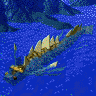
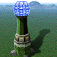
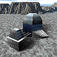
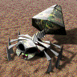
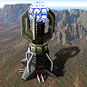
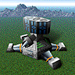

# Reference — TA Unit IDs

Every unit definition shipped in Total Annihilation v3.1c (base game +
Core Contingency + Battle Tactics + the rev 3.1 patch), extracted
directly from the flattened install's `units/*.fbi`. Counts as of
the GoG release: **278 units total** (137 ARM + 141 CORE).

Each row's portrait is the unit's `unitpics/<Objectname>.pcx`,
converted to PNG and stored under [`img/ta-units/`](img/ta-units/).
`Code` is the unit's `UnitName=` (the lookup key everything else
uses to refer to the unit). See the
[FBI field dictionary](https://github.com/coreprime/kbot/blob/main/docs/formats/tdf.md#appendix-a--fbi-field-dictionary)
in the kbot docs for what each FBI field controls. `Weapons`
columns are the literal `Weapon1/2/3=` values — cross-reference
with [TA weapons](ta-weapons.md).

> [!TIP]
> **To regenerate this page**, run `kbot document` (or `task document`)
> from a kbot checkout. Source is the flattened TA install at the path
> your kbot context points at.

## Contents

- [Arm](#arm)
  - [Commander](#arm---commander)
  - [Construction units](#arm---construction-units)
  - [Production buildings (plants, labs, shipyards)](#arm---production-buildings-plants-labs-shipyards)
  - [Resource & storage buildings](#arm---resource--storage-buildings)
  - [Defensive structures (turrets, anti-nuke, big-bertha)](#arm---defensive-structures-turrets-anti-nuke-big-bertha)
  - [Sensors & jammers (radar, sonar)](#arm---sensors--jammers-radar-sonar)
  - [Aircraft (VTOL, bombers, fighters)](#arm---aircraft-vtol-bombers-fighters)
  - [Ships (surface)](#arm---ships-surface)
  - [Submarines & underwater units](#arm---submarines--underwater-units)
  - [Kbots (bipedal walkers)](#arm---kbots-bipedal-walkers)
  - [Vehicles (tanks, hovercraft, jeeps)](#arm---vehicles-tanks-hovercraft-jeeps)
  - [Misc / other](#arm---misc--other)
- [Core](#core)
  - [Commander](#core---commander)
  - [Construction units](#core---construction-units)
  - [Production buildings (plants, labs, shipyards)](#core---production-buildings-plants-labs-shipyards)
  - [Resource & storage buildings](#core---resource--storage-buildings)
  - [Defensive structures (turrets, anti-nuke, big-bertha)](#core---defensive-structures-turrets-anti-nuke-big-bertha)
  - [Sensors & jammers (radar, sonar)](#core---sensors--jammers-radar-sonar)
  - [Aircraft (VTOL, bombers, fighters)](#core---aircraft-vtol-bombers-fighters)
  - [Ships (surface)](#core---ships-surface)
  - [Kbots (bipedal walkers)](#core---kbots-bipedal-walkers)
  - [Vehicles (tanks, hovercraft, jeeps)](#core---vehicles-tanks-hovercraft-jeeps)
  - [Misc / other](#core---misc--other)

---

## ARM

**Arm** — 137 units across 12 categories.

### ARM — Commander

2 units.

| | Code | Name | Description | TED | Cost (M/E) | HP | Weapons |
|:-:|------|------|-------------|-----|-----------:|---:|---------|
|  | `ARMCOM` | Commander | Commander | COMMANDER | 29854 / 34125 | 3000 | ARMCOMLASER, ARM_DISINTEGRATOR |
|  | `ARMDECOM` | Decoy Commander | Decoy Commander | COMMANDER | 721 / 11561 | 1420 | ARMCOMLASER |

### ARM — Construction units

12 units.

| | Code | Name | Description | TED | Cost (M/E) | HP | Weapons |
|:-:|------|------|-------------|-----|-----------:|---:|---------|
|  | `ARMACA` | Adv. Construction Aircraft | Tech Level 2 | CNSTR | 220 / 12096 | 360 | — |
|  | `ARMACK` | Adv. Construction Kbot | Tech Level 2 | CNSTR | 300 / 5784 | 1040 | — |
|  | `ARMACSUB` | Advanced Construction Sub | Tech Level 2 | SHIP | 695 / 7568 | 360 | — |
|  | `ARMACV` | Adv. Construction Vehicle | Tech Level 2 | CNSTR | 481 / 4263 | 1205 | — |
|  | `ARMCA` | Construction Aircraft | Tech Level 1 | VTOL | 105 / 4320 | 280 | — |
|  | `ARMCH` | Construction Hovercraft | Tech Level 1 | CNSTR | 396 / 4370 | 723 | — |
|  | `ARMCK` | Construction KBot | Tech Level 1 | KBOT | 120 / 2410 | 700 | — |
|  | `ARMCS` | Construction Ship | Tech Level 1 | SHIP | 255 / 2130 | 1105 | — |
|  | `ARMCSA` | Construction Seaplane | Tech Level 1 | VTOL | 115 / 5368 | 170 | — |
|  | `ARMCV` | Construction Vehicle | Tech Level 1 | CNSTR | 185 / 2030 | 870 | — |
|  | `ARMFARK` | FARK | Fast Assist-Repair Kbot | KBOT | 480 / 3219 | 830 | — |
|  | `ARMMLV` | Podger | Mine Layer Vehicle | CNSTR | 173 / 1031 | 1200 | — |

### ARM — Production buildings (plants, labs, shipyards)

10 units.

| | Code | Name | Description | TED | Cost (M/E) | HP | Weapons |
|:-:|------|------|-------------|-----|-----------:|---:|---------|
|  | `ARMAAP` | Adv. Aircraft Plant | Produces Aircraft | PLANT | 2210 / 4521 | 2100 | — |
|  | `ARMALAB` | Adv. Kbot Lab | Produces Kbots | PLANT | 2007 / 3277 | 3005 | — |
|  | `ARMAP` | Aircraft Plant | Produces Aircraft | PLANT | 850 / 1370 | 1850 | — |
|  | `ARMASY` | Adv. Shipyard | Produces Ships | PLANT | 2524 / 2402 | 2820 | — |
|  | `ARMAVP` | Adv. Vehicle Plant | Produces Vehicles | PLANT | 1984 / 3200 | 2435 | — |
|  | `ARMHP` | Hovercraft Platform | Builds Hovercraft | PLANT | 2007 / 5277 | 3005 | — |
|  | `ARMLAB` | Kbot Lab | Produces Kbots | PLANT | 705 / 1130 | 2690 | — |
|  | `ARMPLAT` | Seaplane Platform | Builds Seaplanes | PLANT | 2223 / 5396 | 1820 | — |
|  | `ARMSY` | Shipyard | Produces Ships | PLANT | 615 / 775 | 2490 | — |
|  | `ARMVP` | Vehicle Plant | Produces Vehicles | PLANT | 620 / 1000 | 2580 | — |

### ARM — Resource & storage buildings

19 units.

| | Code | Name | Description | TED | Cost (M/E) | HP | Weapons |
|:-:|------|------|-------------|-----|-----------:|---:|---------|
|  | `ARMCKFUS` | Cloakable Fusion Reactor | Produces Energy | ENERGY | 5420 / 42058 | 2200 | — |
|  | `ARMDRAG` | Dragon's Teeth | Perimeter Defense | FORT | 10 / 250 | 3500 | — |
|  | `ARMESTOR` | Energy Storage | Increases Energy Storage | ENERGY | 240 / 2430 | 1000 | — |
|  | `ARMFMKR` | Floating Metal Maker | Floating Metal Maker | METAL | — / 1480 | 110 | — |
|  | `ARMFORT` | Fortification Wall | Perimeter Defense | FORT | 27 / 675 | 2000 | — |
|  | `ARMFUS` | Fusion Reactor | Produces Energy | ENERGY | 5130 / 36058 | 3100 | — |
|  | `ARMGEO` | Geothermal Powerplant | Produces Energy | ENERGY | 520 / 9568 | 880 | — |
|  | `ARMMAKR` | Metal Maker | Converts Energy into Metal | METAL | 0 / 687 | 144 | — |
|  | `ARMMEX` | Metal Extractor | Extracts Metal | METAL | 50 / 521 | 170 | — |
|  | `ARMMMKR` | Moho Metal Maker | Converts Energy into Metal | METAL | 58 / 9350 | 400 | — |
|  | `ARMMOHO` | Moho Mine | Advanced Metal Extractor | METAL | 1508 / 8700 | 1573 | — |
|  | `ARMMSTOR` | Metal Storage | Increases Metal Storage | METAL | 305 / 535 | 1329 | — |
|  | `ARMSOLAR` | Solar Collector | Produces Energy | ENERGY | 145 / 760 | 326 | — |
|  | `ARMTIDE` | Tidal Generator | Produces Energy | WATER | 82 / 768 | 256 | — |
|  | `ARMUWES` | Underwater Energy Storage | Increases Energy Storage | ENERGY | 284 / 2950 | 1447 | — |
|  | `ARMUWFUS` | Underwater Fusion Plant | Produces Energy | ENERGY | 7085 / 54287 | 1231 | — |
|  | `ARMUWMEX` | Underwater Metal Extractor | Extracts Metal | METAL | 130 / 2074 | 330 | — |
|  | `ARMUWMS` | Underwater Metal Storage | Increases Metal Storage | METAL | 360 / 1255 | 1625 | — |
|  | `ARMWIN` | Wind Generator | Produces Energy | ENERGY | 52 / 509 | 176 | — |

### ARM — Defensive structures (turrets, anti-nuke, big-bertha)

18 units.

| | Code | Name | Description | TED | Cost (M/E) | HP | Weapons |
|:-:|------|------|-------------|-----|-----------:|---:|---------|
|  | `ARMAMB` | Ambusher | Pop-up Heavy Cannon | FORT | 2002 / 16821 | 1658 | ARMAMB_GUN |
|  | `ARMAMD` | Protector | Anti Missile Defense System | FORT | 1437 / 88000 | 780 | AMD_ROCKET |
|  | `ARMANNI` | Annihilator | Energy weapon | FORT | 3985 / 25025 | 1410 | ARM_TOTAL_ANNIHILATOR |
|  | `ARMATL` | Advanced Torpedo Launcher | Advanced Torpedo Launcher | WATER | 1762 / 4942 | 520 | ARMATL_TORPEDO |
|  | `ARMBRTHA` | Big Bertha | Long Range Plasma Cannon | FORT | 4184 / 64680 | 1800 | ARM_BERTHACANNON |
|  | `ARMFDRAG` | Floating Dragon's Teeth | Floating Dragon's Teeth | FORT | 20 / 600 | 3500 | — |
|  | `ARMFHLT` | Stingray | Floating Heavy Laser Tower | WATER | 524 / 5796 | 1325 | ARMFHLT_LASER |
|  | `ARMFLAK` | Flakker | Anti-Air Flak Gun | FORT | 1069 / 17425 | 1524 | ARMFLAK_GUN |
|  | `ARMGUARD` | Guardian | Plasma Battery | FORT | 1946 / 7687 | 2477 | ARMFIXED_GUN |
|  | `ARMHLT` | Sentinel | Heavy Laser Tower | FORT | 584 / 5398 | 1230 | ARM_LASERH1 |
|  | `ARMLLT` | L.L.T. | Light Laser Tower | FORT | 262 / 2546 | 750 | ARM_LIGHTLASER |
|  | `ARMMANNI` | Penetrator | Mobile Energy Weapon | TANK | 2604 / 17477 | 650 | ARMMANNI_WEAPON |
|  | `ARMMART` | Luger | Mobile Artillery | TANK | 264 / 2140 | 525 | ARM_ARTILLERY |
|  | `ARMMERL` | Merl | Mobile Rocket Launcher | TANK | 462 / 2746 | 540 | ARMTRUCK_ROCKET |
|  | `ARMRL` | Defender | Missile Tower | FORT | 79 / 843 | 295 | ARMRL_MISSILE |
|  | `ARMSILO` | Retaliator | Nuclear Missile Launcher | SPECIAL | 1010 / 52134 | 2300 | NUCLEAR_MISSILE |
|  | `ARMTL` | Torpedo Launcher | Torpedo Launcher | WATER | 804 / 2658 | 1450 | COAX_TORPEDO |
|  | `ARMVULC` | Vulcan | Rapid Fire Plasma Cannon | FORT | 45198 / 479111 | 1400 | ARMVULC_WEAPON |

### ARM — Sensors & jammers (radar, sonar)

6 units.

| | Code | Name | Description | TED | Cost (M/E) | HP | Weapons |
|:-:|------|------|-------------|-----|-----------:|---:|---------|
|  | `ARMARAD` | Advanced Radar Tower | Long Range Radar Tower | SPECIAL | 125 / 1830 | 120 | — |
|  | `ARMASON` | Advanced Sonar Station | Extended Sonar | WATER | 163 / 2469 | 320 | — |
|  | `ARMJAM` | Jammer | Mobile Radar Jammer | TANK | 97 / 1621 | 460 | — |
|  | `ARMRAD` | Radar Tower | Radar Tower | SPECIAL | 49 / 750 | 51 | — |
|  | `ARMSJAM` | Escort | Radar Jammer Ship | SHIP | 131 / 1928 | 510 | — |
|  | `ARMSONAR` | Sonar Station | Locates Water Units | WATER | 20 / 403 | 50 | — |

### ARM — Aircraft (VTOL, bombers, fighters)

12 units.

| | Code | Name | Description | TED | Cost (M/E) | HP | Weapons |
|:-:|------|------|-------------|-----|-----------:|---:|---------|
|  | `ARMATLAS` | Atlas | Air Transport | VTOL | 107 / 2479 | 150 | — |
|  | `ARMAWAC` | Eagle | Radar Plane | VTOL | 165 / 8062 | 110 | — |
|  | `ARMBRAWL` | Brawler | Gunship | VTOL | 314 / 6249 | 920 | VTOL_EMG |
|  | `ARMFIG` | Freedom Fighter | Fighter | VTOL | 99 / 3234 | 196 | ARMVTOL_MISSILE |
|  | `ARMHAWK` | Hawk | Stealth Fighter | VTOL | 254 / 6893 | 510 | ARMVTOL_ADVMISSILE, ARMVTOL_ADVMISSILE2 |
|  | `ARMLANCE` | Lancet | Torpedo Bomber | VTOL | 378 / 6438 | 370 | ARMAIR_TORPEDO |
|  | `ARMPEEP` | Peeper | Air Scout | VTOL | 40.28 / 1475 | 80 | — |
|  | `ARMPNIX` | Phoenix | Bomber | VTOL | 209 / 7624 | 470 | ARMADVBOMB, ARMAIR2AIRLASER |
|  | `ARMSEAP` | Albatross | Torpedo Seaplane | VTOL | 557 / 9619 | 216 | ARMSEAP_WEAPON1, ARMSEAP_WEAPON2, ARMSEAP_WEAPON3 |
|  | `ARMSEHAK` | Seahawk | Airborne Sonar | VTOL | 139 / 7624 | 470 | — |
|  | `ARMSFIG` | Tornado | Seaplane Fighter | VTOL | 187 / 6307 | 150 | ARMSFIG_WEAPON, ARMSFIG_WEAPON2 |
|  | `ARMTHUND` | Thunder | Bomber | VTOL | 130 / 5496 | 320 | ARMBOMB |

### ARM — Ships (surface)

9 units.

| | Code | Name | Description | TED | Cost (M/E) | HP | Weapons |
|:-:|------|------|-------------|-----|-----------:|---:|---------|
|  | `ARMAAS` | Archer | Anti-Air Ship | SHIP | 1358 / 17058 | 2360 | ARMAAS_WEAPON1, ARMAAS_WEAPON2, ARMAAS_WEAPON3 |
|  | `ARMBATS` | Millenium | Battleship | SHIP | 4404 / 20731 | 5720 | ARM_BATS, ARM_BATS |
|  | `ARMCARRY` | Colossus | Light Carrier | SHIP | 1372 / 11257 | 3390 | — |
|  | `ARMCRUS` | Conqueror | Cruiser | SHIP | 1719 / 8608 | 4050 | ARM_CRUS, ARMDEPTHCHARGE |
|  | `ARMMSHIP` | Ranger | Missile Ship | SHIP | 2348 / 7804 | 1200 | ARMMSHIP_ROCKET, ARMSHIP_MISSILE |
|  | `ARMPT` | Skeeter | Scout Ship | SHIP | 100 / 985 | 560 | ARMPT_LASER, ARMKBOT_MISSILE |
|  | `ARMROY` | Crusader | Destroyer | SHIP | 898 / 4537 | 2870 | ARM_ROY, ARMDEPTHCHARGE |
|  | `ARMSS` | Sea Serpent | Indigenous Lifeform | SPECIAL | 0 / 4385 | 420 | FLAMETHROWER |
|  | `ARMTSHIP` | Hulk | Transport Ship | SHIP | 919 / 4639 | 2000 | — |

### ARM — Submarines & underwater units

3 units.

| | Code | Name | Description | TED | Cost (M/E) | HP | Weapons |
|:-:|------|------|-------------|-----|-----------:|---:|---------|
|  | `ARMSCRAM` | Fibber | Sonar Jamming Sub | WATER | 295 / 2897 | 450 | — |
|  | `ARMSUB` | Lurker | Submarine | WATER | 1151 / 3724 | 610 | ARM_TORPEDO |
|  | `ARMSUBK` | Piranha | Submarine Killer | WATER | 1448 / 5481 | 290 | ARMSMART_TORPEDO |

### ARM — Kbots (bipedal walkers)

16 units.

| | Code | Name | Description | TED | Cost (M/E) | HP | Weapons |
|:-:|------|------|-------------|-----|-----------:|---:|---------|
|  | `ARMAMPH` | Pelican | Amphibious Kbot | KBOT | 255 / 2468 | 800 | ARMAMPH_WEAPON1, ARMAMPH_WEAPON2 |
|  | `ARMASER` | Eraser | Radar Jammer | KBOT | 73 / 1326 | 305 | — |
|  | `ARMFAST` | Zipper | Fast Attack Kbot | KBOT | 151 / 2221 | 550 | ARM_FAST |
|  | `ARMFIDO` | Fido | Assault Kbot | KBOT | 398 / 3556 | 1000 | GAUSS |
|  | `ARMFLEA` | Flea | Fast Light Scout Kbot | KBOT | 44 / 712 | 75 | ARMFLEA_WEAPON |
|  | `ARMHAM` | Hammer | Artillery Kbot | KBOT | 151 / 1187 | 800 | ARM_HAM |
|  | `ARMJETH` | Jethro | Anti-Air Kbot | KBOT | 128 / 1219 | 470 | ARMKBOT_MISSILE |
|  | `ARMMARK` | Marky | Mobile Radar Kbot | KBOT | 95 / 1152 | 320 | — |
|  | `ARMMAV` | Maverick | Gun-slinging Kbot | KBOT | 492 / 10914 | 870 | ARMMAV_WEAPON |
|  | `ARMPW` | Peewee | Infantry Kbot | KBOT | 53 / 697 | 250 | EMG |
|  | `ARMROCK` | Rocko | Rocket Kbot | KBOT | 117 / 964 | 610 | KBOT_ROCKET |
|  | `ARMSNIPE` | Shooter | Sniper Kbot | KBOT | 935 / 14727 | 320 | ARMSNIPE_WEAPON |
|  | `ARMSPY` | Infiltrator | SPY Kbot | KBOT | 128 / 9219 | 270 | — |
|  | `ARMVADER` | Invader | Crawling Bomb | KBOT | 61 / 5473 | 185 | — |
|  | `ARMWAR` | Warrior | Medium Infantry Kbot | KBOT | 196 / 2236 | 850 | ARMWAR_LCANNON, ARMWAR_EMG |
|  | `ARMZEUS` | Zeus | Assault Kbot | KBOT | 267 / 2228 | 875 | LIGHTNING |

### ARM — Vehicles (tanks, hovercraft, jeeps)

16 units.

| | Code | Name | Description | TED | Cost (M/E) | HP | Weapons |
|:-:|------|------|-------------|-----|-----------:|---:|---------|
|  | `ARMAH` | Swatter | Anti-Air Hovercraft | TANK | 120 / 1444 | 375 | ARMAH_WEAPON |
|  | `ARMANAC` | Anaconda | Hovertank | TANK | 272 / 2856 | 880 | ARMANAC_WEAPON |
|  | `ARMBULL` | Bulldog | Heavy Assault Tank | TANK | 467 / 2994 | 2102 | ARM_BULL |
|  | `ARMCROC` | Triton | Amphibious Tank | TANK | 298 / 2300 | 1230 | ARM_MEDIUMCANNON |
|  | `ARMFAV` | Jeffy | Fast Attack Vehicle | TANK | 37 / 564 | 79 | ARM_LASER |
|  | `ARMFLASH` | Flash | Fast Assault Tank | TANK | 106 / 870 | 625 | EMG |
|  | `ARMLATNK` | Panther | Lightning Tank | TANK | 354 / 3830 | 1100 | ARMLATNK_WEAPON, ARMKBOT_MISSILE |
|  | `ARMMH` | Wombat | Hovercraft Rocket Launcher | TANK | 325 / 3131 | 450 | ARMMH_WEAPON |
|  | `ARMSAM` | Samson | Mobile Missile Launcher | TANK | 119 / 1027 | 650 | ARMTRUCK_MISSILE |
|  | `ARMSCAB` | Scarab | Mobile Missile Defense | TANK | 1437 / 88000 | 780 | ARMSCAB_WEAPON |
|  | `ARMSEER` | Seer | Mobile Radar | TANK | 85 / 941 | 480 | — |
|  | `ARMSH` | Skimmer | Scout Hovercraft | TANK | 76 / 1169 | 200 | ARMSH_WEAPON |
|  | `ARMSPID` | Spider | Spider Assault Vehicle | TANK | 230 / 2200 | 450 | ARM_PARALYZER |
|  | `ARMSTUMP` | Stumpy | Medium Assault Tank | TANK | 165 / 1246 | 992 | ARM_LIGHTCANNON |
|  | `ARMTHOVR` | Bear | Transport Hovercraft | TANK | 665 / 7938 | 1150 | — |
|  | `ARMYORK` | Phalanx | Mobile Flak Vehicle | TANK | 830 / 10500 | 621 | ARMYORK_GUN |

### ARM — Misc / other

14 units.

| | Code | Name | Description | TED | Cost (M/E) | HP | Weapons |
|:-:|------|------|-------------|-----|-----------:|---:|---------|
|  | `ARMASP` | Air Repair Pad | Automatically repairs aircraft | SPECIAL | 425 / 8510 | 680 | — |
|  | `ARMBEAC` | Alien Beacon | Alien Beacon | SPECIAL | 5214 / 423100 | 11000 | — |
|  | `ARMDEV1` | Implosion Device | Implosion Device | SPECIAL | 8545 / 132500 | 4110 | — |
|  | `ARMEMP` | Stunner | EMP Missile Launcher | SPECIAL | 1802 / 52134 | 2300 | ARMEMP_WEAPON |
|  | `ARMFRT` | Defender - NS | Missile Tower - Naval Series | WATER | 71 / 987 | 252 | ARMRL_MISSILE |
|  | `ARMGATE` | Galactic Gate | Space Teleporter | SPECIAL | 213965 / 1865294 | 2876 | — |
|  | `ARMMINE1` | Tiny | Low Damage, Med. Range Mine | SPECIAL | 32 / 1017 | 100 | — |
|  | `ARMMINE2` | Area Mine | Low Damage, Large Range Mine | SPECIAL | 61 / 1909 | 100 | — |
|  | `ARMMINE3` | Focused Mine | Med. Damage, Small Range Mine | SPECIAL | 86 / 2688 | 100 | — |
|  | `ARMMINE4` | HE Area Mine | Med. Damage, Large Range Mine | SPECIAL | 137 / 4294 | 100 | — |
|  | `ARMMINE5` | Precision Mine | High Damage, Small Range Mine | SPECIAL | 132 / 4135 | 2000 | — |
|  | `ARMMINE6` | Nuclear Mine | Nuclear Mine | SPECIAL | 498 / 22272 | 100 | — |
| — | `ARMSCORP` | Scorpion | Indigenous Lifeform | SPECIAL | 0 / 15660 | 1000 | ARMSCORP_WEAPON |
|  | `ARMTARG` | Targeting Facility | Automatic Radar Targeting | SPECIAL | 15130 / 136058 | 1900 | — |

---

## CORE

**Core** — 141 units across 11 categories.

### CORE — Commander

2 units.

| | Code | Name | Description | TED | Cost (M/E) | HP | Weapons |
|:-:|------|------|-------------|-----|-----------:|---:|---------|
|  | `CORCOM` | Commander | Commander | COMMANDER | 23512 / 35838 | 3000 | CORCOMLASER, CORE_DISINTEGRATOR |
|  | `CORDECOM` | Decoy Commander | Decoy Commander | COMMANDER | 705 / 12085 | 1580 | CORCOMLASER |

### CORE — Construction units

11 units.

| | Code | Name | Description | TED | Cost (M/E) | HP | Weapons |
|:-:|------|------|-------------|-----|-----------:|---:|---------|
|  | `CORACA` | Adv. Construction Aircraft | Tech Level 2 | CNSTR | 231 / 12824 | 370 | — |
|  | `CORACK` | Adv. Construction Kbot | Tech Level 2 | CNSTR | 325 / 6096 | 1070 | — |
|  | `CORACSUB` | Advanced Construction Sub | Tech Level 2 | SHIP | 690 / 7911 | 370 | — |
|  | `CORACV` | Adv. Construction Vehicle | Tech Level 2 | CNSTR | 455 / 4504 | 1220 | — |
|  | `CORCA` | Construction Aircraft | Tech Level 1 | CNSTR | 110 / 4580 | 290 | — |
|  | `CORCH` | Construction Hovercraft | Tech Level 1 | CNSTR | 390 / 4455 | 740 | — |
|  | `CORCK` | Construction Kbot | Tech Level 1 | CNSTR | 130 / 2540 | 710 | — |
|  | `CORCS` | Construction Ship | Tech Level 1 | CNSTR | 260 / 2375 | 1150 | — |
|  | `CORCSA` | Construction Seaplane | Tech Level 1 | VTOL | 125 / 5824 | 180 | — |
|  | `CORCV` | Construction Vehicle | Tech Level 1 | TANK | 175 / 2145 | 825 | — |
|  | `CORMLV` | Spoiler | Mine Layer Vehicle | CNSTR | 187 / 1117 | 1400 | — |

### CORE — Production buildings (plants, labs, shipyards)

11 units.

| | Code | Name | Description | TED | Cost (M/E) | HP | Weapons |
|:-:|------|------|-------------|-----|-----------:|---:|---------|
|  | `CORAAP` | Adv. Aircraft Plant | Produces Aircraft | PLANT | 2191 / 4422 | 2200 | — |
|  | `CORALAB` | Adv. Kbot Lab | Produces Kbots | PLANT | 1972 / 3625 | 3170 | — |
|  | `CORAP` | Aircraft Plant | Produces Aircraft | PLANT | 830 / 1340 | 1925 | — |
|  | `CORASY` | Adv. Shipyard | Produces Ships | PLANT | 2460 / 2325 | 2760 | — |
|  | `CORAVP` | Adv. Vehicle Plant | Produces Vehicles | PLANT | 1947 / 3520 | 2580 | — |
|  | `CORGANT` | Krogoth Gantry | Builds Krogoth | PLANT | 6587 / 9574 | 3050 | — |
|  | `CORHP` | Hovercraft Platform | Builds Hovercraft | PLANT | 1793 / 5421 | 3356 | — |
|  | `CORLAB` | Kbot Lab | Produces Kbots | PLANT | 680 / 1250 | 2600 | — |
|  | `CORPLAT` | Seaplane Platform | Builds Seaplanes | PLANT | 2305 / 5367 | 2000 | — |
|  | `CORSY` | Shipyard | Produces Ships | PLANT | 600 / 750 | 2490 | — |
|  | `CORVP` | Vehicle Plant | Produces Vehicles | PLANT | 600 / 1100 | 2550 | — |

### CORE — Resource & storage buildings

20 units.

| | Code | Name | Description | TED | Cost (M/E) | HP | Weapons |
|:-:|------|------|-------------|-----|-----------:|---:|---------|
| — | `CORBUILD` | Hydration Plant | Creates Water | SPECIAL | 220 / 2550 | 1806 | — |
|  | `CORCKFUS` | Cloakable Fusion Reactor | Produces Energy | ENERGY | 5321 / 46225 | 2450 | — |
|  | `CORDRAG` | Dragon's Teeth | Perimeter Defense | FORT | 11 / 300 | 3600 | — |
|  | `CORESTOR` | Energy Storage | Increases Energy Storage | ENERGY | 250 / 2490 | 1070 | — |
|  | `CORFMKR` | Floating Metal Maker | Floating Metal Maker | METAL | — / 1530 | 120 | — |
|  | `CORFORT` | Fortification Wall | Perimeter Defense | FORT | 23 / 612 | 1750 | — |
|  | `CORFUS` | Fusion Power Plant | Produces Energy | ENERGY | 5004 / 37865 | 3000 | — |
|  | `CORGEO` | Geothermal Powerplant | Produces Energy | ENERGY | 505 / 9375 | 930 | — |
|  | `CORMAKR` | Metal Maker | Metal Maker | METAL | 0 / 700 | 150 | — |
|  | `CORMEX` | Metal Extractor | Extracts Metal | METAL | 51 / 514 | 175 | — |
|  | `CORMMKR` | Moho Metal Maker | Produces Metal | METAL | 51 / 10928 | 500 | — |
|  | `CORMOHO` | Moho Mine | Advanced Metal Extractor | METAL | 1450 / 9121 | 1465 | — |
|  | `CORMSTOR` | Metal Storage | Increases Metal Storage | METAL | 320 / 550 | 1306 | — |
|  | `CORSOLAR` | Solar Collector | Produces Energy | ENERGY | 141 / 790 | 320 | — |
|  | `CORTIDE` | Tidal Generator | Produces Energy | WATER | 81 / 752 | 253 | — |
|  | `CORUWES` | Underwater Energy Storage | Increases Energy Storage | ENERGY | 280 / 2540 | 1521 | — |
|  | `CORUWFUS` | Underwater Fusion Plant | Produces Energy | ENERGY | 7210 / 57349 | 1425 | — |
|  | `CORUWMEX` | Underwater Metal Extractor | Extracts Metal | METAL | 125 / 2219 | 355 | — |
|  | `CORUWMS` | Underwater Metal Storage | Increases Metal Storage | METAL | 350 / 1523 | 1750 | — |
|  | `CORWIN` | Wind Generator | Produces Energy | ENERGY | 55 / 523 | 179 | — |

### CORE — Defensive structures (turrets, anti-nuke, big-bertha)

18 units.

| | Code | Name | Description | TED | Cost (M/E) | HP | Weapons |
|:-:|------|------|-------------|-----|-----------:|---:|---------|
|  | `CORATL` | Advanced Torpedo Launcher | Advanced Torpedo Launcher | WATER | 1758 / 5389 | 562 | CORATL_TORPEDO |
|  | `CORBUZZ` | Buzzsaw | Rapid Fire Plasma Cannon | FORT | 35264 / 462648 | 1700 | CORBUZZ_WEAPON |
|  | `CORDOOM` | Doomsday Machine | Energy Weapon | FORT | 2140 / 14245 | 3140 | CORE_DOOMSDAY, CORE_LIGHTLASER, CORE_LASERH1 |
|  | `CORFDRAG` | Floating Dragon's Teeth | Floating Dragon's Teeth | FORT | 18 / 630 | 3800 | — |
|  | `CORFHLT` | Thunderbolt | Floating Heavy Laser Tower | WATER | 558 / 5812 | 1385 | CORFHLT_LASER |
|  | `CORFLAK` | Cobra | Anti-Air Flak Gun | FORT | 1092 / 18995 | 1655 | CORFLAK_GUN |
|  | `CORFMD` | Fortitude Missile Defense | Anti Missile Defense System | SPECIAL | 1508 / 92321 | 780 | FMD_ROCKET |
|  | `CORHLT` | Gaat Gun | Heavy Laser Tower | FORT | 589 / 5443 | 1200 | CORE_LASERH1 |
|  | `CORINT` | Intimidator | Long Range Plasma Cannon | FORT | 4328 / 62520 | 1900 | CORE_INTIMIDATOR |
|  | `CORLLT` | Light Laser Tower | Light Laser Tower | FORT | 268 / 2608 | 710 | CORE_LIGHTLASER |
|  | `CORMART` | Mobile Artillery | Mobile Artillery | TANK | 251 / 1535 | 600 | CORE_ARTILLERY |
|  | `CORPLAS` | Immolator; //c | Plasma Tower | FORT | 321;  //C  llt=268 / 1790;  //C llt=2608 | 842;  //C  llt=710 | CORPLAS_WEAPON |
|  | `CORPUN` | Punisher | Plasma Battery | FORT | 1887 / 7585 | 2540 | CORFIXED_GUN |
|  | `CORRL` | Pulverizer | Missile Tower | FORT | 76 / 805 | 300 | CORRL_MISSILE |
|  | `CORSILO` | Silencer | Nuclear Missile Launcher | SPECIAL | 975 / 48768 | 2560 | CRBLMSSL |
|  | `CORTL` | Torpedo Launcher | Torpedo Launcher | WATER | 831 / 3058 | 1520 | COAX_TORPEDO |
|  | `CORTOAST` | Toaster | Pop-up Heavy Cannon | FORT | 2146 / 12687 | 1877 | CORTOAST_GUN |
|  | `CORVIPE` | Viper | Pop-Up Heavy Laser | FORT | 642 / 6687 | 988 | CORVIPE_LASER |

### CORE — Sensors & jammers (radar, sonar)

6 units.

| | Code | Name | Description | TED | Cost (M/E) | HP | Weapons |
|:-:|------|------|-------------|-----|-----------:|---:|---------|
|  | `CORARAD` | Advanced Radar Tower | Long Range Radar | SPECIAL | 122 / 1920 | 130 | — |
|  | `CORASON` | Advanced Sonar Station | Locates Water Units | WATER | 152 / 2257 | 240 | — |
|  | `CORRAD` | Radar Tower | Radar Tower | SPECIAL | 50 / 800 | 51 | — |
|  | `CORSJAM` | Phantom | Radar Jammer Ship | SHIP | 135 / 2254 | 570 | — |
|  | `CORSONAR` | Sonar Station | Sonar Station | WATER | 20 / 399 | 52 | — |
|  | `CORVRAD` | Informer | Mobile Radar | TANK | 86 / 1209 | 510 | — |

### CORE — Aircraft (VTOL, bombers, fighters)

12 units.

| | Code | Name | Description | TED | Cost (M/E) | HP | Weapons |
|:-:|------|------|-------------|-----|-----------:|---:|---------|
|  | `CORAPE` | Rapier | Gunship | VTOL | 294 / 5778 | 940 | VTOL_ROCKET, VTOL_ROCKET2 |
|  | `CORAWAC` | Vulture | Radar Plane | VTOL | 169 / 7824 | 170 | — |
|  | `CORFINK` | Fink | Air Scout | VTOL | 36 / 1369 | 90 | — |
|  | `CORHUNT` | Hunter | Airborne Sonar | VTOL | 142 / 7421 | 495 | — |
|  | `CORHURC` | Hurricane | Strategic Bomber | VTOL | 220 / 8050 | 480 | CORADVBOMB, CORAIR2AIRLASER |
|  | `CORSEAP` | Typhoon | Torpedo Seaplane | VTOL | 545 / 9785 | 210 | CORSEAP_WEAPON1, CORSEAP_WEAPON2, CORSEAP_WEAPON3 |
|  | `CORSFIG` | Voodoo | Seaplane Fighter | VTOL | 182 / 6524 | 159 | CORSFIG_WEAPON, CORSFIG_WEAPON2 |
|  | `CORSHAD` | Shadow | Bomber | VTOL | 131 / 5691 | 315 | CORBOMB |
|  | `CORTITAN` | Titan | Torpedo Bomber | VTOL | 364 / 6588 | 375 | CORAIR_TORPEDO |
|  | `CORVALK` | Valkyrie | Air Transport | VTOL | 115 / 2695 | 160 | — |
|  | `CORVAMP` | Vamp | Stealth Fighter | VTOL | 257 / 6973 | 490 | CORVTOL_ADVMISSILE, CORVTOL_ADVMISSILE2 |
|  | `CORVENG` | Avenger | Fighter | VTOL | 101 / 3181 | 202 | CORVTOL_MISSILE |

### CORE — Ships (surface)

13 units.

| | Code | Name | Description | TED | Cost (M/E) | HP | Weapons |
|:-:|------|------|-------------|-----|-----------:|---:|---------|
|  | `CORARCH` | Shredder | Anti-Air Ship | SHIP | 1314 / 17921 | 2450 | CORARCH_WEAPON1, CORARCH_WEAPON2, CORARCH_WEAPON3 |
|  | `CORBATS` | Warlord | Battleship | SHIP | 4181 / 19741 | 6140 | CORE_BATSLASER, COR_BATS |
|  | `CORCARRY` | Hive | Light Carrier | SHIP | 1379 / 11715 | 3500 | — |
|  | `CORCRUS` | Executioner | Cruiser | SHIP | 1724 / 8551 | 4170 | COR_CRUS, COREDEPTHCHARGE |
|  | `CORMSHIP` | Missile Frigate | Missile Ship | SHIP | 2283 / 7628 | 1250 | CORMSHIP_ROCKET, CORSHIP_MISSILE |
|  | `CORPT` | Searcher | Scout Ship | SHIP | 95 / 917 | 570 | COREPT_LASER, CORKBOT_MISSILE |
|  | `CORROY` | Enforcer | Destroyer | SHIP | 887 / 4505 | 3150 | CORE_ROY, COREDEPTHCHARGE |
|  | `CORSHARK` | Shark | Submarine Killer | SHIP | 1356 / 5245 | 276 | CORSMART_TORPEDO |
| — | `CORSS` | Sea Serpent | Indigenous Lifeform | SPECIAL | 0 / 4385 | 420 | FLAMETHROWER |
|  | `CORSSUB` | Leviathan | Battle Sub | SHIP | 3850 / 19940 | 3052 | CORSSUB_WEAPON |
|  | `CORSUB` | Snake | Submarine | SHIP | 1199 / 3902 | 590 | CORE_TORPEDO |
|  | `CORTHOVR` | Turtle | Transport Hovercraft | TANK | 650 / 7541 | 1080 | — |
|  | `CORTSHIP` | Envoy | Transport Ship | SHIP | 887 / 4786 | 2120 | — |

### CORE — Kbots (bipedal walkers)

17 units.

| | Code | Name | Description | TED | Cost (M/E) | HP | Weapons |
|:-:|------|------|-------------|-----|-----------:|---:|---------|
|  | `CORAK` | A.K. | Infantry Kbot | KBOT | 56 / 696 | 265 | CORE_LASER |
|  | `CORAMPH` | Gimp | Amphibious Kbot | KBOT | 324 / 2935 | 1150 | CORAMPH_WEAPON1, CORAMPH_WEAPON2 |
|  | `CORCAN` | The Can | Armored Assault Kbot | KBOT | 420 / 3500 | 2800 | CORE_CANLASER |
|  | `CORCRASH` | Crasher | Missile Kbot | KBOT | 129 / 1224 | 480 | CORKBOT_MISSILE |
|  | `CORFAST` | Freaker | Fast Attack Kbot | KBOT | 175 / 2658 | 630 | CORFAST_WEAPON |
|  | `CORHRK` | Dominator | Heavy Rocket Kbot | KBOT | 388 / 2107 | 620 | CORHRK_ROCKET |
|  | `CORKROG` | Krogoth | Experimental Kbot | KBOT | 29489 / 116664 | 29918 | CORKROG_FIRE, CORKROG_HEAD, CORKROG_ROCKET |
|  | `CORMORT` | Morty | Mobile Mortar Kbot | KBOT | 321 / 2865 | 920 | CORE_MORT |
|  | `CORNECRO` | Resurrection Kbot | Resurrection Kbot | KBOT | 376 / 10164 | 470 | — |
|  | `CORPYRO` | Pyro | Assault Kbot | KBOT | 260 / 2200 | 700 | FLAMETHROWER |
|  | `CORROACH` | Roach | Crawling Bomb | KBOT | 65 / 5471 | 195 | — |
|  | `CORSPEC` | Spectre | Radar Jammer | KBOT | 70 / 1453 | 310 | — |
|  | `CORSPY` | Parasite | SPY Kbot | KBOT | 156 / 13452 | 340 | — |
|  | `CORSTORM` | Storm | Rocket Kbot | KBOT | 118 / 985 | 620 | CORKBOT_ROCKET |
|  | `CORSUMO` | Sumo | Adv. Armored Assault Kbot | KBOT | 844 / 5987 | 4950 | CORSUMO_WEAPON |
|  | `CORTHUD` | Thud | Artillery Kbot | KBOT | 147 / 1161 | 800 | CORE_THUD |
|  | `CORVOYR` | Voyeur | Mobile Radar Kbot | KBOT | 93 / 1283 | 350 | — |

### CORE — Vehicles (tanks, hovercraft, jeeps)

18 units.

| | Code | Name | Description | TED | Cost (M/E) | HP | Weapons |
|:-:|------|------|-------------|-----|-----------:|---:|---------|
|  | `CORAH` | Slinger | Anti-Air Hovercraft | TANK | 115 / 1542 | 395 | CORAH_WEAPON |
|  | `CORETER` | Deleter | Mobile Radar Jammer | TANK | 100 / 1757 | 520 | — |
|  | `CORFAV` | Weasel | Scout | TANK | 38 / 575 | 84 | CORE_LASER |
|  | `CORGATOR` | Instigator | Assault Tank | TANK | 110 / 887 | 653 | GATOR_LASER |
|  | `CORGOL` | Goliath | Very Heavy Assault Tank | TANK | 697 / 3906 | 2845 | COR_GOL |
|  | `CORLEVLR` | Leveler | Riot Tank | TANK | 292 / 1887 | 375 | CORLEVLR_WEAPON |
|  | `CORMABM` | Hedgehog | Mobile Missile Defense | TANK | 1508 / 92321 | 780 | CORMABM_WEAPON |
|  | `CORMH` | Nixer | Hovercraft Rocket Launcher | TANK | 318 / 3352 | 460 | CORMH_WEAPON |
|  | `CORMIST` | Slasher | Missile Launcher | TANK | 116 / 947 | 655 | CORTRUCK_MISSILE |
|  | `CORRAID` | Raider | Medium Assault Tank | TANK | 169 / 1241 | 1058 | CORE_LIGHTCANNON |
|  | `CORREAP` | Reaper | Heavy Assault Tank | TANK | 473 / 3048 | 2014 | CORE_REAP |
|  | `CORSCORP` | Scorpion | Indigenous Lifeform | SPECIAL | 0 / 15660 | 1000 | CORSCORP_WEAPON |
|  | `CORSEAL` | Crock | Amphibious Tank | TANK | 295 / 2310 | 1144 | CORE_MEDIUMCANNON |
|  | `CORSENT` | Copperhead | Mobile Flak Vehicle | TANK | 886 / 12487 | 685 | CORSENT_GUN |
|  | `CORSH` | Scrubber | Scout Hovercraft | TANK | 72 / 1252 | 200 | CORSH_WEAPON |
|  | `CORSNAP` | Snapper | Hovertank | TANK | 280 / 3069 | 850 | CORSNAP_WEAPON |
| — | `CORTRUCK` | Truck | Ground Transport | TANK | 218 / 875 | 3284 | — |
|  | `CORVROC` | Diplomat | Mobile Rocket Launcher | TANK | 427 / 2470 | 602 | CORTRUCK_ROCKET |

### CORE — Misc / other

13 units.

| | Code | Name | Description | TED | Cost (M/E) | HP | Weapons |
|:-:|------|------|-------------|-----|-----------:|---:|---------|
|  | `CORASP` | Air Repair Pad | Automatically repairs aircraft | SPECIAL | 430 / 8540 | 690 | — |
|  | `CORBEAC` | Alien Beacon | Alien Beacon | SPECIAL | 5214 / 423100 | 11000 | — |
|  | `CORDEV1` | Implosion Device | Implosion Device | SPECIAL | 8545 / 132500 | 4110 | — |
|  | `CORFRT` | Stinger | Missile Tower - Naval Series | WATER | 72 / 1054 | 290 | CORFRT_MISSILE |
|  | `CORGATE` | Galactic Gate | Space Teleporter | SPECIAL | 197485 / 1982431 | 2469 | — |
|  | `CORMINE1` | M-104 | Low Damage, Med. Range Mine | SPECIAL | 20 / 532 | 200 | — |
|  | `CORMINE2` | M-209 | Low Damage, Large Range Mine | SPECIAL | 48 / 1156 | 200 | — |
|  | `CORMINE3` | M-303 | Med. Damage, Med. Range Mine | SPECIAL | 73 / 1704 | 200 | — |
|  | `CORMINE4` | M-420 | High Damage, Med. Range Mine | SPECIAL | 104 / 2342 | 200 | — |
|  | `CORMINE5` | M-515 | High Damage, Large Range Mine | SPECIAL | 264 / 7607 | 200 | — |
|  | `CORMINE6` | M-610 | Nuclear Mine | SPECIAL | 595 / 26172 | 200 | — |
|  | `CORTARG` | Targeting Facility | Automatic Radar Targeting | SPECIAL | 14982 / 141148 | 1800 | — |
|  | `CORTRON` | Neutron | Neutron Missile Launcher | SPECIAL | 1708 / 52134 | 2100 | CORTRON_WEAPON |

---

